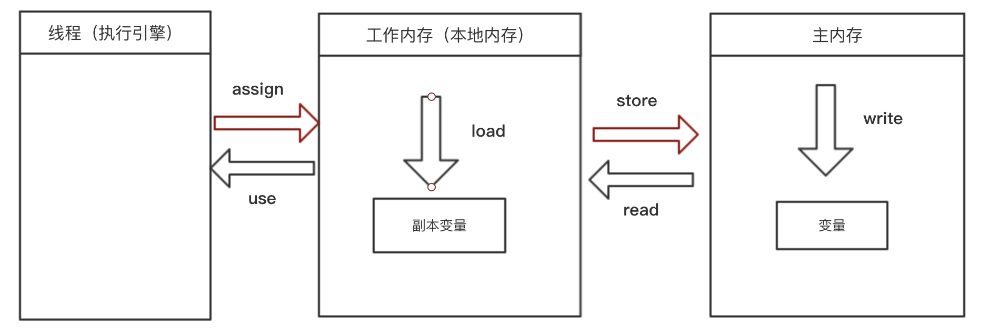

# 大纲

# 前言

**Java内存模型**(JMM)和**Java运行时数据区**(Java内存结构)是两个概念。

面试的时候，如果 面试官问你Java内存模型，他可能指的是后者(虽然这个可能是他理解错)，为了确保你回答无误，最好向他确认一下是前者还是后者。

# 目标

定义程序中**各个变量**的**访问规则**，即在虚拟机中讲变量**存储到内存**和从内存**取出**变量这样的底层细节

抽象结构如下图所示

以下几点需要注意：

- 这里的变量，不是像Java语言中的变量，他不包含**局部变量**和**方法参数**，因为那个是线程私有的，**不共享**
- 线程对变量的操作只能通过**本地内存**(工作内存)，**不能**直接**操作主内存**

# 内存间的交互操作

对于以下8个操作，虚拟机保证必须是原子操作(不可再分的)

- lock(锁定)：作用于**主内存**的变量，把一个变量标示为一个线程独占状态
- unlock(解锁)：作用于**主内存**的变量，他把一个处于**锁定状态**的变量释放出来，**释放后**的变量才可以**被其他线程锁定**
- read(读取)：作用于**主内存**的变量，他把一个变量的值从**主内存**传输到线程的**本地内存**(工作内存)，以便随后的load动作使用
- load(载入)：作用于**工作内存**的变量，把read操作得到的值放入**本地内存**(工作内存)的**变量副本**中
- use(使用)：作用于**工作内存**的变量，把**本地内存**(工作内存)中一个变量的值传递给**执行引擎**(Java线程)。每当**虚拟机**遇到一个需要**使用变量**的**字节码指令**，就执行该操作
- assign(赋值): 作用于**工作内存**的变量，把从**执行引擎**(Java线程)接收到的值赋给**工作内存(**本地内存)。每当**虚拟机**遇到一个给**变量赋值**的字节码指令时执行这个操作
- store(存储)：作用于**工作内存**的变量，把**工作内存**中的一个变量的值传送到**主内存**中，以便后面的write使用
- write(写入)：作用于**主内存**的变量，把store操作从**工作内存**传过来的变量存到**主内存变量**中。

这个流程用图表展示出来是这样

执行上述8条命令还应该满足一下几个规则：

- 不允许 read和load、store和write操作之一单独出现(如从主内存读到工作内存，但是工作内存不加载进变量）
- 不允许一个线程丢弃他最近的assign操作，（变量在工作内存中改变了之后必须把该变化同步回主内存）
- 不允许线程无原因的(没有进行任何assign)，把数据从工作内存同步到主内存
- 一个新的变量只能在主内存中产生(即)