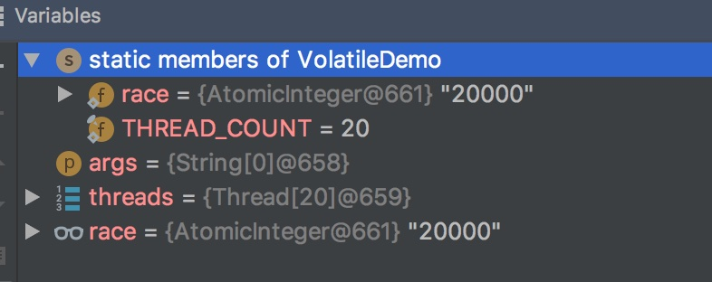

# 前言

讲到线程同步，就一定会提到 volatile关键字，那么volatile到底是什么东西呢

# 大纲


# 是什么

Java 语言规范第3版中对**volatile**的定义如下：

> Java 编程语言允许线程访问共享变量，为了确保共享变量能被准确和一致地更新，线程应该确保通过排它锁单独获得这个变量。Java语言提供了volatile，在某些情况下比锁更方便。如果一个变量被声明为volatile变量，Java所有线程看到这个变量的值应当是一致的

但是上面的最后一句话老被人误解，以为"**如果一个变量声明为volatile变量，那么他的并发运算应当是安全的**。",这个理解是**错误**的，为啥呢，在后面的可见性会说

# 有啥特性

- 可见性
- 禁止指令重排

# 可见性

可见性是指，当一个线程修改一个共享变量时，另一个线程能立即读到这个修改的值。但是这句话（或者说这个特性）**并不能保证并发运算是线程安全的**


普通的值就不行，**因为普通的值在线程间传递需要通过主内存来完成**，所以一个线程更改了数据之后，其他线程不能立即感知，需要线程更改了主内存中的值之后，其他线程再从里面读到数值才行（如果这个不太清楚可以参考我的这篇文章——[Java内存模型](https://github.com/leosanqing/Java-Notes/blob/master/ConcurrencyProgramming/0-%E5%9F%BA%E7%A1%80/Java%20%E5%86%85%E5%AD%98%E6%A8%A1%E5%9E%8B/Java%E5%86%85%E5%AD%98%E6%A8%A1%E5%9E%8B.md)）

我们来看这个例子

```java
public class VolatileDemo {
    public static volatile int race = 0;

    public static   void  increase() {
        race++;
    }


    private static final int THREAD_COUNT = 20;

    public static void main(String[] args) {

        Thread[] threads = new Thread[THREAD_COUNT];
        for (int i = 0; i < THREAD_COUNT; i++) {
            threads[i] = new Thread(() -> {
                for (int j = 0;  j< 1000; j++) {
                    increase();
                }
            });

            threads[i].start();
        }

        //等待线程全部执行完
        while (Thread.activeCount() > 1)
            Thread.yield();
        System.out.println(race);

    }
}

```

如果他的线程安全，那么输出应当是 20000，那么实际情况呢？


**他的值是不确定的**，唯一确定的是他的值不是 20000.

所以它并不能保证并发运算线程安全

## 为什么

因为他能保证每次从内存中取到的数据都是最新的，但是却不能保证上面那个加法的运算是原子的，什么意思呢？

- 就是我可能有一个线程取到了0，这个时候数据是最新的，
- 然后开始运算了，++这个步骤分为好几步，
- 可能在第2步的时候，另一个线程也读了这个数字，然后他读到的也是0(因为一开始的线程还没有完成加法，内存中还是0)，也开始了++运算
- 然后最后运算完成之后，两个线程写回去的数值都是1
- 这个时候，另一个线程开始读了，但是他读到了是1

所以这就不能保证，他们加出来的是20000

## 怎么保证线程安全

既然说了，上面的不是线程安全是因为那个加法操作不是原子操作，那么我们那个加法改成原子操作或者给加法加个锁，是不是线程就安全了呢？

**答案是正确的**，比如我们这样


```java
import java.util.concurrent.atomic.AtomicInteger;

public class VolatileDemo {
    public static AtomicInteger race = new AtomicInteger(0);

    public static  void increase() {
        race.incrementAndGet();
    }


    private static final int THREAD_COUNT = 20;

    public static void main(String[] args) {

        Thread[] threads = new Thread[THREAD_COUNT];
        for (int i = 0; i < THREAD_COUNT; i++) {
            threads[i] = new Thread(() -> {
                for (int j = 0;  j< 1000; j++) {
                    increase();
                }
            });

            threads[i].start();
        }

        //等待线程全部执行完
        while (Thread.activeCount() > 1)
            Thread.yield();
        System.out.println(race);

    }
}
```



可以看到，这个是线程安全的

他的内部是怎么实现的，用的什么方法保证是一个原子操作，可以参考我的这篇文章AtomicInteger怎么实现原子操作


还有一个就是加锁了，将increase方法声明为synchronized方法,这个时候 race 也不必声明为 volatile 变量。这种方法比上面的那种方法的效率要相对低一些

```java
  public static synchronized   void increase() {
        race++;
    }


```

## 可见性实现原理

如果一个变量声明为volatile变量，那么他的指令中会增加一个前缀 Lock

这个Lock有啥作用呢？

- 将当前缓存行的数据写回到系统内存
- 这个写回内存的操作使得其他CPU里缓存了该内存地址的数据无效


### 将当前缓存行的数据写回到系统内存

- 在最近的处理器中，Lock一般锁缓存不锁总线
- 如果访问的内存已经在缓存在处理器内部，则不会有Lock
  - 相反，他会锁这块区域的缓存并写回到内存，并使用缓存一致性来保证修改的原子性，此操作称为"缓存锁定"，
  - 缓存一致性会阻止同时修改由两个以上处理器缓存的内存区域数据

### 一个处理器的缓存回写到内存会使其他处理器中的缓存无效

- 处理器使用嗅探技术保证他的内部缓存、系统内存和其他处理器的缓存的数据在总线上保存一致


## 适合什么操作

**一个线程写，多个线程读的操作。**因为一个写不会出现覆盖问题，并且读的都是内存中的最新值

# 禁止指令重排

指令重排这个问题应该算是处理器的一个优化，但是有时候，指令重排会导致很多小问题

