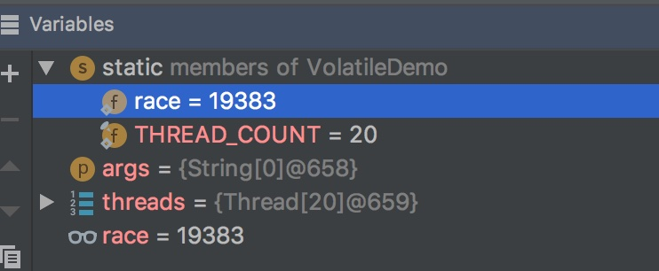

# 前言

讲到线程同步，就一定会提到 volatile关键字，那么volatile到底是什么东西呢

# 大纲


# 是什么

Java 语言规范第3版中对**volatile**的定义如下：

> Java 编程语言允许线程访问共享变量，为了确保共享变量能被准确和一致地更新，线程应该确保通过排它锁单独获得这个变量。Java语言提供了volatile，在某些情况下比锁更方便。如果一个变量被声明为volatile变量，Java所有线程看到这个变量的值应当是一致的

但是上面的最后一句话老被人误解，以为"**如果一个变量声明为volatile变量，那么他的并发运算应当是安全的**。",这个理解是**错误**的，为啥呢，在后面的可见性会说

# 有啥特性

- 可见性
- 禁止指令重排

# 可见性

可见性是指，当一个线程修改一个共享变量时，另一个线程能读到这个修改的值。但是这句话（或者说这个特性）**并不能保证并发运算是线程安全的**

我们来看这个例子

```java
public class VolatileDemo {
    public static volatile int race = 0;

    public static void increase() {
        race++;
    }


    private static final int THREAD_COUNT = 20;

    public static void main(String[] args) {

        Thread[] threads = new Thread[THREAD_COUNT];
        for (int i = 0; i < THREAD_COUNT; i++) {
            threads[i] = new Thread(() -> {
                for (int j = 0;  j< 1000; j++) {
                    increase();
                }
            });

            threads[i].start();
        }

        //等待线程全部执行完
        while (Thread.activeCount() > 1)
            Thread.yield();
        System.out.println(race);

    }
}

```

如果他的线程安全，那么输出应当是 20000，那么实际情况呢？




**他的值是不确定的**，唯一确定的是他的值不是 20000.

所以它并不能保证并发运算线程安全

## 为什么

因为