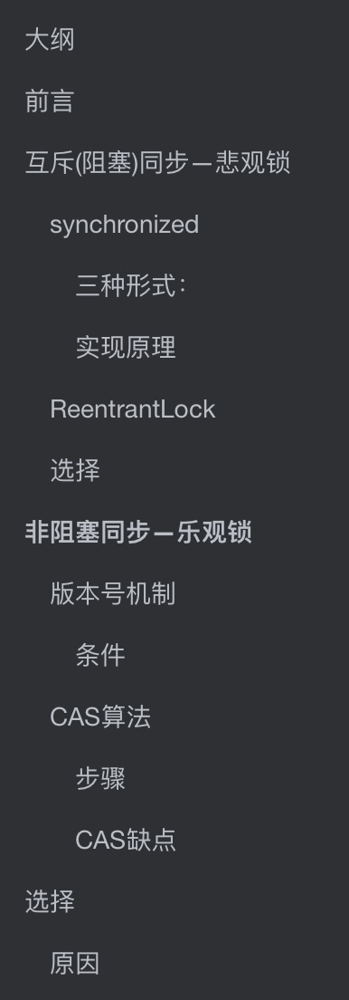
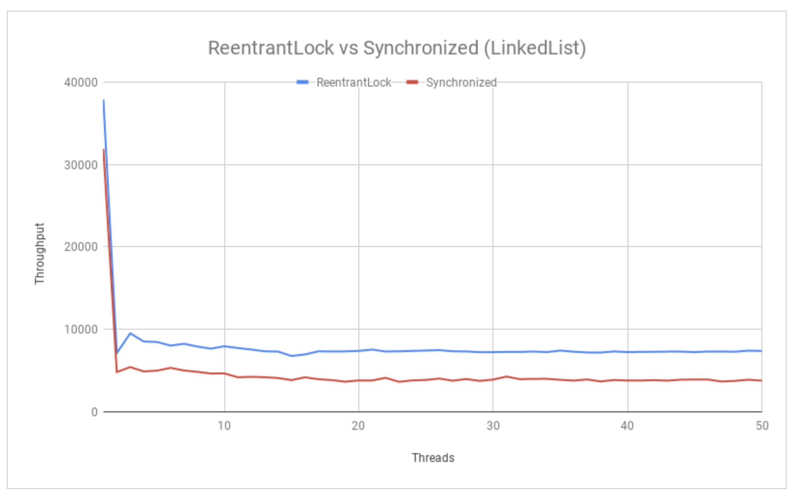
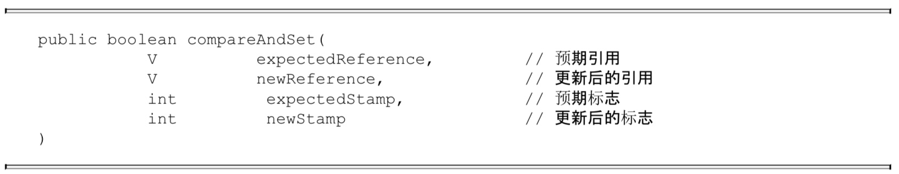

# 大纲

# 前言

悲观锁和乐观锁是面试的高频问题

我们应该有一些概念

**悲观锁**顾名思义，就是悲观的认为只要不做正确的同步措施，他就一定会出现问题

**乐观锁**是说对于数据的同步我乐观的认为不采用同步措施也不会产生问题，但是如果产生了问题我就进行补救措施，比如retry

多线程间的同步机制主要有**四种**

- 互斥量
- 临界区
- 信号量
- 事件

先不讲这四个的区别，只要先记住，Synchronized就是使用操作系统的互斥量

# 互斥(阻塞)同步—悲观锁

互斥只是同步机制的其中一个手段，也是很常见的保障并发正确性的手段

我们知道传统的锁（如synchronized或者reentrantLock）之所以被称为**重量级锁**，就是因为他使用**操作系统互斥量**来实现同步

## synchronized

这是我们相对来说最熟悉的方式，一般新手学同步的时候，我们都是采用这个关键字，但是这个方式因为是使用**操作系统信号量**，所以相对来说效率比较低

Java中 synchronized能实现同步基础：**Java中的对象都可以作为锁**

### 三种形式：

- 普通同步方法，锁的的对象的实例
- 静态同步方法，锁的是当前类的Class对象
- 对于同步方法块，锁的是括号中的配置对象 

### 实现原理

> JVM 是基于 进入和退出 **monitor对象**来实现方法同步和代码块同步

当synchronized关键字**经过编译**后，会在同步块的前后（同步代码块开始和结束或者异常的地方）分别形成 `monitorenter` 和 `monitorexit`两个字节码指令。

- 每一个monitorenter必定有一个monitorexit与之对应。当执行到monitorenter指令的时候，锁计数器加一，对应的，执行到 monitorexit ，计数器减一。**当计数器为0的时候，锁就被释放**
- synchronized同步块对于同一个线程是可重入的，不会出现自己锁死自己的情况
- 同步块在已进入的线程执行完之前，会阻塞其他线程进入访问

同步方法规范中并没有明说，但是同步方法也可是使用上面两个指令来实现

## ReentrantLock

在基本用法上，ReentrantLock和Synchronized很相似

相比Synchronized，ReentrantLock增加了如下功能：

- 等待可中断
  - 顾名思义，就是等待中的线程可以选择放弃等待，转而做其他事
  - 对于执行时间长的同步块很有帮助
- 可实现公平锁
  - 什么是公平？**先来后到**算一个，谁先申请，谁就先拿，按照申请锁的顺序来排序获取锁的顺序
  - 但是非公平锁，比如Synchronized就不是，他是随机的
  - ReentrantLock 默认也是非公平锁，但是可以通过带布尔值的构造函数来实现公平锁
- 锁可以绑定多个条件
  - 指一个ReentrantLock对象可以同时绑定多个Condition对象，
  - 在Synchronized 中，锁对象的 wait()和notify()或notifyAll()方法可以实现一个隐含的条件，如果要和多余一个条件关联的时候，就不得不额外添加一个锁
  - ReentrantLock 无须这样做，只需要多次调用newCondition()方法就行

## 选择

在最新的版本中，对于Synchronized 的优化非常大，性能已经和ReentrantLock差不太多，所以如果不是使用那些高级功能，还是建议使用 synchronized。毕竟后面还是会大力优化Synchronized

下面是JDK8下，二者性能对比（前者是自增，后者是链表）

# 非阻塞同步—乐观锁

乐观锁不需要**线程挂起等待**，所以也叫**非阻塞同步**

## 版本号机制

一般在一个数据表中加一个 version字段，表示这个数据被更新的次数，当这个数据被**修改一次**，版本号就**加一**。

### 条件

**提交版本必须大于当前记录的版本**

举个例子

> 我现在银行账户有 10元，现在有一个version字段，版本号为 1.
>
> 现在我A操作取出2元，我先读入数据  version =1，然后扣除
>
> 与此同时，B操作也要取出1元，读入数据 version =1，然后扣除
>
> 这个时候，A操作完成，上传数据，版本号加一，version=2，这个版本大于当前的记录值 1，所以更新操作完成
>
> 这个时候，B操作也完成了，也要更新，他的版本号加一，version=2，然后更新的时候发现这个版本号和当前记录的版本号相同，不满足提交版本号必须大于当前记录的版本号的条件，不允许更新
>
> 这个时候，B操作就要重新读入再重复之前的步骤

通过这样的方法，我们就保证了B操作不会将A操作所更新的值覆盖，保证了数据的同步

## CAS算法

CAS算法是基于硬件的发展产生的。为什么呢，因为我们需要这两个原子步骤

- 操作
- 冲突检测

但是我们如何保证上面的两个步骤是安全的？肯定不能使用**互斥同步**，如果使用了也不是非阻塞式了。这个时候我们就要依赖**硬件指令**了，**让看似很多步骤的命令，能够使用一条指令就能完成**，比如：

- 测试并设置
- 获取并增加
- 交换
- 比较并交换（CAS）
- 加载链接/条件存储（LL/SC)

前面的三条是很早之前就有的指令，后面的两条是现代的处理器才有的指令

### 步骤

CAS有三个数。

- V,内存位置 
- A，旧值
- B，新值 

当且仅当V的值符合A的值的时候，处理器才会使用B值来更新V中的值；否则他就不执行更新。（上述比较和更新是一个原子操作）。一般情况下这个操作是**自旋的**，也就是会不断尝试，直到完成

### CAS缺点

- ABA问题
  - 因为他是要比较V中的值和A值是否相等（更准确的是V中的值是否发生变化），但是如果相等就能说明他没有发生变化吗?显然是不行的，因为这个V的值可能一开始是A，后面变成了B，然后又变成了A。显然这样子V的值和A是相等的，但是却发生了变化。
  - 解决方法，给他加个版本号。
    - 每次更新，版本加一。`变成1A -> 2B -> 3A` 
    - 在JDK1.5之后，就有这个类`AtomicStampedReference`,然后可以使用`compareAndSet`方法。他首先检查当前引用是否为预期引用，然后检查当前标志是否等于预期标志
  - 
- 循环时间长，开销大
  - 如果CAS不成功，他会一直消耗CPU的性能
  - 如果JVM能支持处理器提供的`pause`指令，性能会有一定提升
    - 他可以延迟流水线执行指令，使CPU不会消耗过多资源
    - 避免退出循环的时候，因为**内存顺序冲突**而导致流水线被清空，从而提高性能
- 只能保证一个共享变量的原子操作
  - 如果操作一个共享变量，使用 CAS是可行的
  - 如果操作多个变量，那就需要使用锁或者把它整合成一个变量
    - JDK1.5之后，有`AtomicReference`类，可以把多个变量放到一个对象中，从而使用CAS操作

# 选择

> 悲观锁适合写，乐观锁适合读

- 如果写操作多，会有很多线程冲突，那么这个时候选择悲观锁；如果读操作多，那么线程冲突比较少，这个时候选择乐观锁

## 原因

- 写操作多，竞争资源情况多，CAS会因为自旋而浪费CPU资源
- 读操作多，竞争资源情况少
  - 使用悲观锁会让线程阻塞，并且会让线程在用户态和内核态来回切换(可以看我这篇文章，[Java与线程](https://github.com/leosanqing/Java-Notes/blob/master/ConcurrencyProgramming/0-%E5%9F%BA%E7%A1%80/%E7%BA%BF%E7%A8%8B%E5%AE%9E%E7%8E%B0/%E7%BA%BF%E7%A8%8B%E5%AE%9E%E7%8E%B0.md))