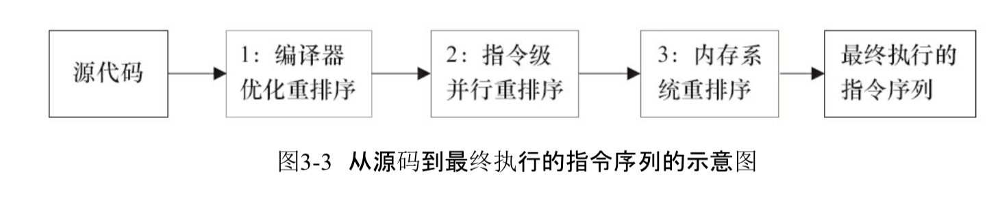

# 啥是指令重排

简单说就是编译器还有处理机为了提高程序执行的效率，将指令进行重新排序的一种现象

## 指令重排类型

- 编译器优化的重排序
  - 编译器在不改变**单线程**程序语义的前提下，可以重新安排程序的执行顺序
- 指令级并行的重排序
  - 现代处理器采用了指令级并行技术来将多条指令重叠执行。如果**不存在数据依赖**，就可以改变语句对应的机器指令的顺序
- 内存系统的指令重排
  - 由于处理器使用 缓存和读/写缓冲区，使得加载和存储操作看上去可能是无序的

## 可能经历的步骤

# 为啥指令重排