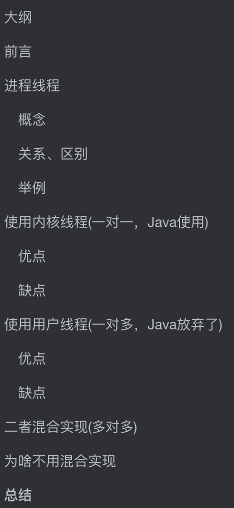
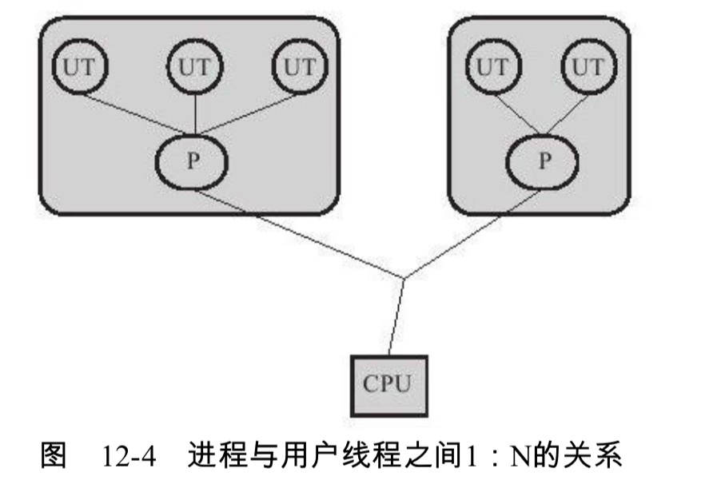
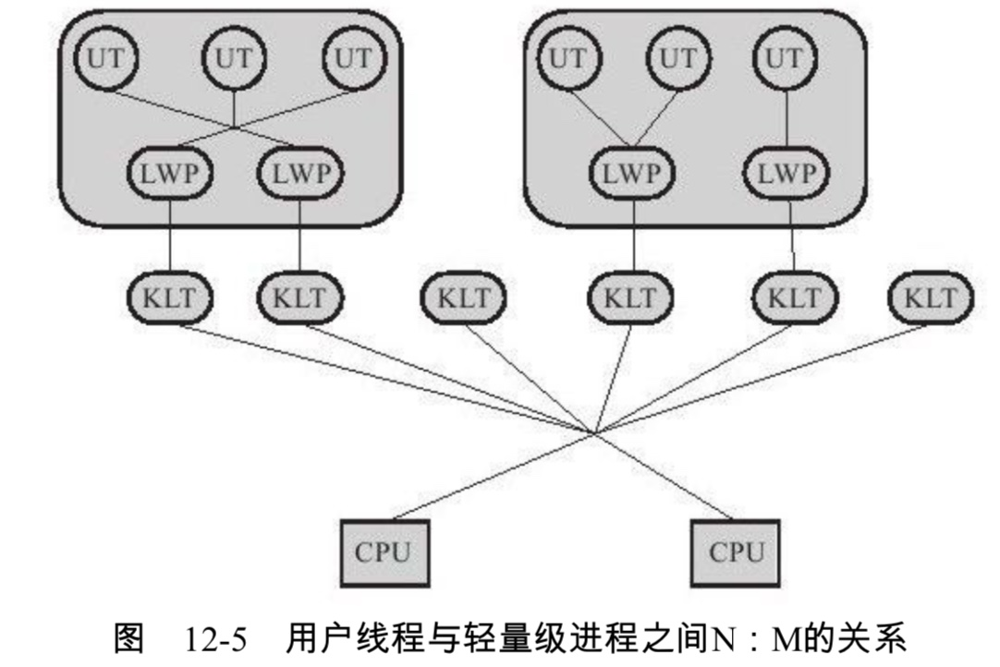
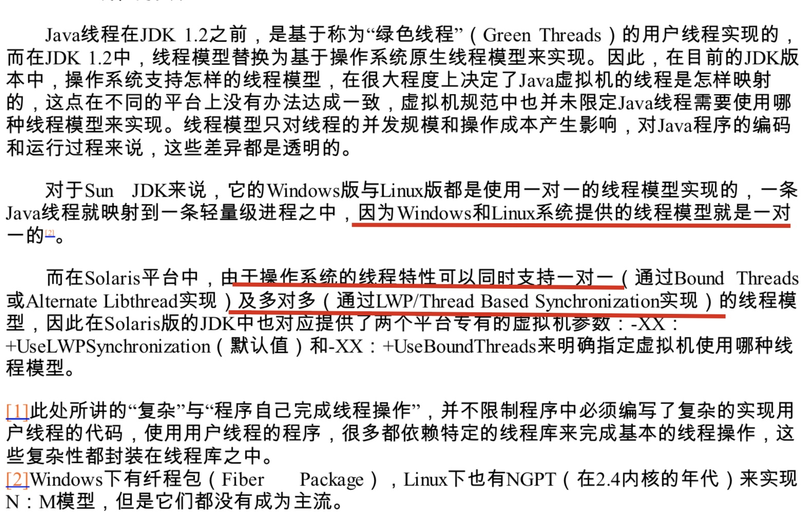

# 大纲

# 前言

并发不一定需要线程，有些语言他实现并发并不是线程而是进程，比如PHP的多进程并发。但是Java中讨论的并发，一般都是和线程脱不开关系，所以要先看下Java的线程如何实现

线程的实现一般分为三种

- 使用内核线程实现
- 使用用户线程实现
- 二者混合实现

# 进程线程

## 概念

- 线程是cpu调度和执行的单位
- 进程是cpu拥有独立资源的基本单位，是cpu资源分配的单位

## 关系、区别

- 很像工厂和工人的区别，或者火车和车厢的关系，但不是非常准确
- 一个进程拥有至少一个线程，线程必须依赖进程存在
- 进程拥有独立资源的单位，线程不拥有系统资源，但是可以访问属于进程的资源
- 进程切换代价大，线程切换代价小
- 进程可以并发执行，同一个进程的线程也可以并发执行

## 举例

我们在用chrome浏览器，我们可以一边听着歌，一边下东西，一边浏览网页

而进程就是这个chrome浏览器运行程序，我们听歌，下东西，浏览网页能同时做，就是因为可以多个线程同时运行，也就是多线程并发

这个能同时执行几个线程，就要看CPU是几核，正常情况是一对一的关系

而我们人一般只能执行一个线程，其实没有所谓的一心多用，因为只有一个大脑，不然就能左手画圆，右手画方了（当然，这是我自己的想法）。你看着我们好像可以一边听歌，一边走路或者干其他事

应该就是我们切换速度特别快，可能比现在电脑的cpu还快。然后利用一些惯性，完成剩下的事，比如走路你都抬起来了，不能停在半空吧，就算不控制也会由于重力和惯性完成剩下的动作。

# 使用内核线程(一对一，Java使用)

先上图

- 内核线程(KLT,Kernel-Level Thread)使用操作系统内核来支持线程执行，这种线程由内核来完成切换
- 使用线程调度器(Thread Scheduler)对线程进行调度，并且将各个线程的任务映射到处理器上(CPU)。每个内核线程可以看做内核的分身，这样操作系统就可以同时处理多个任务，支持多线程的
- 程序一般不直接使用内核线程，而是操作内核线程更高级的接口——轻量级进程(LWP,Light Weight Process)，这个轻量级进程就是我们通常意义上的**线程**
- 因为每个轻量级进程都会有一个内核线程支持，所以必须先要支持内核线程才能有轻量级线程

## 优点

- 由于有轻量级线程，CPU的资源分配(进程)和执行(轻量级进程,也就是线程)分开了
- 由于有内核线程，每个轻量级进程都成了一个**独立的调度单位**(所以说线程是资源调度的基本单位)。这样，当出现线程阻塞的时候，另外的线程也可以进行工作，不会影响整个进程的工作

## 缺点

- 轻量级线程是基于内核线程实现的，所以线程的各种操作，如创建等，都需要系统进行调用，而系统调用的**代价会很高**，会在用户态和内核态之间来回切换
- 因为轻量级进程是基于内核线程实现的，所以每个线程都会消耗一定的内核资源。所以一个系统**能支持的线程是有限**的

# 使用用户线程(一对多，Java放弃了)

- 广义：广义上说，只要不是内核线程那就是用户线程(UT，User Thread)，所以轻量级进程也可以说是用户线程，但是轻量级进程必须由内核线程来支持，很多操作都需要系统的调用，所以效率不是很高
- 狭义：狭义上说，用户线程是指**完全建立在用户空间线程库上，系统内核不能感知线程存在**的实现
- 线程的建立、同步、销毁完全是用户态完成的，如何处理得当，不需要切回到内核线程，因此效率可以更高，并且支持更多的线程
- 部分高性能数据库中的多线程就是使用用户线程这种方式实现的

## 优点

- 效率更高，不需要切换回内核态，
- 可以支持更多的线程数量

## 缺点

- 线程的操作都需要用户在程序自己完成
- 由于操作系统只把资源分配到进程，所以像 线程阻塞，"多处理器中如何将用户线程映射到处理器上"这些问题的处理将尤其困难和复杂，甚至不可能完成
- Java、Ruby曾经使用这种方式实现，但最后放弃

# 二者混合实现(多对多)

- 好像结合了二者的优点
- 用户线程还是在用户空间中，因此线程的创建，析构等操作依然廉价(用户线程的优点)，而且支持大规模的并发
- 操作系统提供的轻量级进程则作为用户线程和内核线程之间的桥梁，这样就可以使用内核提供的线程调度功能和处理器映射(解决了用户线程的缺点)，并且用户线程由轻量级线程完成，降低了整个进程被阻塞的风险

# 为啥不用混合实现

我在网上搜了很多，关键字是 "内核线程和用户线程混合实现 缺点"

好像没有找到答案，我在《深入理解Java虚拟机》这本书中好像是找到了答案(当然这个是我自己的理解，仅供参考)

**应该是操作系统自身支持的原因**

# 总结

|   模式   |                           优点                           |                       缺点                       |
| :------: | :------------------------------------------------------: | :----------------------------------------------: |
| 内核线程 | 出现阻塞，不影响整个线程的进度 将资源的分配和执行分离 |        效率低，消耗大 可并发的线程不多        |
| 用户线程 |      消耗低，不需要切回内核线程 可以支持大量线程      | 很多操作需要用户自己完成 阻塞调度问题不好解决 |
| 混合模式 |                       二者优点结合                       |              可能需要操作系统的支持              |

