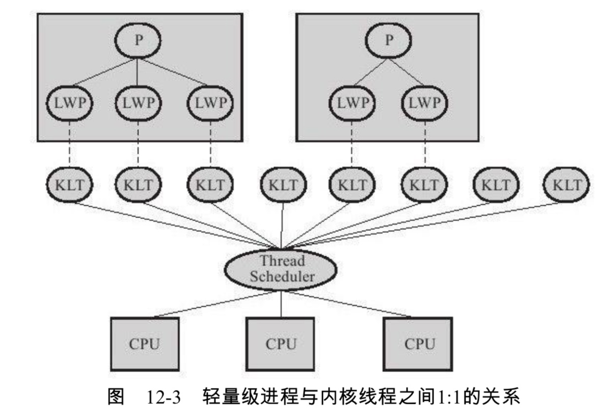

# 大纲

# 前言

并发不一定需要线程，有些语言他实现并发并不是线程而是进程，比如PHP的多进程并发。但是Java中讨论的并发，一般都是和线程脱不开关系，所以要先看下Java的线程如何实现

线程的实现一般分为三种

- 使用内核线程实现
- 使用用户线程实现
- 二者混合实现

# 进程线程

## 概念

- 线程是cpu调度和执行的单位
- 进程是cpu拥有独立资源的基本单位，是cpu资源分配的单位

## 关系、区别

- 很像工厂和工人的区别，或者火车和车厢的关系，但不是非常准确
- 一个进程拥有至少一个线程，线程必须依赖进程存在
- 进程拥有独立资源的单位，线程不拥有系统资源，但是可以访问属于进程的资源
- 进程切换代价大，线程切换代价小
- 进程可以并发执行，同一个进程的线程也可以并发执行

## 举例

我们在用chrome浏览器，我们可以一边听着歌，一边下东西，一边浏览网页

而进程就是这个chrome浏览器运行程序，我们听歌，下东西，浏览网页能同时做，就是因为可以多个线程同时运行，也就是多线程并发

这个能同时执行几个线程，就要看CPU是几核，正常情况是一对一的关系

而我们人一般只能执行一个线程，其实没有所谓的一心多用，因为只有一个大脑，不然就能左手画圆，右手画方了（当然，这是我自己的想法）。你看着我们好像可以一边听歌，一边走路或者干其他事

应该就是我们切换速度特别快，可能比现在电脑的cpu还快。然后利用一些惯性，完成剩下的事，比如走路你都抬起来了，不能停在半空吧，就算不控制也会由于重力和惯性完成剩下的动作。

# 使用内核线程(一对一)

先上图

- 内核线程(KLT,Kernel-Level Thread)使用操作系统内核来支持线程执行，这种线程由内核来完成切换
- 使用线程调度器(Thread Scheduler)对线程进行调度，并且将各个线程的任务映射到处理器上(CPU)。每个内核线程可以看做内核的分身，这样操作系统就可以同时处理多个任务，支持多线程的
- 程序一般不直接使用内核线程，而是操作内核线程更高级的接口——轻量级进程(LWP,Light Weight Process)，这个轻量级进程就是我们通常意义上的**线程**
- 因为每个轻量级进程都会有一个内核线程支持，所以必须先要支持内核线程才能有轻量级线程

# 使用用户线程实现

# 二者混合实现

