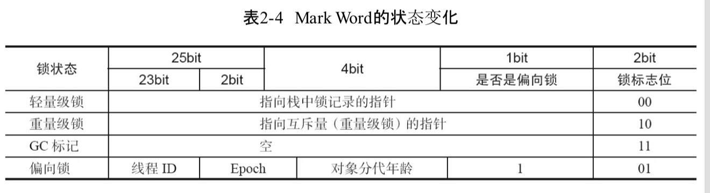
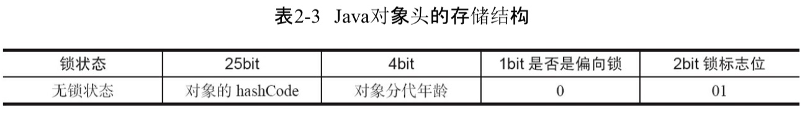
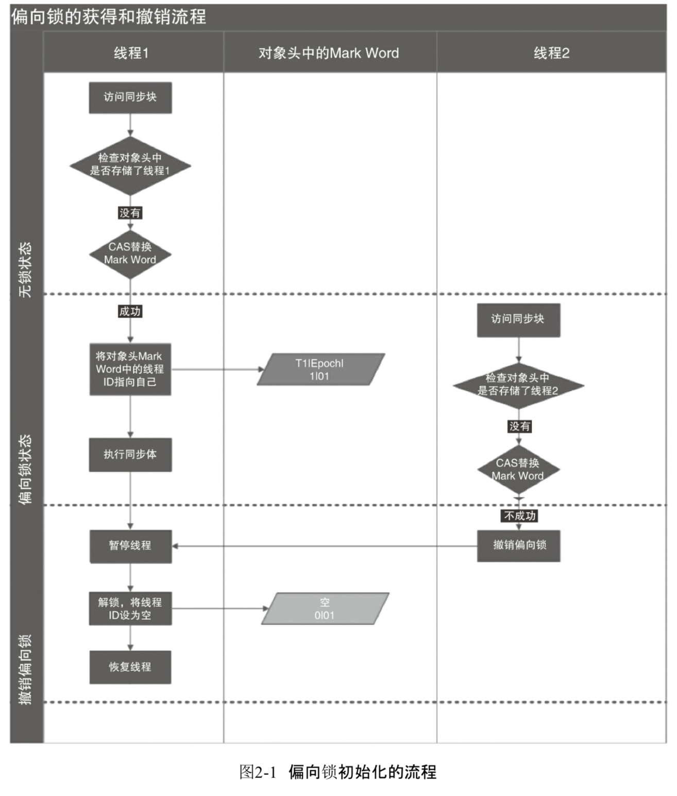
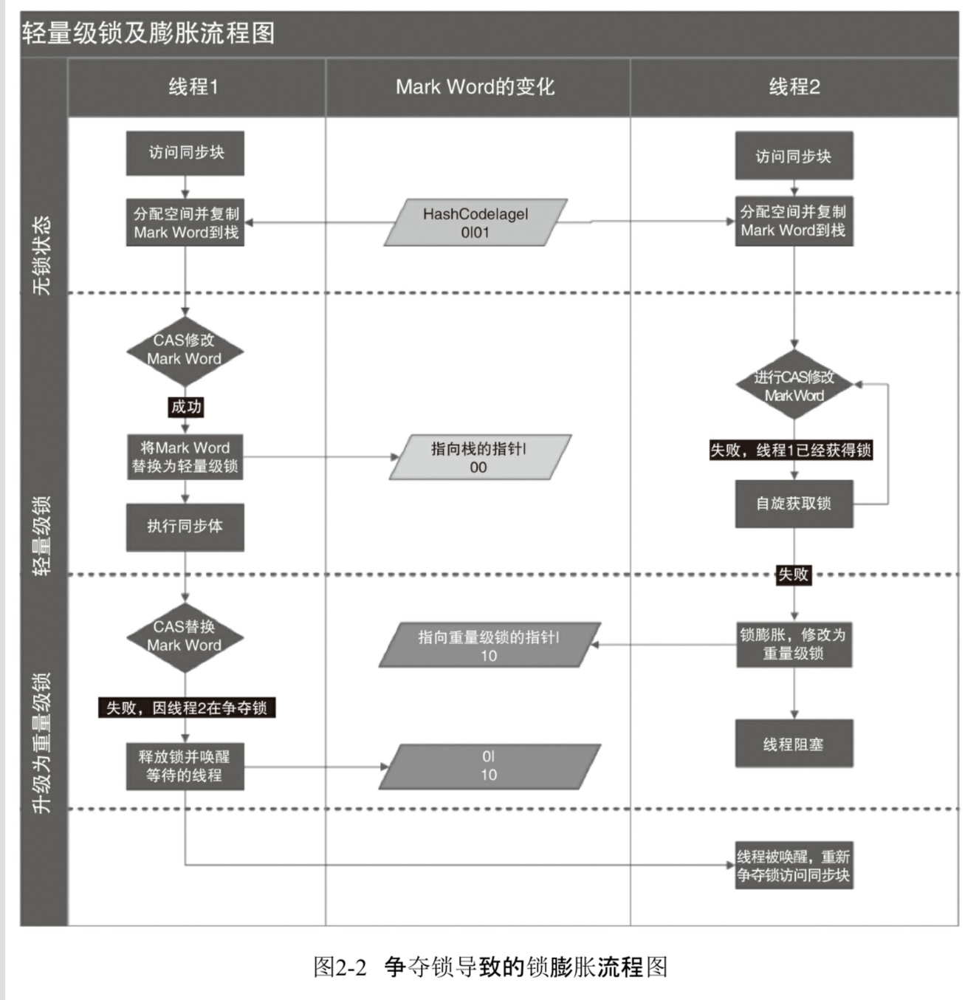
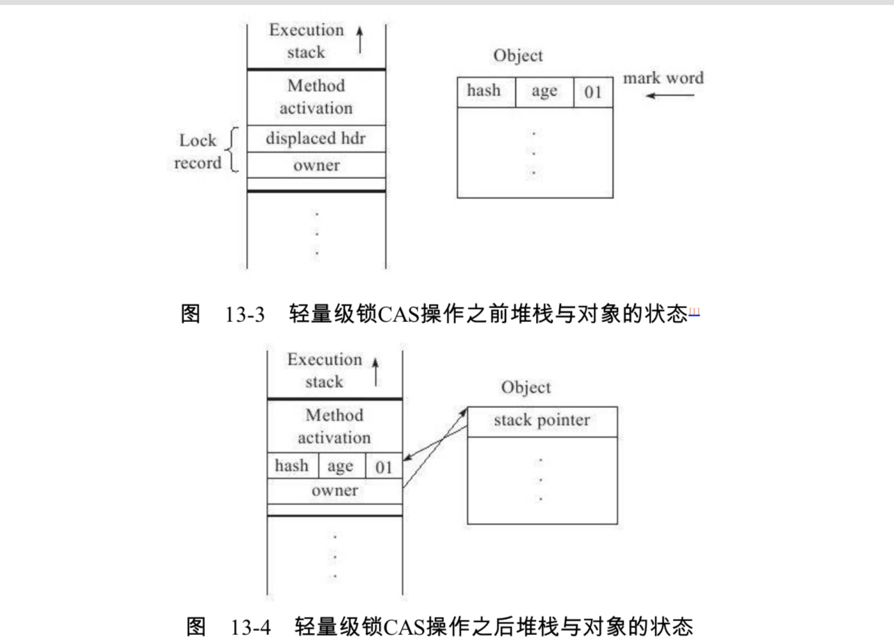
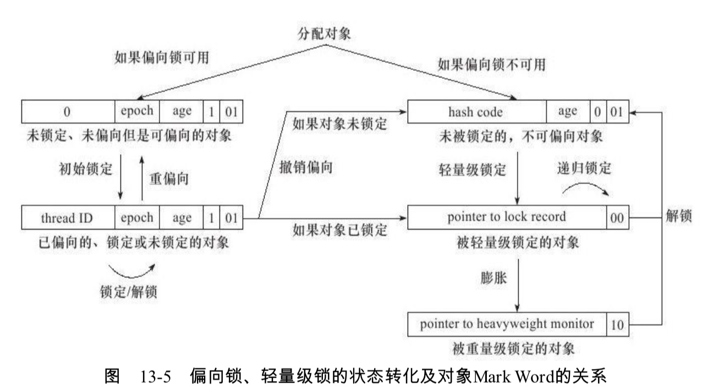

# 大纲

# 前言

在JDK1.6以后，为了减少消耗，锁进行了很多的升级。并且有了四种状态，从低到高

- 无锁状态
- 偏向锁状态
- 轻量级锁状态
- 重量级锁状态

下面就介绍一下这四种不同等级的锁

**不同等级间的锁可以进行升级，但是不能进行降级**

# 对象内存布局

在讲锁之前我们应该了解对象的内存布局，因为后面锁的判定时需要用到，

该内容可以看我的这篇文章，[对象的内存布局](https://github.com/leosanqing/Java-Notes/blob/master/JVM/%E5%AF%B9%E8%B1%A1%E7%9A%84%E5%86%85%E5%AD%98%E5%B8%83%E5%B1%80/%E5%AF%B9%E8%B1%A1%E7%9A%84%E5%86%85%E5%AD%98%E5%B8%83%E5%B1%80.md)，重点看对象头中的运行时数据(Mark Word)

看了这个你应该知道，Mark Word(以后简称MW) 会随着 **标志位的变化而变化**

## MW变化

**先把他放出来，免得等会儿你自己翻** 

# 无锁状态

> 可以看到，这种情况下，MW被分为了四个部分，他锁的标志位为 01，是否是偏向锁标志位为 0.

# 偏向锁(biasedLock)

先看MW变化(在对象头变化的那一张图片中)

可以看到，他的**锁标志位**和**无锁**的标志位是一样的 都是 01，但是是否是偏向锁的标志位就变了 变成了 1.并且整个MW部分变成了5部分

## 目的

经过研究发现，**大多数情况下**，锁**不仅不存在**多线程竞争，而且总是由**同一线程**多次获得，为了**让线程获得锁**的**代价更低**而引人了偏向锁

偏向锁，就如同他的名字一样，"偏向"，"偏心"，英文"biased"也是偏爱的意思。

他为啥是叫这个呢，**因为这个锁偏向于第一个获取到他的线程**，如果在接下来的执行过程中，该锁**没有被其他的线程**获取，则持有偏向锁的线程将**永远不需要**再进行同步

## 步骤

上面一共被分为三大部分，

- 无锁状态
- 偏向锁状态
- 撤销偏向锁

上面的图中，线程一演示了偏向锁的**初始化流程**，线程2演示了偏向锁**撤销的过程**

### 初始化过程

- 当锁对象**第一次**被线程获取的时候，虚拟机会将对象头中的锁标志位置为 "01"(偏向模式)
- 同时，使用CAS(如果不了解CAS，可以看这篇文章，[悲观锁和乐观锁](https://github.com/leosanqing/Java-Notes/blob/master/ConcurrencyProgramming/0-%E5%9F%BA%E7%A1%80/%E6%82%B2%E8%A7%82%E9%94%81%E5%92%8C%E4%B9%90%E8%A7%82%E9%94%81/%E6%82%B2%E8%A7%82%E9%94%81%E5%92%8C%E4%B9%90%E8%A7%82%E9%94%81.md))操作，把获取到这个锁的**线程的ID**记录在对象的MW中，
- 如果 CAS成功，持有偏向锁的线程每次进入这个锁相关的同步块时，虚拟机可以不进行任何同步操作
  - 

### 撤销过程

- 首先暂停拥有偏向锁的线程
- 然后检查持有偏向锁的线程是否活着
  - 不活跃，将对象头设置成无锁状态 (标志位"01"，但不可偏向)
  - 活，
    - CAS成功，重新偏向，更改线程ID
    - 失败，恢复成无锁状态，或者变成轻量级锁定状态。

# 轻量级锁

标志位为"00"，可以看最开始的图

为啥叫轻量级锁，因为这是相比于传统的**重量级锁**而言，原来传统的重量级锁，使用的是**系统互斥量**实现的

他的出现并不是代替重量级锁，**而是在没有多线程竞争的前提下，减少系统互斥量操作产生的性能消耗**

## 步骤

先看图

### 加锁

- 线程在执行同步块之前，JVM会现在当前线程的**栈帧**中创建用于存储**锁记录**（下图的LockRecord）的空间，并将对象头中的MW复制到**锁记录**中，官方称为 Displaced Mark Word
- 然后，虚拟机将使用CAS操作，将对象的MW更新为指向**锁记录**的指针
  - 如果这个操作成功，那么该线程就有了该对象的锁，并且对象的MW的锁标志位置为 "00"，表示该对象处于轻量级锁定状态
  - 如果更新失败，表示其他线程竞争锁，当前线程尝试使用**自旋**来获取锁

### 解锁

- 使用CAS操作将 Displaced Mark Word 替换回到对象头
  - 如果成功，则说明没有发生竞争
  - 失败，则表示当前锁存在竞争，锁就会膨胀成重量级锁
    - 释放锁，并且唤醒等待的线程

## 缺点

轻量级能提升程序同步性能的依据是"对于绝大部分的锁，**在整个同步周期内都是不存在竞争的**"，这是一个经验数据。

- 如果没有竞争，轻量级锁使用CAS操作，避免使用互斥量
- 如果存在竞争，除了互斥量的开销，还有 CAS的操作，不仅没有提升，反而性能会下降

# 各个锁之间的转换

# 对比

|    锁    |                             优点                             | 缺点                                           |                适用场景                |
| :------: | :----------------------------------------------------------: | ---------------------------------------------- | :------------------------------------: |
|  偏向锁  | 加锁和解锁都不需要额外的消耗，和执行非同步方法相比仅存在纳秒级的差距 | 如果线程间存在锁竞争，会带来额外的锁撤销的消耗 |         只有一个线程访问同步块         |
| 轻量级锁 |           竞争的线程不会阻塞，提高了程序的响应速度           | 如果始终得不到锁竞争的线程，使用自旋会消耗CPU  | 追求响应时间 同步块执行速度非常块 |
| 重量级锁 |               线程竞争不使用自旋，不会消耗CPU                | 线程阻塞，响应时间慢                           |   追求吞吐量 同步块执行时间较长   |

