# 前言

当你在阅读源码的时候，看到那些继承来实现去的各种类和接口，是不是已经不知道他的爸爸(父类)是谁，他的爷爷(父类的父类)是谁，只知道他的祖宗是谁(Object类)？毕竟类之间的关系太说不清道不明，只能说一句"贵圈真乱"

没关系，Idea有一个超级强大并且非常实用的东西，可以让你一下子就搞清楚他们之间那些，轻松搞定他们之间的关系，毕竟谁也不想喜当爹，"我怎么突然多了一个内部类，他是不是我的内部类"。看看接口那么绿就知道，他自己有多少孩子都不知道

多的不说了，先看效果图：这个主题的风格真的对我的胃口(极客的感觉)，Idea的主题风格都是比较好看的

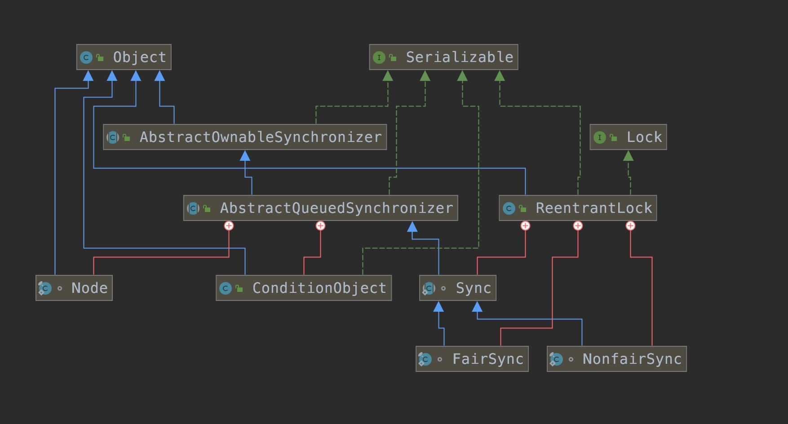

# 线代表的含义

蓝色实线 --> 继承

绿色虚线 --> 实现

红色实现 --> 内部类

我们以 ReentrantLock 举例

## 原谅色

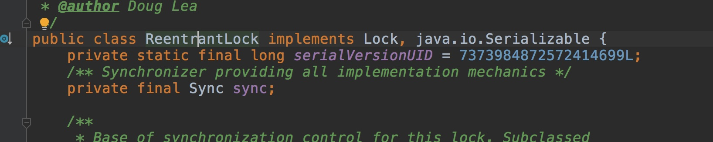

我们看他实现了 Lock和Serializable 接口，所以类图关系上展示的就是绿色的虚线

接口根本不知道自己有多少个孩子(实现类)，当真原谅色

## 红色

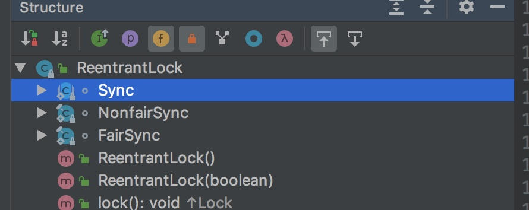

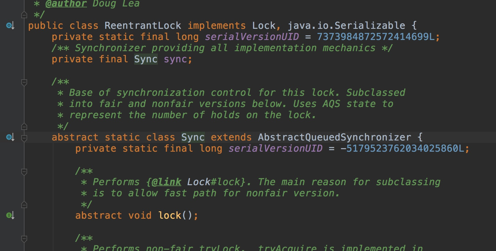

我们看到，Sync这个抽象类是 ReentrantLock类的内部类，我们再看类图关系中，他就是用红色线表示关系

不信我们再看看另一个类 AbstractQueuedSynchronizer

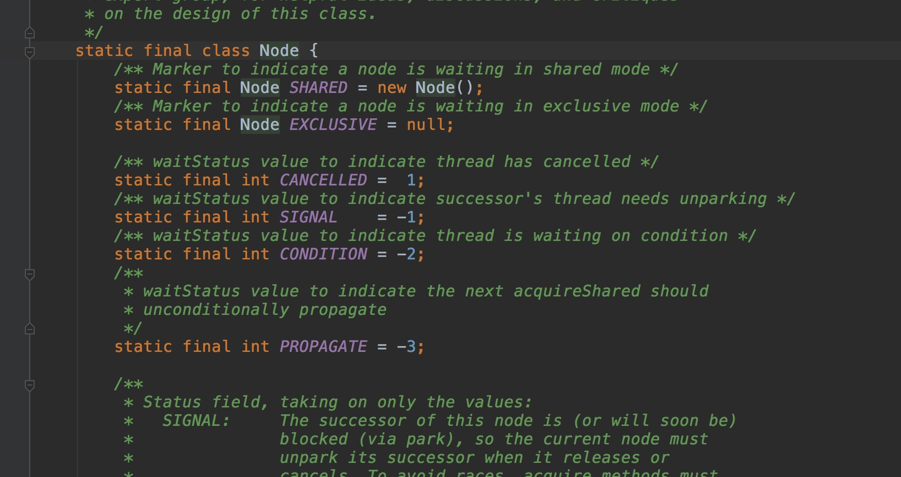

## 蓝色

Sync 继承自AbstractQueuedSynchronizer，并且所有的类(除了Object)，都继承自Object，所以所有的类的蓝色线都会指向Object

# 怎么搞出来

## 选中类，右键

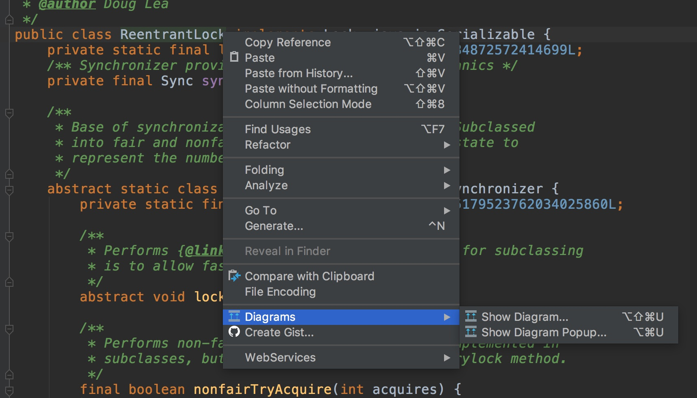

## 两种模式

- 第一个就是我一开始展现的那种，他会单独在另一个窗口打开
- 第二个他会直接在类的旁边弹出一个窗口，显示关系

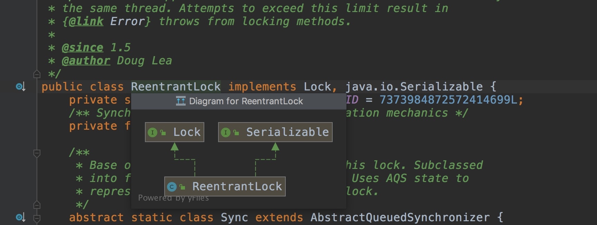

我们主要以第一个为例展示，怎么一步步展现出那么多类，找出他的那么多父亲、叔叔，爷爷，还有祖宗

# 找出他的隐藏亲戚

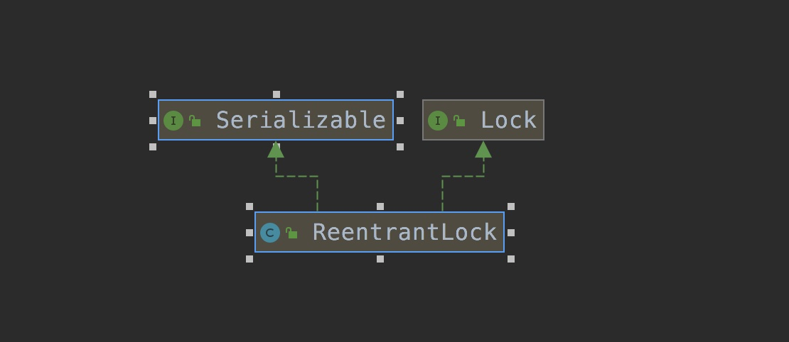

我们一进去是这样的，并不是我开头的那样，各种说不清的父亲叔叔，因为它一开始只显示直接父类和实现的接口

## 先找他的父亲

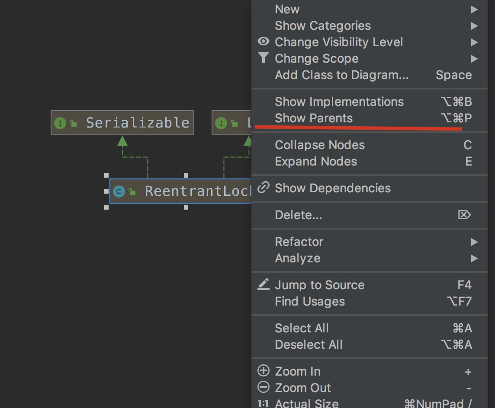

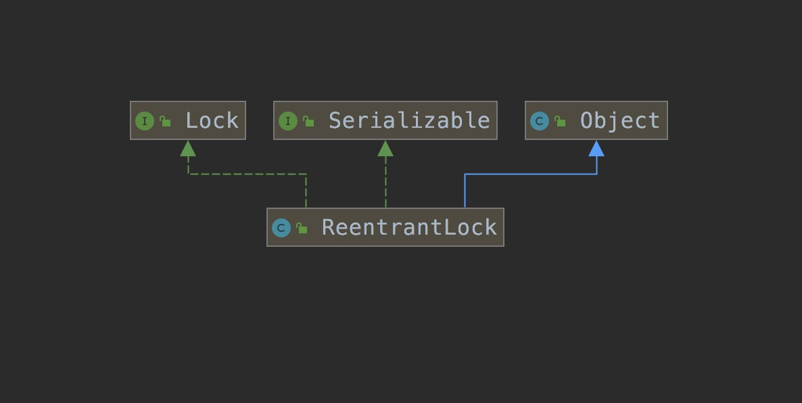

ReentrantLock 是一个富二代，他没有爷爷，祖宗，只有一个爸爸。因为他没有继承除了Object之外的类

## 找他的养子(内部类，不是继承自他的)

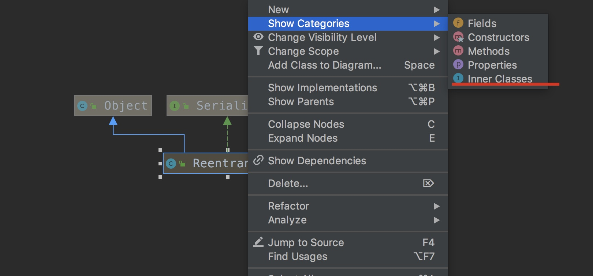

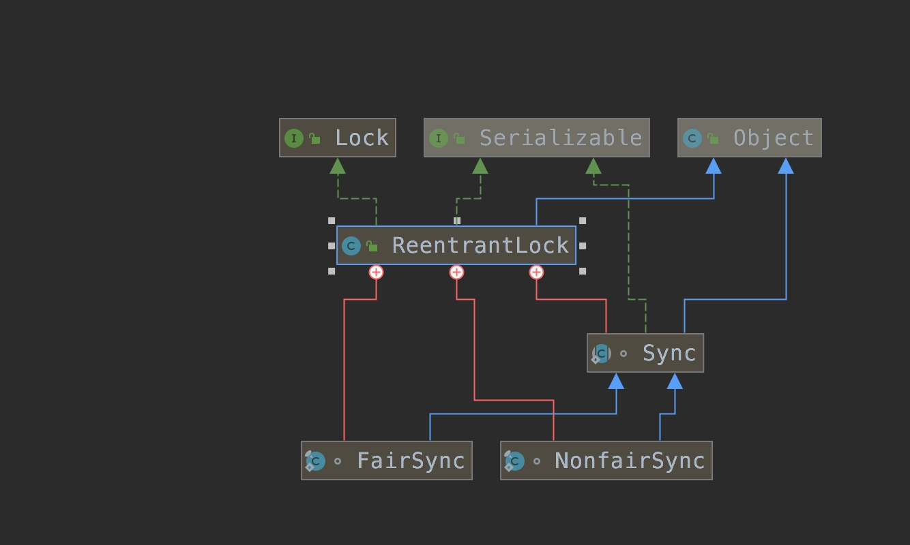

## 过滤、筛选

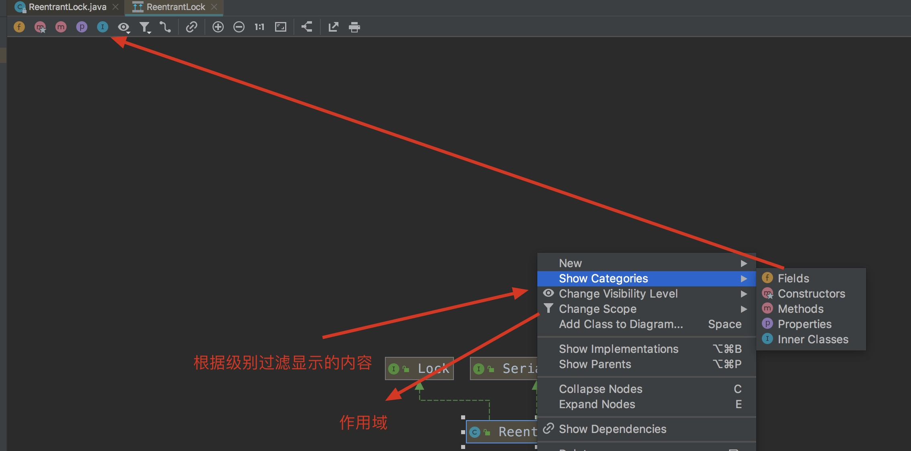

## 连找两下Sync的父类

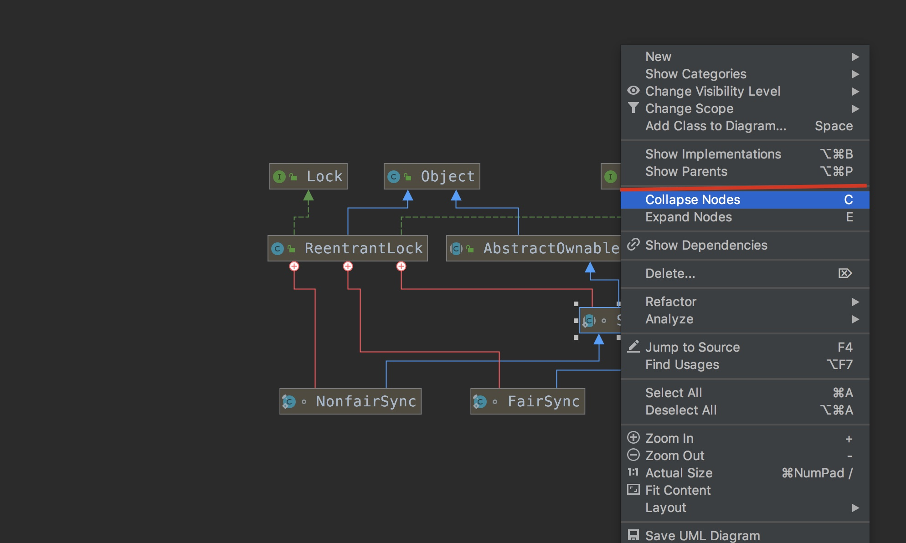

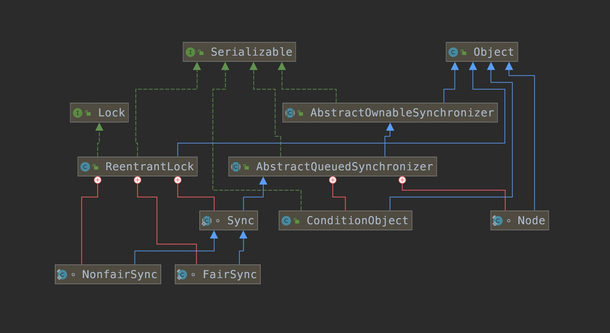

就成了一开始进来的时候的图

# 进入源码

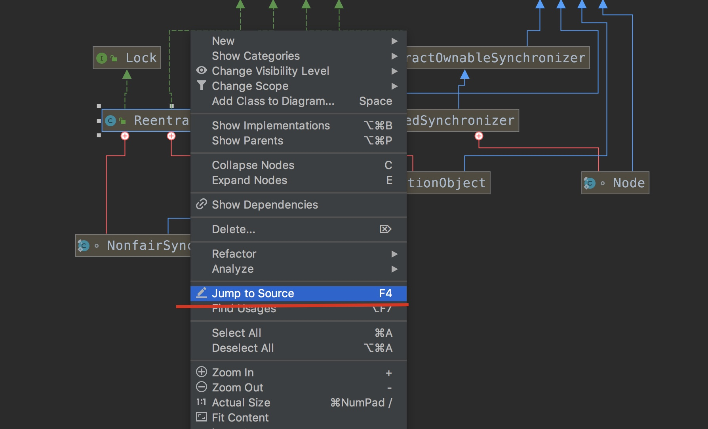

这样就可以直接跳转进源码

# 添加其他类

有的时候你觉得这个类不是你想要的，你还要横向对比，找出他的叔叔(爷爷相同，但是没有直接的继承关系)或者兄弟姐妹(父亲相同的类)

你可以直接右键选择这个

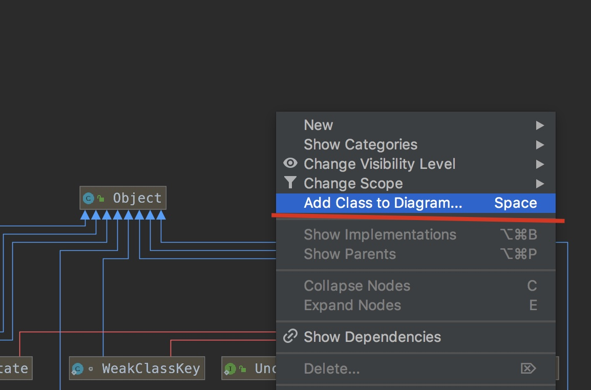

然后输入你想添加的类，比如Thread类

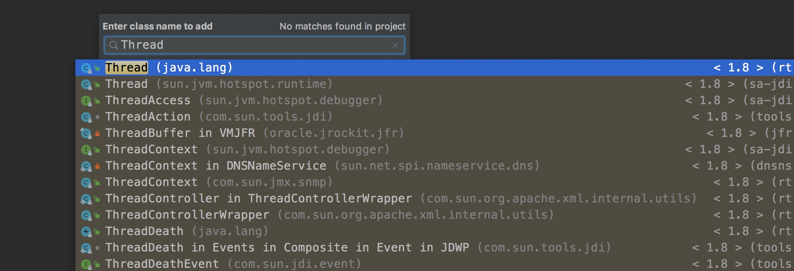

然后就会添加进来，如果他们两个没有关系(如果是类都会有关系，毕竟都继承自Object，但是如果父类没有加载出来，就认为没有关系)，那么就不会有连线，比如我们删除Object类

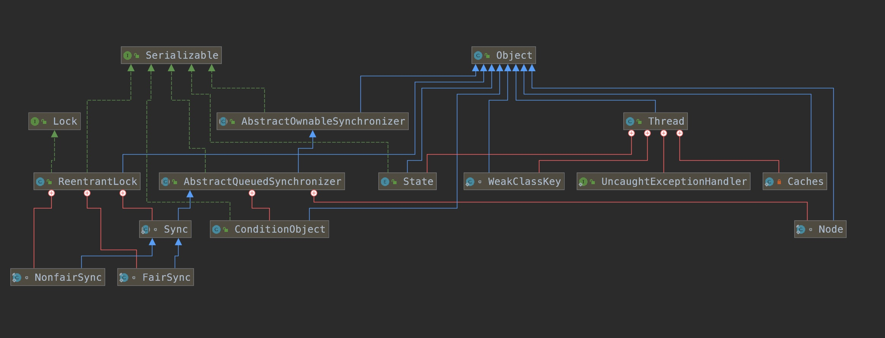

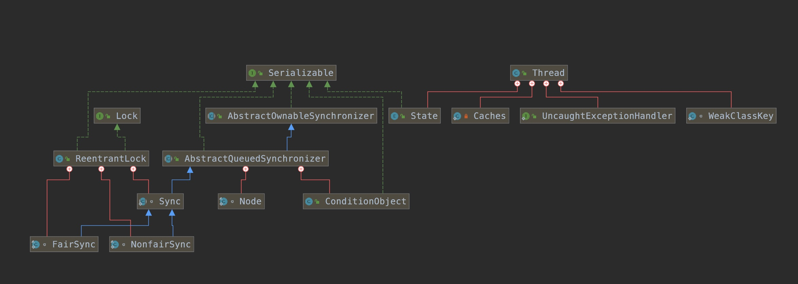

# 最后

有了这样的东西，我想你不论是阅读源码还是做什么，你应该都不会搞不清楚类和类/(接口)之间的关系了

祝大家都能开开心心的阅读源码，解读他们之间的关系

