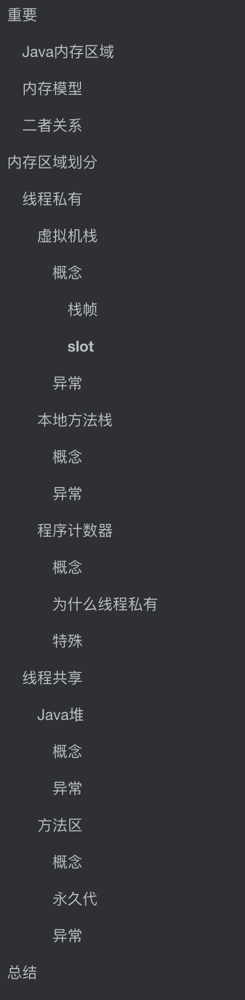
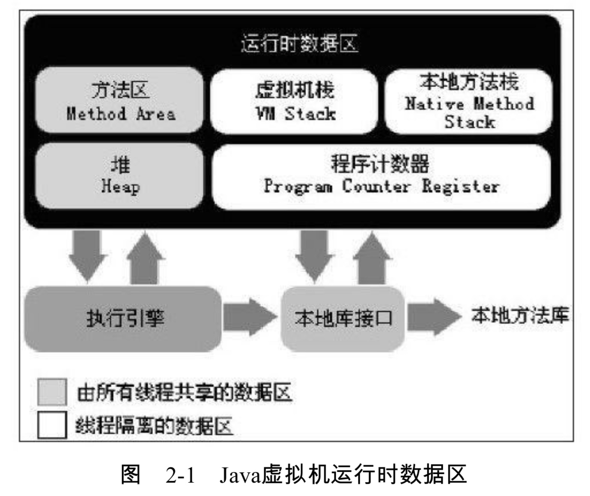
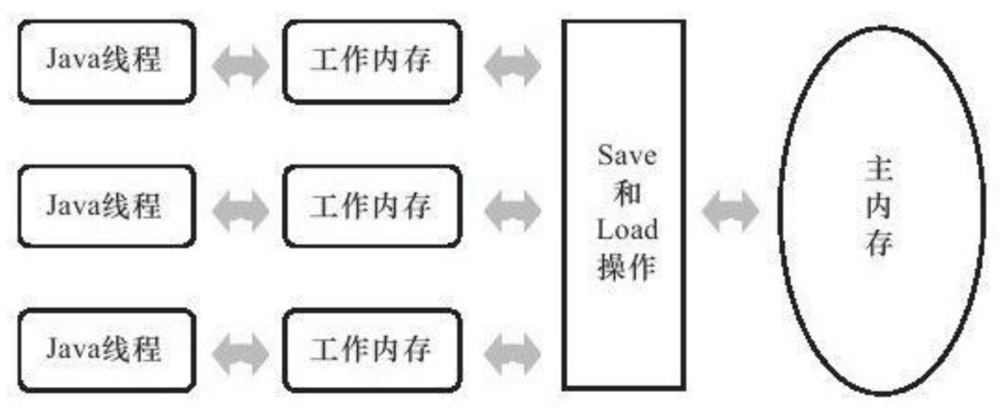
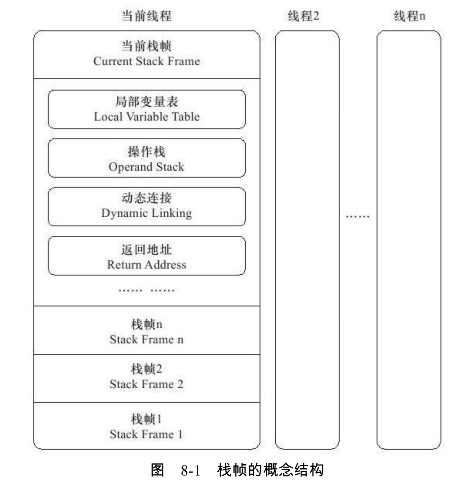
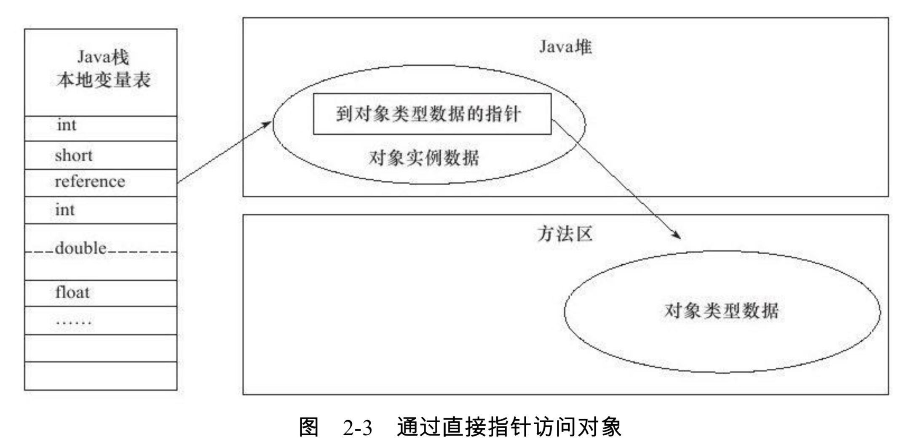

# 大纲




# 重要

阅读这篇文章前，一个重要的概念要弄清楚。

**Java 内存区域和 Java 内存模型（JMM）是两个概念**

很多人，包括写博客的一些人，他们自己都搞不清楚这两个啥意思，我搜出来文章很多将两者混为一谈的。

我用这个名字做标题也是让很多不太清楚的朋友都能搜到这篇文章，然后搞清楚概念。这篇文章讲 **Java内存区域**，如果你是想了解内存模型的话，可以看我的这篇文章 Java内存模型。当然如果你是面试的话，一般是问你Java内存区域(JVM运行时数据区)，所以我先写这一篇文章  Java内存模型(JMM)

## Java内存区域

Java内存区域是这样的：




## 内存模型

内存模型是这样的




## 二者关系

> 引用《深入理解Java虚拟机》里的原话:"这里所讲的主内存、工作内存与本书第2章所讲的Java内存区域中的堆，栈、方法区等并不是同一层次的内存划分，这两者基本上是没有关系的，如果两者一定要勉强对应起来，那从变量、主内存、工作内存的定义来看，主内存主要对应于Java堆中的对象实例数据部分，而工作内存则对应于虚拟机栈中的部分区域"

# 内存区域划分


Java运行时数据区可以分为两类：

- 线程私有
  - 虚拟机栈
  - 本地方法栈(不是所有JVM都有，比如Hotspot就没有)
  - 程序计数器
- 线程共享
  - 方法区
  - 堆

## 线程私有

### 虚拟机栈

#### 概念

java虚拟机栈是**线程私有的**，他的生命周期和线程相同。**他描述的是Java方法执行的内存模型：每个方法在执行的同时都会创建一个栈帧用于存储局部变量表、操作数栈、动态链接、方法出口等信息每个方法从调用知道执行完的过程，就对应这一个栈帧在虚拟机栈中入栈到出栈的过程**。

> 什么意思呢？我也用他的这个调用方法入栈的方式给你讲吧

##### 栈帧

他存放了以下重要信息（部分）：

- 局部变量表
- 操作数栈
- 动态链接
- 方法出口
- 等……..

我们还记得上面图的内存模型吗？我们把**Java线程**单独拿出来，他的数据结构就成了这个样子



假设我们现在有一个递归程序

```java
public class Test {
    public static void main(String[] args) {
        Test test = new Test();
        test.recursive();
    }
    public void recursive(){
        recursive();
    }
}

```

现在他在`main`线程中执行，那么你可以把上图的当前线程替换成`main`线程，然后他每调用一次`recursive`函数，他就把它压入栈中。如果当前执行方法完，那么他的栈帧就要出栈被抛弃。

> 上面的不会执行完，他会一直调用，直到消耗栈允许的最大深度，然后抛出  `Stack Overflow`异常，这个我在后面异常的时候会讲到

##### slot

我们还听到很多博客讲述这个区域的时候有用到 **slot**这个概念，那个这个`slot`是什么呢？

我们刚刚说到栈帧的数据结构，他存储的重要信息，其中有一个是**局部变量表**，而这个局部变量表也是由一个个小的数据结构组成，他就叫**局部变量空间（slot）**。你也可以把它当成是一个空间大小的度量单位，就像字节一样，因为存储的数据的大小也是用这个衡量的。

局部变量表存放了编译期可知的各种**基本数据类型**(boolean、byte、char、short、int、float、long、double)、**对象引用**(reference类型)和**returnAddress类型**。（我不知道书上是不是写错了，因为下图的本地变量表中并没有这个类型，而且在上图的栈帧中，也是把这个和局部变量表分开列出的，如果知道答案的请给我留言，非常感谢）

局部变量表，就如下图所示(这个是对象的访问定位的其中一种方法，指针直接访问对象，Java采用的是这种)。如果要看Java对象访问的话，可以参考我的这篇文章，Java对象访问。



我们看到 `int`，`short`等只占用了一个 `slot`，**但是double占用了两个slot**，（long没有画出，但他也占用两个slot）在java虚拟机中确实是这样，d**ouble和long类型比较特殊，在其他方面，存储long和double的时候，别的数据一般使用一个单位的空间就行，他们就需要两个。**

#### 异常

虚拟机栈会抛出两种异常

- Stack Overflow Error
- OutOfMemoryError (也就是常说的OOM异常)

这两种异常是从两个方面说的，可以形象的说为 **深度和宽度** 

还记得上面栈帧的图和我的程序吗？

当我启动那个程序他一定会报出 **Stack Overflow Error**。 因为他是无限的递归，但是我的虚拟机的深度是有限的(这个可以进行参数设置调整 **分配参数：-Xss**)。顺便说一句，如果你要运行很多的线程，那么你可能需要把**栈的深度调小**，因为总的就那么大，而每个线程使用的是独立大小

OOM异常的话，是由于如果虚拟机栈可以动态拓展的话(大部分都可以扩展)，如果拓展时无法申请到足够的空间，那么就会抛出OOM异常

### 本地方法栈

#### 概念

**注意：有的虚拟机中是将本地方法栈和虚拟机栈合在一起的，比如Hotspot虚拟机**

本地方法栈和虚拟机栈差不多，不过 Java虚拟机栈为虚拟机执行Java方法服务，而本地方法栈为虚拟机使用到的Native方法服务。我们知道Java虚拟机有一部分是用其他语言编写的，比如C/C++,因此他有一部分是这些语言的类库方法。

**Navtive 方法是 Java 通过 JNI 直接调用本地 C/C++ 库**，可以认为是 Native 方法相当于 C/C++ 暴露给 Java 的一个接口，Java 通过调用这个接口从而调用到 C/C++ 方法。当线程调用 Java 方法时，虚拟机会创建一个栈帧并压入 Java 虚拟机栈。然而当它调用的是 native 方法时，虚拟机会保持 Java 虚拟机栈不变，也不会向 Java 虚拟机栈中压入新的栈帧，虚拟机只是简单地动态连接并直接调用指定的 native 方法。

具体可以参考这篇博文 [Java本地方法栈](https://www.cnblogs.com/wade-luffy/p/5813747.html)

#### 异常

因为和Java虚拟机栈类似，所以异常也是 

- Stack Overflow 
- OOM

### 程序计数器

#### 概念

程序计数器是线程私有的，他是一块较小的内存空间，他可以看作是当前线程执行的字节码的行号指令器。在虚拟机的概念模型里(仅仅是概念模型，不同虚拟机的实现方式可能有更高效的方法)，字节码解释器工作时就是通过改变这个计数器的值来选取下一条需要执行的字节码指令，分支、循环、跳转、异常处理等基础功能都需要依赖这个计数器。

#### 为什么线程私有

 Java虚拟机的多线程是通过线程轮流切换并分配处理器执行时间的方式来实现的，在任何一个确定的时刻，一个处理器(对于多核处理器来说是一个内核)都只会执行一条线程中的指令、因此**为了线程切换后能恢复到正确的执行位置，每条线程都需要有一个独立的程序计数器，各条线程之间计数器互不影响，独立存储**，我们称这类内存区域为"线程私有"的内存。

#### 特殊

他是Java虚拟机规范中唯一一个没有规定OOM异常情况的区域

## 线程共享

这里是GC垃圾回收重点"照顾"的对象，可以参考我的博文：[JVM垃圾回收](https://github.com/leosanqing/Java-Notes/blob/master/JVM/JVM%E5%9E%83%E5%9C%BE%E5%9B%9E%E6%94%B6.md)

### Java堆

#### 概念 

对于大所数应用来说，Java堆是Java虚拟机所管理的内存中最大的一块，也被线程共享。**唯一的目的就是存放对象实例，几乎所有的对象实例都在这里分配内存**

他还可以再细分为：新生代，老年代(基于分代垃圾回收算法，可以参考我上面的博文连接)

#### 异常

- OOM

可以通过参数设置大小(-Xmx 和 -Xms)

### 方法区

#### 概念

和Java堆一样是线程共享的，它用于存储已经被虚拟机加载的：

- 类信息
- 常量
- 静态变量
- 即时编译后的代码
- 等…...

#### 永久代

使用 Hotspot 虚拟机的开发者来说，更习惯把方法区称为"永久代"，但是两者并不等价，仅仅是Hotspot虚拟机的设计团队选择把GC分代收集扩展到方法区。而且**永久代已经从JDK1.7开始逐渐移除，并在 JDK1.8之后完全被移除。**而且Hotspot之所以有这样的情况是因为当时他们为了方便，懒得为方法区单独写内存管理算法，而直接使用Java堆的管理算法。

然后他们就为这个付出了代价，所以现在已经移除了这个永久代

#### 异常

- OOM

当方法区无法满足内存分配需求

# 总结

- java内存区域(或者成为内存结构或者运行时数据区)和java内存模型（JMM）不是同一个概念

- 内存区域划分

  - 线程私有

    - Java虚拟机栈
    - 本地方法栈(不是每个JVM都有)
    - 程序计数器
      - 唯一一个没有OOM异常的地方

  - 线程共享

    - Java堆
    - 方法区
      - 永久代不等同方法区，在JDK1.8已经被移除

    