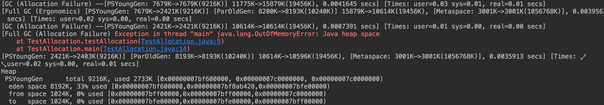
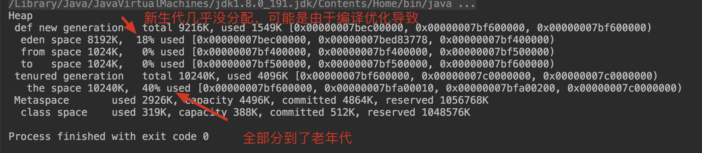
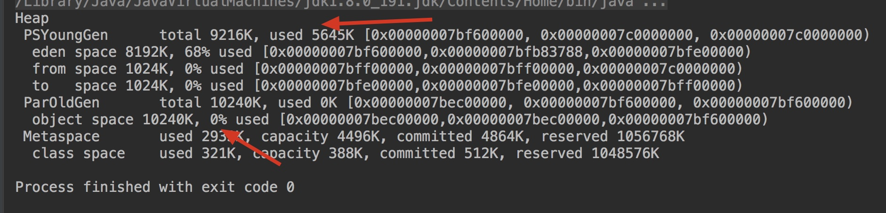

# 相关参数

新手不知道怎么调整可以参考我的这篇文章--[idea调整JVM参数](https://github.com/leosanqing/Java-Notes/blob/master/JVM/idea%E8%B0%83%E6%95%B4JVM%E5%8F%82%E6%95%B0/idea%E8%B0%83%E6%95%B4JVM%E5%8F%82%E6%95%B0.md)

- `-Xmx`： 堆最大值
- `-Xms`: Java堆最小值
- `-Xmn`：新生代的大小
- `XX:+PrintGCDetails`：打印日志
- `-XX:SurvivorRatio=8` Eden和一个Survivor大小的比值
- `-XX:+UseSerialGC` 使用Serial+SerialOld收集器
- `-XX:PretenureSizeThreshold`设置直接分配在老年代的大小(**只有ParNew和Serial收集器有用**)
- `-XX:MaxTenuringThreshold`晋升老年代的阈值

# 对象优先分配在Eden

大多数情况下，对象优先在Eden区中分配。(如果不了解JVM的分代，先搜索下分代)

- 如果Eden分配不足，
  - 进行一次MinorGC，
  - 如果还不够，到Survivor 区看看
    - 如果够，分配在Survivor
    - 不够，去ParOldGen区看看
      - 不够，进行一次 FullGC
      - 还不够，抛异常

```java
/**
* VM参数:  -verbose:gc -Xms20M -Xmx20M -Xmn10M -XX:+PrintGCDetails -XX:SurvivorRatio=8
*/

public class TestAllocation {
    private static final int _1MB = 1024*1024;
    public static void testAllocation(){
        byte[] allcation1,allcation2,allcation3,allcation4,allcation5;
        allcation1 = new byte[2 * _1MB];
        allcation2 = new byte[2 * _1MB];
        allcation3 = new byte[2 * _1MB];
        allcation4 = new byte[4 * _1MB];
        allcation5 = new byte[6 * _1MB];

    }

    public static void main(String[] args) {
        testAllocation();
    }
}

```

上述代码运行结果截图



你可以调整参数，比如Eden填满了，是否会放到 Survivor 区（把Survivor比例调小一点）。

# 大对象直接进入老年代

如果对象大于一个阈值，那么可以直接分配到老年代，不经过Eden和存活周期

```java
/**
 * -verbose:gc -Xms20M -Xmx20M -Xmn10M -XX:+PrintGCDetails -XX:SurvivorRatio=8 -XX:PretenureSizeThreshold=3145728 -XX:+UseSerialGC
 */
public class TestPretenureSizeThreshold {
    private static final int _1MB = 1024*1024;
    public static void PretenureSizeThreshold(){
        byte[] allcation4,allcation5;

        allcation4 = new byte[4 * _1MB];
        //allcation5 = new byte[6 * _1MB];

    }

    public static void main(String[] args) {
        PretenureSizeThreshold();
    }
}
```

运行截图



假如不使用Serial或者ParNew收集器，那么设置的这个`-XX:PretenureSizeThreshold=3145728`参数就是无效的 

可以看下面这个截图



# 长期存活的对象将进入老年代

我们知道JVM使用分代的思想来管理垃圾，那么内存回收的时候就得知道哪个是哪个代。虚拟机给每个对象定义了一个年龄(age)计数器，默认是15。出生在Eden的对象每熬过一次垃圾回收就+1.可以通过`-XX:MaxTenuringThreshold`设置。

这个也是对象最常发生的事


# 动态对象年龄判定

**如果Survivor 空间的相同年龄所有对象大小的总和大于Survivor的一半，年龄大于或等于该年龄的对象就可以直接进入老年代，不需要等到我们设置的参数** `-XX:MaxTenuringThreshold`所等到的值。

假如 Survivor的大小为1M，如果我设置了他们需要活到15才能晋升到老年代。我有三个对象，A占用Survivor空间1/4M，2岁；B占用空间1/4，2岁；C占空间1/5，3岁；D占空间1/6，1岁；那么因为A+B>=1/2M，那么ABC这三个对象就可以直接进入老年代。而D不行，因为他的年龄小于AB的年龄。

# 空间分配担保

在发生MinorGC之前，虚拟机会先检查老年代最大可用的连续空间是否大于新生代所有对象总空间。如果大于，则MinorGC可以确保是安全的，如果不成立，虚拟机会查看HandlerPromotionFailure设置值是否允许担保失败

如果允许，那么会进一步检查老年代最大可用连续空间是否大于历次晋升老年代的平均大小。

如果大于，将尝试进行一次 MinorGC。如果小于或者HandlerPromotionFailure设置为false，那么将尝试进行一次FullGC

总结起来就是

- 发生MinorGC前，检查老年代大小是否大于新生代所有对象总空间
  - 大于，进行MinorGC
  - 小于，检查是否允许担保
    - 允许，查看老年代最大的可用连续空间是否大于历次晋升老年代的平均大小
      - 是，进行一次冒险的 MinorGC
      - 不是，进行FullGC
    - 不允许，进行FullGC

## 目的

​	为了避免频繁的FullGC，因为FullGC非常耗时，基本比Minor高出一个数量级