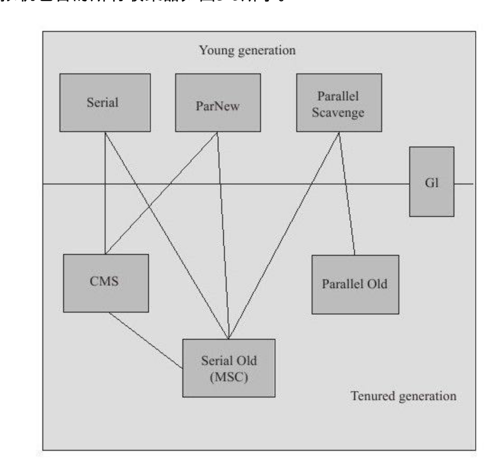
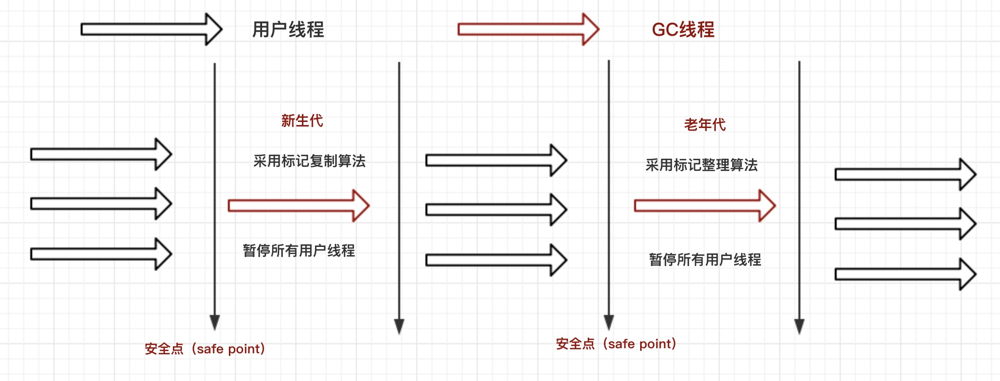
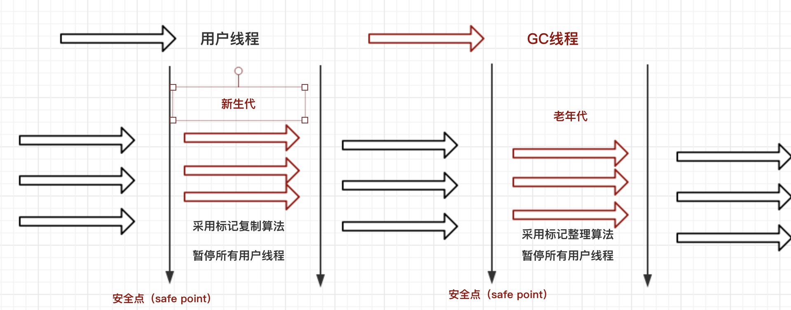
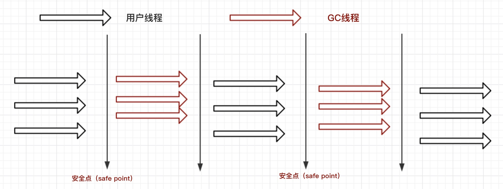
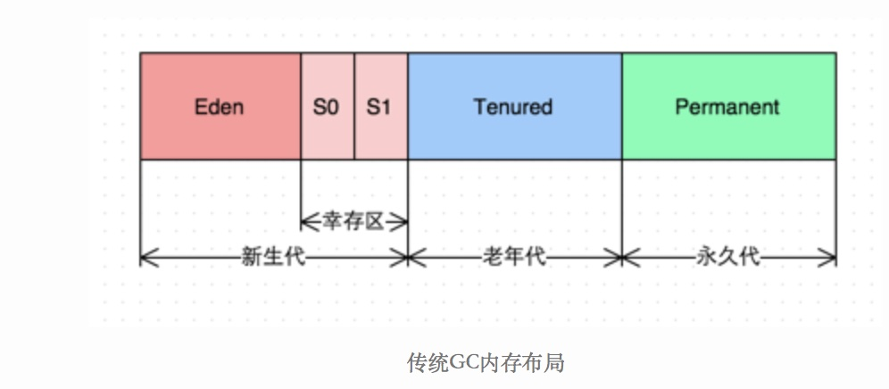
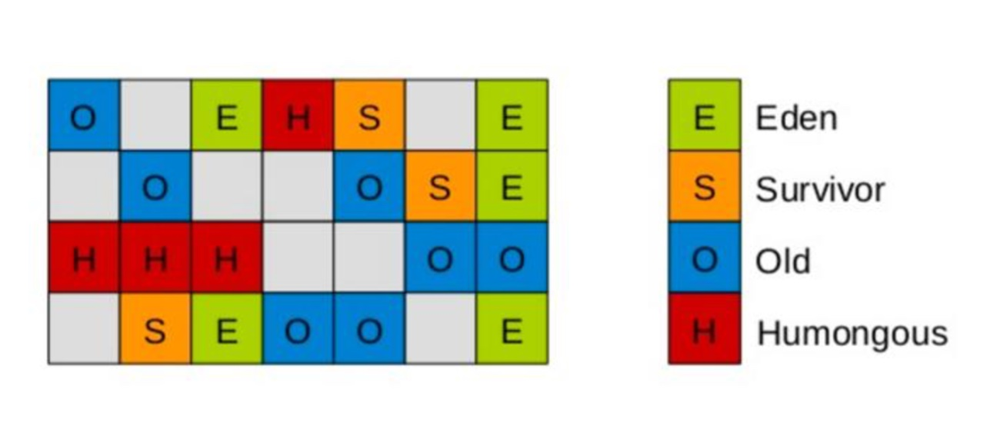
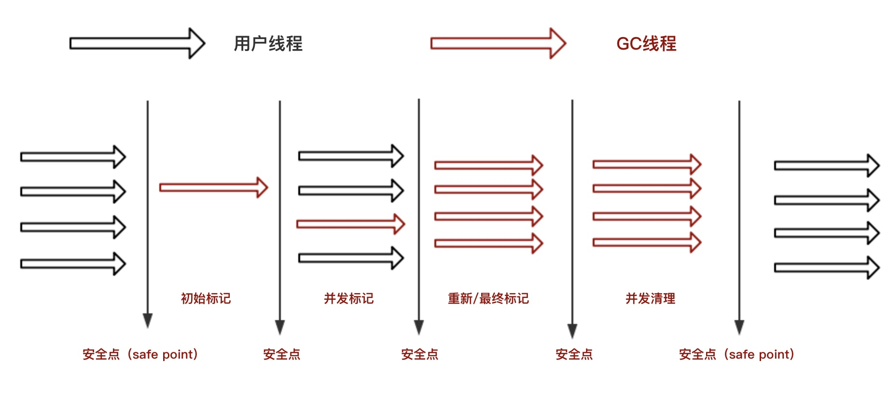

# 前言

如果不了解**垃圾回收算法**或者是**判定对象存活的可达性分析算法**，可以参看我的这篇博文，[垃圾回收](https://github.com/leosanqing/Java-Notes/blob/master/JVM/JVM%E5%9E%83%E5%9C%BE%E5%9B%9E%E6%94%B6.md)

垃圾回收器是垃圾回收的具体实现，这里只讲Hotspot虚拟机的7中不同的垃圾回收器。

- 新生代
  - Serial
  - ParNew
  - Parallel Scavenge
- 老年代
  - CMS
  - Serial Old
  - Parallel old
- 二者皆可的 G1(JDK1.9之后，成为默认的收集器)

虚拟机使用的时候是采用组合的方式，但是也不是可以随意组合的，组合方式如下

# Serial 

## 特点

- 单线程
- Stop The world
- 在client模式下默认的新生代的收集器

从名字可以看出来他是一个单线程的收集器(Serial有串行的意思)，他在工作的时候，用户的其他所有工作线程都必须停止。这也是"Stop the World"的由来。

但是这种的工作方式让人听难受的，你想想你工作的时候正在兴头上，马上高潮了，突然戛然而止。GC线程出来工作了，你一动不能动。因为它自动发起的，自动完成的，用户不可见，不可预知。

下面用图给你解释下。(**Serial搭配Serial Old**)

如果不了解**标记复制算法**或者**安全点**可以查看我的这篇博文--[垃圾回收算法](https://github.com/leosanqing/Java-Notes/blob/master/JVM/JVM%E5%9E%83%E5%9C%BE%E5%9B%9E%E6%94%B6.md)

# ParNew

## 特点

- 多线程版 Serial收集器

- 很多server模式下首选的新生代收集器

- 其他和Serial一样

  

**多线程版不一定意味着比单线程的Serial的效率高**，因为他有别的线程的频繁交互，随着CPU的增多，才会比他的效率高

## Parallel Scanvenge

## 特点

- 吞吐量优先(最大的特色)

- 自动调节适应

- 多线程

你可以把收集过程和ParNew差不多，图片也差不多。但是他有两个特色

### 吞吐量优先

其他收集器关注的是减少垃圾收集时用户停顿的时间。**而他关注的是达到一个可控的吞吐量**

吞吐量是CPU运行用户代码的时间与CPU消耗的总时间的比值

吞吐量 = 运行用户代码的时间 / (运行用户代码+垃圾回收的时间)。

虚拟机总共运行了 100s，垃圾回收用了 1s，那吞吐量就为99%

由两个参数控制

- -XX: MaxGCPauseMillis
- -XX: GCTimeRatio

根据名字就可以看出来啊，第一个是说回收时的暂停时间、单位毫秒，第二个是回收时间所占的比例。

但是第一个设置的越小，垃圾回收越频繁，总时间不一定会下降。应该很好理解

第二个是GC时间比例,相当于吞吐量的倒数。范围(1,100)的整数。如果设置为1，值为50%=1/(1+1)。**默认为**99，即允许回收时间占1% = 1/(1+99).

### 自动调节适应

参数：-XX：UseAdaptiveSizePolicy

如果打开，那么你就可以不用自己手工去指定新生代的大小、Eden和Survivor区的比例、晋升老年代对象大小(如果一个对象足够大，那么可以直接在老年代分配)。

如果对于收集器的运作不太了解，那么可以打开这个参数，交给虚拟机自己完成

# Serial Old

## 特点

- 和新生代的Serial一样
- 标记整理算法

图片参考 Serial 

# Parallel Old

## 特点

- 标记-整理算法
- 吞吐量优先

这个收集器是在JDK1.6之后才提供，没有提供之前 新生代的Parallel Scavenge的地位比较尴尬。还记得我一开始的图吗，**如果没有这个收集器，新生代的 Parallel 只能选择 Serial**，他和 CMS 不兼容。**但是Serial Old 这个收集器在多线程模式下，以及老年代很大的情况下的性能算是表现比较差的**。一般选择组合都去用 `PerNew + CMS`了，他就很尴尬。

**到了JDK1.6之后，在注重吞吐量以及CPU资源敏感的场合，可以优先考虑Parallel组合了**，这个时候 Serial Old ，在**server模式**下就作为CMS的后备方案，在并发收集时发生 **Concurrent Mode Failure** 的时候使用(介绍CMS的时候我会说明)

图片描述如下图所示

# CMS

CMS（Concurrent Mark Sweep）是一款**以获取最短回收停顿时间为目标的收集器**。非常符合**在很大一部分的Java应用集中在互联网站**或者**B/S系统的服务端上应用**的需求。因为这种的应用尤其**重视服务的响应速度**，希望**停顿时间短**，以此带来更好的用户体验

## 特点

- 标记-清除(其他老年代的都是标记整理)
- 并发收集
- 以获取最短回收停顿时间为目标

## 回收步骤

- 初始标记
- 并发标记
- 重新标记
- 并发清除

**记住**：其中 **初始标记**和**重新标记**是**需要"Stop The World"**，不过时间很短

初始标记的过程仅仅标记**GC Root直接关联的对象**，他并不去标记间接关联的。这个过程交给第二阶段**并发标记**来完成；

重新标记阶段则是为了修正并发标记期间因用户程序继续运作而导致标记产生变动的那一部分对象的标记记录，停顿时间比第一阶段的初始标记稍长。

第四个阶段，并发清除。也是可以并发完成的。

>因为在这里第一次出现并发的概念，我解释一下在垃圾回收的时候并发和并行的概念。注意只是垃圾回收中的并行并发。
>
>并行是，多个回收线程工作，工作线程不工作。
>
>并发是，回收线程和工作线程一起工作。
>
>所以你可以说 ParNew 是并行的收集器，但不能说是并发的收集器

收集器工作图解如下图所示

## 缺点

- 对CPU资源敏感
- 无法处理浮动垃圾
- 标记-清除算法

如果CPU资源很少，可开启线程也很少。那么CMS会让用户体验非常差，因为要分出相当多的资源去运行垃圾回收，导致运行程序的资源变少。

因为他是并发进行回收的，所以当我在收集时，你还在产生垃圾，那么这部分垃圾被称为的**浮动垃圾**。而这部分垃圾不得不在我下一次回收时才能回收。而且他也不能充分利用空间，毕竟要分一部分给浮动垃圾，所以如果垃圾过多，空间不能满足，就会出现"Concurrent Mode Failure"提前触发一次 Full GC，这个过程会启动 Serial Old进行收集。

# G1

G1(Garbage First)是一款**面向服务端应用**的垃圾收集器。在JDK1.9被设置成默认的垃圾回收器，基本算是最前沿的垃圾回收器。当然还有更牛逼的垃圾回收器ZGC。不过他是在JDK 11 才被推出，所以一般人用不到，也不用了解，想了解可以看下这篇文章，[JDK11的ZGC](https://juejin.im/entry/5b86a276f265da435c4402d4)

## 特点

- 并行并发
- 分代收集
- 空间整合(算是最大的不同)
- 可预测的停顿
- 本身并不提供Full GC

我们先看传统的年代分割

(JDK1.8之后已经移除了永久代，改为元空间了)

下面是G1的分割

通过图片可以看出来，之前的垃圾回收器的年代是空间（逻辑上）连续的，而G1的空间是不连续的，他被划分为**一个个大小相等的 region** 

**从整体上看，他是采用"标记-整理算法"，局部(两个region之间)看是"标记-复制算法"。**所以G1运作期间不会产生内存碎片。

**可预测的停顿**：是指**用户可以指定整个GC过程的期望停顿时间**，通过参数`-XX:MaxGCPauseMillis`，那么他是怎么满足用户期望的时间呢？就需要**停顿预测模型**了。G1根据这个模型统计计算出来的历史数据来预测本次收集需要选择的Region数量，从而尽量满足用户设定的目标停顿时间

## 收集过程

- 初始标记
- 并发标记
- 最终标记
- 筛选回收

先用一张图解释一下步骤

从图中我们可以看到，G1的过程和CMS差不多，但是还是有一些区别，主要是最后的清理阶段，他也是STW(Stop The World)的。其他更多的是算法的差别。