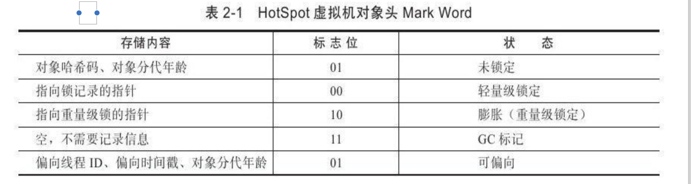
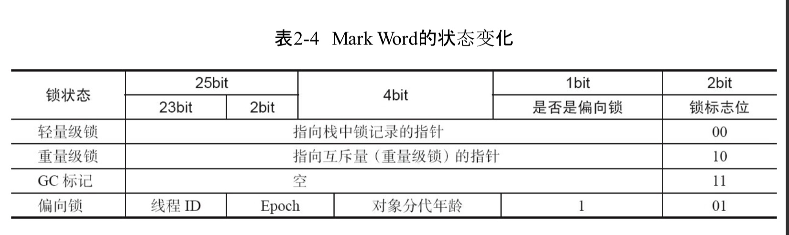

# 大纲

# 前言

在HotSpot中，对象在内存中存储的布局可以分为三个区域：

- 对象头
- 实例数据
- 对齐填充

下面我们就挨个说下这三个东西到底是啥，有啥东西

一定要重点注意第一个对象头里的东西，因为讲并发时**锁优化**还有**对象创建**会用到这个

# 对象头

对象头里存两个部分的信息

- 运行时数据(Mark Word)
- 类型指针(Class Pointer)

## 运行时数据

这里主要存对象自身的运行时数据，比如

- 哈希码
- GC分代年龄
- 锁状态标志
- 线程持有的锁
- 偏向线程ID
- 偏向时间戳
- 等…..

用图看下就知道了

### 长度

- 对象是数组类型
  - 3字宽(32位虚拟机中，一字宽=4字节=32bit;64位虚拟机乘2)
- 非数组类型
  - 2字宽(不同虚拟机位数，同上)

注意**这个里面的数据**是会**随着锁标志位**的**变化而变化**

## 类型指针

Class Point，用来指向对象对应到Class对象(其对应的元数据)内存地址。

32 位中 占4个字节，64位占8个字节。

## Array Length(数组长度，数组对象才有)

32位的JVM上，长度为32位；64位JVM则为64位。

64位JVM如果开启`+UseCompressedOops`选项（开启指针压缩），该区域长度也将由64位压缩至32位。32位HotSpot VM是不支持UseCompressedOops参数的，只有64位HotSpot VM才支持。

# 实例数据

实例数据才是**对象真正存储的有效信息**，也是在程序代码中所定义的各种类型的字段内容。

无论是从父类继承下来的，还是在子类定义的，都需要记录下来。这部分的存储顺序受到**虚拟机分配策略参数**和**字段在Java源码中定义顺序**的影响

HotSpot虚拟机默认的分配策略为longs/doubles、ints、short/chars、bytes/booleans、oops(普通对象指针，在垃圾回收文章的安全区会见到)，可以看到，**相同宽度的字段总会分配到一起**

在满足上面的那个前提下，**父类中定义的变量会出现在子类中定义的变量之前**，如果`CompactFields`参数值为 true，默认为 true，那么**子类中定义的变量也可能会插到父类变量的空隙中。**

# 对齐填充

这部分不是必然存在，只是位数不够，拿来填充，为了整齐，仅仅起到占位符的作用

因为HotSpot VM 的自动内存管理系统要求**对象起始地址必须是8字节的整数倍**，换句话说，就是对象的大小必须是 **8字节的整数倍**

 