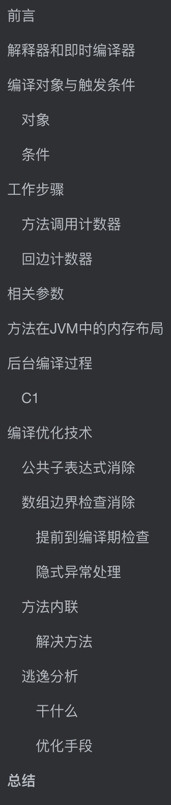
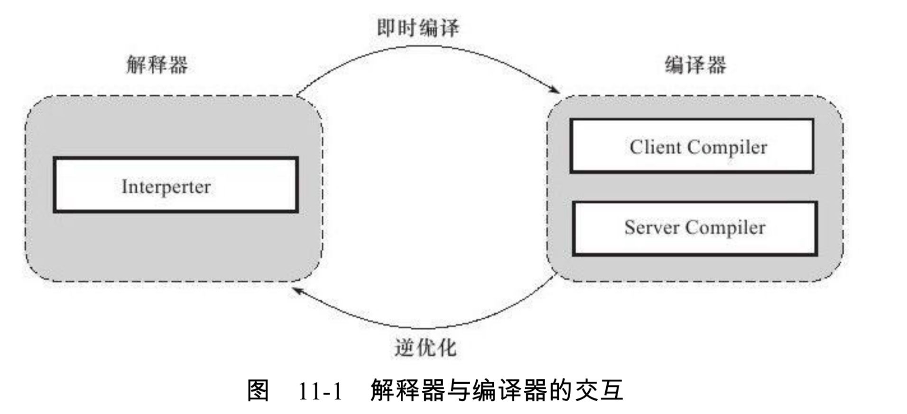
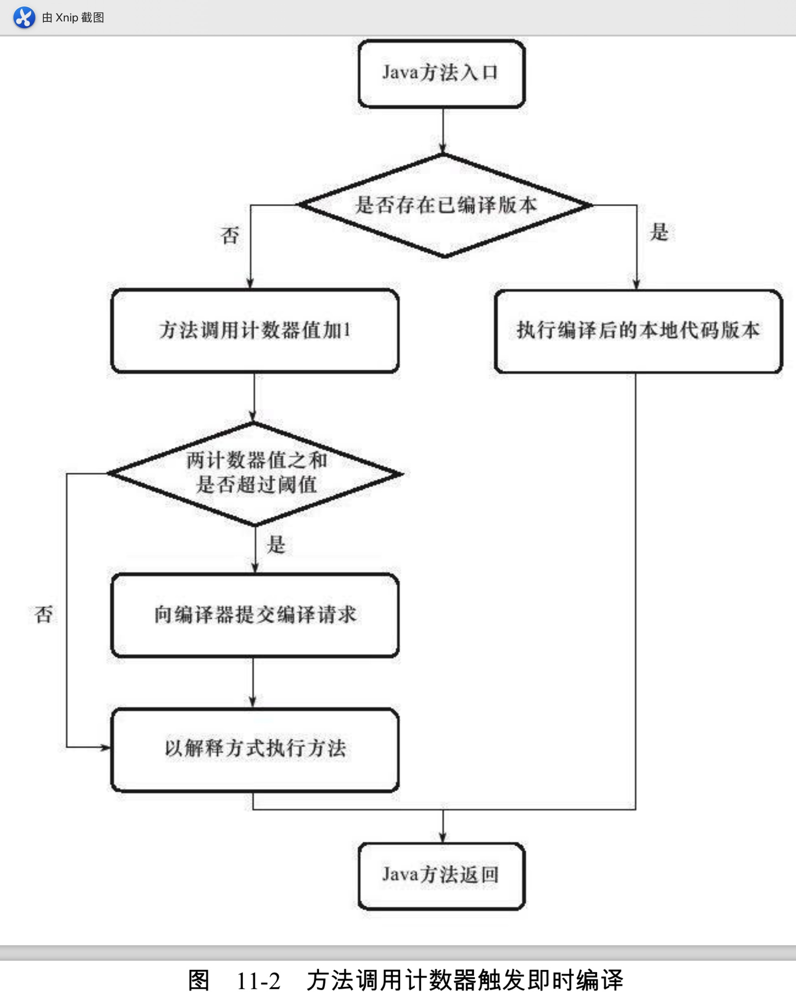
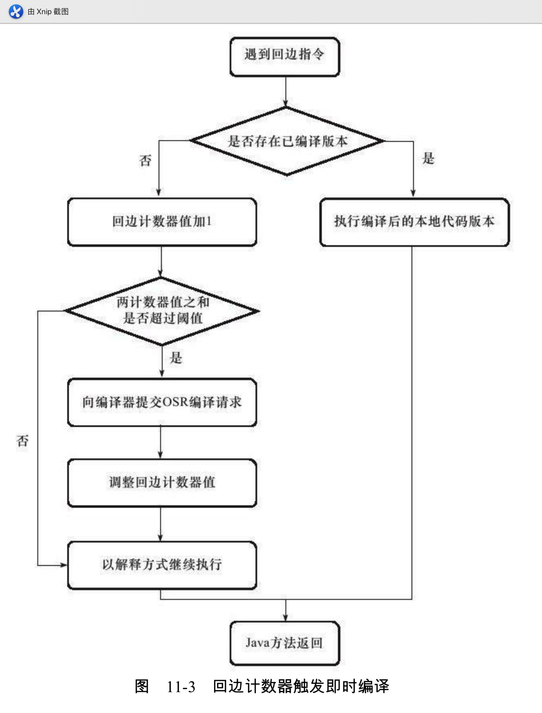
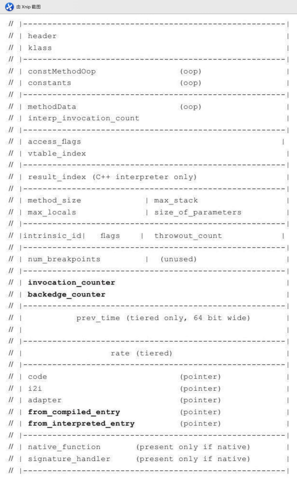
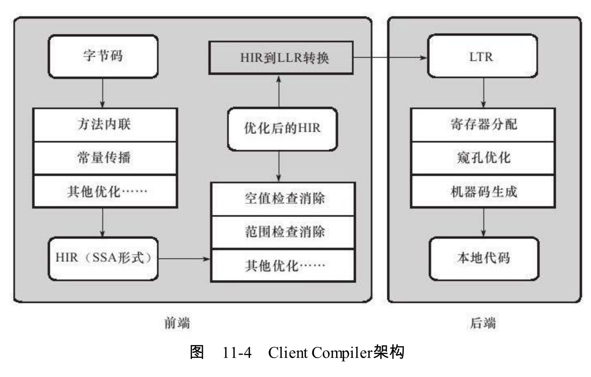
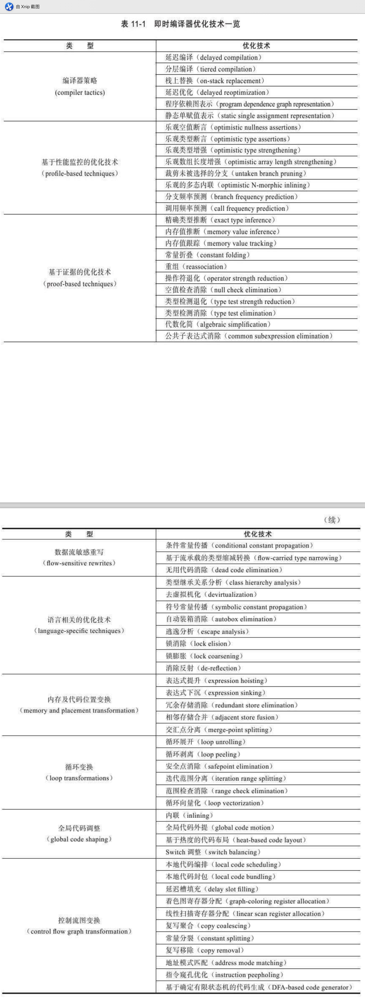

# 大纲



# 前言

是不是很多人的印象中，Java要比C++运行的慢？如果现在还停留在这个想法，那或许该更新下想法了，因为Java近几年在运行优化方面做了非常多的研究和改进，可以说已经基本不怎么输于C++的运行速度了。

我们参照HotSpot虚拟机的优化来说明，不同虚拟机肯定是不同的，但是也有参考价值。

# 解释器和即时编译器

所谓无风不起浪，**为啥大家觉得Java的执行速度要比C++慢呢？**现在又怎么说二者现在的执行速度差别不太大了呢？

因为早期的Java代码主要都是由**解释器**来完成，并且即使用到**即时编译器**，即时编译器的**性能优化**也做得**不是太好**，所以早期才有了上面说的"Java比C++执行慢"，所以才说那是早期的思想。，现在Java优化做的非常好，我们就挨个说下吧

现在主流的（不是全部）虚拟机都采用**解释器**和**编译器**共存的架构，二者互相配合工作，如下图所示



二者互有优缺点，优缺点正好相对。

- 解释器
  - 优点
    - 程序需要快速启动时，可以省去编译的时间
    - 不占用内存资源，因为不需要编译成本地代码
  - 缺点
    - 执行速度低
  - 还有个作用，作为**"激进优化"**的**逃生门**，本篇后面会讲到
- 编译器
  - 优点
    - 把更多的代码编译成本地代码，提高执行效率
  - 缺点
    - 不能立即启动，编译需要时间
    - 占用一些内存资源

所以啊，虚拟机才会配合二者进行使用。那些"**热点代码**"（这个概念后面会提到）会被即时编译器编译成本地代码，以此来提高执行速度，"非热点代码"就用解释器来执行。为啥这样呢？可能符合"**二八定理**"吧。20%的代码是热点代码，但是他们却可能占用80%的执行资源。


我们看到上面的图片中，**编译器有两种**，一个是客户端的，一个是服务端的，前者被称为C1编译器，后者称为C2编译器，**两个的参数设置也不一样。优化手段也不太一样，后面会讲到**。

# 编译对象与触发条件

## 对象

我们之前提到，即时编译器只编译那些"热点代码"，那么啥是热点代码呢？只有以下两类

- 被多次调用的方法
- 被多次执行的循环体

前者比较好理解，后者有点不好理解。如果一个方法中，**存在循环多次的循环体**，那么这个**循环体的代码**也被执行了很多次，所以也认为是"热点代码"。但是虽然是由于**循环体**造成他是热点代码的，但是**编译器编译**的时候，是根据**整个方法进行编译**(而不是只编译循环体)。这种编译方式由于**编译发生在方法执行过程中**，因此被形象的称为**栈上替换**(On Stack Replacement，简称OSR)。**前者**也是**以整个方法作为编译对象**。

## 条件

那么啥是度呢？多少次才叫多次？才会触发即时编译条件呢？

判断一段代码是不是热点代码，是不是需要触发即时编译，我们称之为**热点探测**，主流的热点探测判定方式有**两种**：

- 基于采样的热点探测
- 基于计数器的热点探测(JVM采用)
- 看到这两个有没有想起以前学过的哪里和这个看上去很像？还记得判定对象是否死亡的两种方法吗？可达性分析和引用计数，其实第一种和可达性分析还真有些地方很像，他可以看调用关系，就像可达性分析的路径。(学知识，这样对照学才会印象深刻，可以说有这样的想法，东西已经算是你的了)

**基于采样的热点探测**：采用这种方法的虚拟机会周期性的检查各个线程的栈顶，如果发现某个(或者某些)方法经常出现在栈顶，那这个方法就是"热点方法"。(有没有像可达性分析法搜索可达路径？)

**基于计数器的热点探测**：为每一个方法(甚至是代码块)建立一个计数器，统计是否超过阈值。还记得两种热点代码吗？他专门准备了两种相对的计数器。前者是方法调用计数器，后者是回边计数器

两个方法优劣对比：

- 基于采样
  - 好处：
    - 实现简单、高效
    - 可以很容易获取方法调用关系(将调用栈展开即可)
  - 缺点
    - 难精确确认一个方法的热度，容易受到线程阻塞或别的因素影响

- 基于计数器
  - 好处
    - 统计精确
  - 缺点
    - 要为每个方法建立一个计数器
    - 不能获取调用关系


# 工作步骤

我们先看图

## 方法调用计数器



当一个方法执行时，

- 首先检查这个方法是否被JIT编译过(即是否存在被JIT编译过的代码版本)
  - 如果有，先执行编译过的代码版本
  - 没有，调用计数+1，判断两个计数器之和是否超过阈值(注意是两个计数器)
    - 超过阈值，向即时编译器提交该方法的编译请求
    - 没有超过，继续以解释器方式执行。
    - 如果不设置，那么他不会等到编译器编译完成，执行编译后的代码，而是执行解释器，下一次调用才执行编译后的代码

这里的方法调用计数器里面的值不是**绝对值**，而是一个相对的**执行频率**，即**一段时间**之内方法被调用的次数。超过一定时间，调用次数仍然未达到阈值，那么方法调用计数器的值就会减少一半，这个过程称为**方法调用计数器热度的衰减**。这个像不像原子的衰变？然后这个时间，他们就取名为**半衰周期**。但是这个是可以关掉的，相关参数设置在**参数那段讲**

## 回边计数器

啥是回边呢？**在字节码中遇到控制流向后跳转的指令**，被称为"**回边**"，这个计数器也是为了触发OSR编译(这个概念，上文讲过)

执行步骤和方法调用计数器相似



不同的是，这个计数器没有所谓的**半衰**

# 相关参数

- `-client/-server`：指定JVM运行哪种模式
- `-Xint`：强制JVM使用解释模式，编译器不工作
- `-Xcomp`：和上面不同的是，他只是优先编译器工作，当编译无法进行的情况下，解释器还是会介入
- `-XX: -UseCounterDecay`:关闭热度衰减
- `-XX: CounterHalfLifeTime`：设置半衰期时长，单位秒
- `-XX: CompileThreshold`:设置方法调用阈值
- `-XX: BackEdgeThreshold`:设置回边计数器阈值
- `-XX： -BackgroundCompilation`：禁止后台编译，达到阈值，等到编译完再往下执行，且执行编译好的代码

# 方法在JVM中的内存布局



一行长度为32bit

# 后台编译过程

后台编译过程，Client Compiler (C1)和Server Compiler(C2)的工作是不一样的，后者更为复杂，是全局优化，前者主要是局部性的优化

## C1



共分为三个阶段：

1. 一个**平台独立的前端**将字节码构造成一种**高级中间代码表示**(High-Level Intermediate Representation，HIR)
   - HIR使用静态单分配(SSA)的形式来代表代码值，这可以是的一些在HIR的构造过程之中和之后进行的优化动作更容易实现。
   - 再此之前编译器会在字节码上完成一部分**基础优化**，如方法内联、常量传播等优化将会在字节码被构造成HIR之前完成
2. 一个**平台相关的后端**从HIR中产生**低级中间代码表示**(Low-Level Intermediate Representation)
   - 而在此之前会在HIR上完成一些优化，如空值检查消除、范围检查消除等
3. **平台相关的后端**使用**线性扫描算法**(Linear Scan Register Allocation)在LIR上分配寄存器，并在LIR上做**窥孔**(Peephole)优化，然后产生机器代码。

# 编译优化技术

一共有非常多的技术




不过**最具有代表性**的是以下四个：

- 语言无关的经典优化技术之一：公共子表达式消除
- 语言相关的经典优化技术之一：数组范围检查消除
- 最重要的优化技术之一：方法内联
- 最前沿的优化技术之一：逃逸分析(造成java实例不一定全部在堆中分配)

## 公共子表达式消除

如果一个**表达式E已经计算过**了，并且先前的计算到现在E中所有变量的值都**没有发生变化**，那么E**的这次出现就成为了公共子表达式**

如果有一下程序代码

`int d = (c * b) * 12 + a + (a + b *c);`

当这段代码进入虚拟机即时编译器后，他将进行如下优化：

- 检测到 c * b 与 b*c 是一样的
- 并且计算期间值没有变化
- 就会被视为 `int d = E * 12 + a + (a+E)`
- 也可能发生如下变化
  - `int d =E * 13 + a *2 `

## 数组边界检查消除

我们知道，相同的代码，Java要比C++执行的慢，这也是人们会有一开始的那种想法的原因之一。那么为什么呢？

Java程序由于有虚拟机，很多东西都会替你来做，比如越界检查，除零检查，垃圾回收这种。

比如数组  `nums[]`，Java中如果你要访问其中一个元素，你的下标一定是在[0,num.length-1]的，如果超出了，他就会报错`java.lang.ArrayIndexOutOfBoundsException`.但是C或者C++,使用的是**裸指针**，因此这种判断需要程序员自己操作。

Java中，如果你要对数组进行读写操作，那么就一定要检查他的范围是否超出，这是由JVM进行，但是大量的执行步骤中，都会带有这个，哪怕你知道不可能超出，但是JVM可不知道。

### 提前到编译期检查

所以能不能告诉他，"**我们的一定不会超出，你别再检查了呢？**"

事实上，**不行**，，因为数组越界检查是必须做的。**但是可以跟他谈判，让他减少次数**，**提前到编译期检查一次**

比如我们有下面的程序 `nums[3]`，只要在编译期间根据数据流分析来确定`nums.length`的值，并且判断下标 3并没有越界，那么执行的时候就没必要判断了。

### 隐式异常处理

用于：

- Java中空指针检查
- 算术运算符中除数为0的检查

如果有下列代码

```java
if(num != null){
    return num.getVal();
}else {
    throw new NullPointerException();
}
```

使用隐式异常优化后

```java
try{
  return num.val;
}catch(segment_fault){
  uncommon_trap();
}
```


虚拟机会注册一个`Segment Fault`信号的异常处理器，

- 当num不为空的话，对val的访问是不会额外消耗一次对num判空的开销的。
- 当num为空
  - 必须转到异常处理器中恢复，并且抛出`NullPointerException`异常
    - 这个过程必须从用户态转到内核态中处理
    - 结束后在返回用户态处理，速度更慢
- 所以当，空值极少时，这种隐式异常优化是值得的

## 方法内联

他的重要意义是**为其他优化手段打下基础**，为啥这样说呢，请看下面的示例：

```java
public class DeadCode {
    public static void testInline(String[] args) {
        Object object = null;
        foo(object);
    }
    
    public static void foo(Object object){
        if(object != null){
            System.out.println("do something");
        }
    }
}
```

我们自己看下就应该知道，`testInline()`方法中的代码根本没有一点意义。我们称这种代码是"Dead Code"

如果不进行内联，虚拟机根本不会发现，即使他进行了**无用代码消除**，他在即时编译的时候也不会消除这些代码。因为分开来看，这两个方法都是有意义的啊

方法内联的行为看起来**似乎很简单**

- 把目标方法的代码"复制"到发起调用的方法中，避免真实的方法调用而已

但是真的这么简单吗？**不是的，根据经典编译原理的优化理论，大部分的Java方法都不可以内联**

我们知道方法的调用分为：**解析和分派**，尤其是分派中的**动态分派**，编译期是不能知道调用的是哪个类的方法(可以参考我的这篇文章，[重载和重写的区别-方法调用层次](https://github.com/leosanqing/Java-Notes/blob/master/JVM/%E8%99%9A%E6%8B%9F%E6%9C%BA%E6%89%A7%E8%A1%8C%E5%AD%90%E7%B3%BB%E7%BB%9F/%E6%96%B9%E6%B3%95%E8%B0%83%E7%94%A8/%E6%96%B9%E6%B3%95%E8%B0%83%E7%94%A8.md))

比如下面的代码

```java
public class DeadCode {
    
    static class ParentB{
        int val;
        public int getVal(){
            return val;
        }
        public  ParentB(int val){
            this.val = val;
        }
        public  ParentB(){
        }

    }
    static class SubB extends  ParentB{
        public int getVal(){
            return val;
        }
        public  SubB(int val){
            this.val = val;
        }

        public SubB() {
        }
    }

    public static void main(String[] args) {
        ParentB subB = new SubB(5);
        System.out.println(subB.getVal());
    }
}
```

编译期，他是不会知道 `getVal()`调用的是 sub的还是Parent的方法，只有运行期才会知道

那怎么办呢？

### 解决方法

首先JVM团队想到**CHA(类型继承关系分析，Class Hierarchy Analysis)技术**。

> 一种基于整个应用程序的类型肥西技术，用于确定在目前已加载的类中，某个接口是否有多于一种的实现，某各类是否存在子类、子类是否为抽象类等信息。

- 编译器在内联时，如果是**非虚方法**(如果不知道这个概念，可以参考我的这篇方法调用的文章，[重载和重写的区别-方法调用层次](https://github.com/leosanqing/Java-Notes/blob/master/JVM/%E8%99%9A%E6%8B%9F%E6%9C%BA%E6%89%A7%E8%A1%8C%E5%AD%90%E7%B3%BB%E7%BB%9F/%E6%96%B9%E6%B3%95%E8%B0%83%E7%94%A8/%E6%96%B9%E6%B3%95%E8%B0%83%E7%94%A8.md))，那么直接内联就行

- 如果遇到**虚方法**，则会向CHA查询此方法在当前程序下是否有多个目标版本可供选择，

  - 如果查询结果结果只有一个版本，可以进行内联，不过这个是**激进优化**(可以类比内存分配策略的空间担保)，需要预留一个"逃生门"(可能由解释器或者没有解释器版本的虚拟机用没有进行激进优化的C1作为逃生门)，称为"内联守护"
    - 如果程序的后续执行过程中，JVM一直没有加载到会令这个方法的接收者的继承关系发生变化的类，那这个内联优化的代码就可以一直使用下去。
    - 如果出现了那个新类，那就需要抛弃已经编译好的代码，退回到解释状态执行，或者C1重新编译

- 如果向CHA查询的结果是有多个版本的目标方法可以选择，

  - 编译器会进行最后一次尝试，使用**内联缓存**完成内联

    ​	这个是建立在目标方法**正常入口之前**的缓存

  - 未发生方法调用之前，内联缓存为空

  - 发生第一次调用，缓存记录下方法接收者的版本信息，并且每次调用都比较接收者版本

    - 如果以后每次进来的方法接收者版本都是一样的，那这个内联还可以进行下去
    - 不一致，则说明程序真正使用了虚方法的**多态特性**，这时候才会取消内联，查找虚方法表进行分派(这个表也可以在这找到[重载和重写的区别-方法调用层次](https://github.com/leosanqing/Java-Notes/blob/master/JVM/%E8%99%9A%E6%8B%9F%E6%9C%BA%E6%89%A7%E8%A1%8C%E5%AD%90%E7%B3%BB%E7%BB%9F/%E6%96%B9%E6%B3%95%E8%B0%83%E7%94%A8/%E6%96%B9%E6%B3%95%E8%B0%83%E7%94%A8.md))

## 逃逸分析

他和上面的CHA(类型关系继承分析)一样，都不是直接优化的手段，而是为**其他优化手段提供依据的分析技术**

### 干什么

逃逸分析的基本行为就是：**分析对象动态作用域**

- 方法逃逸：当一个对象在方法中被定义后，他可能被外部方法引用，例如**作为调用参数传递到其他方法**中
- 线程逃逸：上述方法甚至还能被外部线程访问到，譬如给**类变量赋值**或**可以在其他线程访问到的实例变量**

### 优化手段

如果能证明一个对象不会有方法逃逸和线程逃逸，那就可以对其进行高效的优化：

- **栈上分配**：
  - 正常来说对象是在Java堆上进行分配的(不知道的可以看我这篇 [JVM运行时数据区](https://github.com/leosanqing/Java-Notes/blob/master/JVM/Java%E5%86%85%E5%AD%98%E5%8C%BA%E5%9F%9F/Java%E5%86%85%E5%AD%98%E5%8C%BA%E5%9F%9F.md))。但是放到堆上就意味着垃圾回收的时候要进行判断还要进行回收，并且还要整理空间。但是我们知道如果他不会逃逸，那么就在栈上分配，工作完随着栈销毁就行了，不需要垃圾回收器那些工作。
- **同步消除**
  - 和上面一样，如果一个变量不发生逃逸的，就不会存在线程间的竞争，那么就没必要对其进行同步措施了
- **标量替换**
  - 概念
    - **标量**：指一个数据已经无法再分解成更小的数据来表示了，Java中的原始数据(int，long、reference等)
    - **聚合量**：相对于标量。一个数据可以进行分解。比如Java对象
    - **标量替换**：如果把一个Java对象分解，根据程序的访问情况，**将其**使用到的**成员变量**恢复**原始数据**来访问
  - 如果根据逃逸分析证明一个对象不会逃逸，并且可以拆分，
    - 那么就可能不会创建对象，直接创建若干个他的（对象）被这个方法用到的成员变量来代替
    - 并且这些成员变量不仅是分配在栈上，而且可以做进一步优化

# 总结

- 一般主流的虚拟机有两种部分
  - 解释器
  - 编译器
    - 编译对象——热点代码
- HotSpot采用的热点探测
  - 基于计数器的热点探测
    - 计数器
      - 方法调用计数器
      - 回边计数器
- 编译优化技术(代表)
  - 公共子表达式消除
  - 数组边界检查消除
    - 提前到编译期
    - 隐式异常处理
  - 方法内联
  - 逃逸分析
    - 栈上分配
    - 标量替换
    - 同步消除