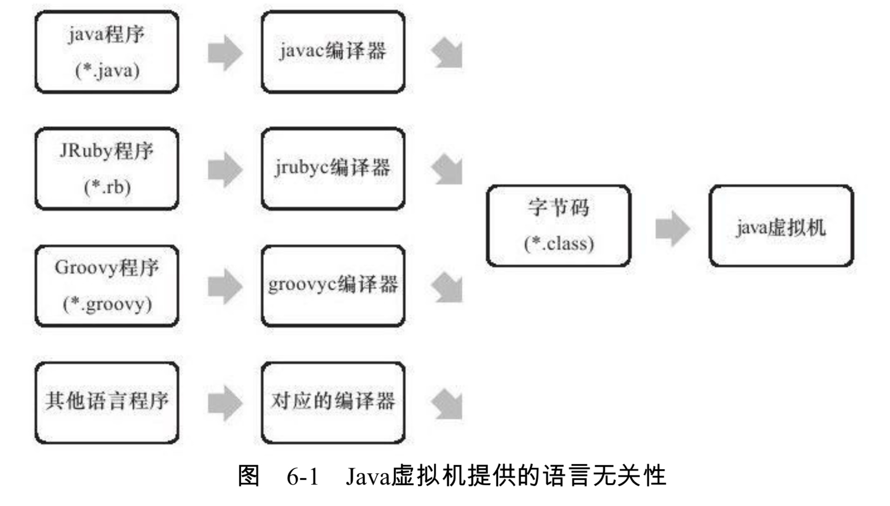

# 一次编写，到处运行

我们学Java的时候，一开始听到最多的或者最显著的优势就是**跨平台性**，甚至可以说是Java语言的跨平台性才让Java语言在互联网时代大放异彩，现在成为数一数二的主流语言。

# 无关性的基石——字节码

**字节码**和**虚拟机**是无关性的基石。

一个Java程序经过**编译器**将这个程序编译为**字节码**的文件，然后这个文件就可以在相关的虚拟机上运行，不论这个虚拟机是运行在Windows还是 MacOS还是Linux系统(至少虚拟机的JDK版本号大于等于当前字节码的版本号，在后面的字节码文件的结构的**版本号**中会讲到)。

# JVM不和任何语言绑定

**请注意**：现在的JVM不仅仅只能运行Java语言编写的程序，他也能运行其他语言编写的程序，不过这些编写好的程序要通过相应的**编译器**编译成字节码文件才能实现跨平台，跨语言。

**Java虚拟机不和包括Java在内的任何语言绑定，它只与“Class文件”这种特定的二进制文件格式所关联，Class文件中包含了Java虚拟机指令集和符号表以及若干其他辅助信息。**

JVM会把相应的Class文件，也就是字节码文件翻译成机器码，因为计算机只认识机器码。所以不管你是啥语言写的，只要是他能通过相应的编译器编译成字节码文件，那么他就能在任何装了JVM的平台上运行。

虚拟机的垃圾回收以及各种垃圾回收器在之前的文章中已经介绍过，想查看的可以参考我的这些博文 

- [判定对象死活以及垃圾回收算法](https://github.com/leosanqing/Java-Notes/blob/master/JVM/JVM%E5%9E%83%E5%9C%BE%E5%9B%9E%E6%94%B6.md)
- [从最旧到最新的垃圾回收器](https://github.com/leosanqing/Java-Notes/blob/master/JVM/%E5%9E%83%E5%9C%BE%E5%9B%9E%E6%94%B6%E5%99%A8/%E5%9E%83%E5%9C%BE%E5%9B%9E%E6%94%B6%E5%99%A8.md)

下面是字节码文件结构的介绍以及虚拟机如何加载运行字节码文件

- [字节码（Class）文件结构](https://github.com/leosanqing/Java-Notes/blob/master/JVM/%E8%99%9A%E6%8B%9F%E6%9C%BA%E6%89%A7%E8%A1%8C%E5%AD%90%E7%B3%BB%E7%BB%9F/%E5%AD%97%E8%8A%82%E7%A0%81%E6%96%87%E4%BB%B6%E7%BB%93%E6%9E%84/%E8%83%BD%E7%9C%8B%E6%87%82%E7%9A%84%E5%AD%97%E8%8A%82%E7%A0%81-%E4%B8%8A.md)
- [虚拟机类加载过程](https://github.com/leosanqing/Java-Notes/blob/master/JVM/%E8%99%9A%E6%8B%9F%E6%9C%BA%E6%89%A7%E8%A1%8C%E5%AD%90%E7%B3%BB%E7%BB%9F/%E7%B1%BB%E5%8A%A0%E8%BD%BD%E8%BF%87%E7%A8%8B/%E7%B1%BB%E5%8A%A0%E8%BD%BD.md)