# 文章结构

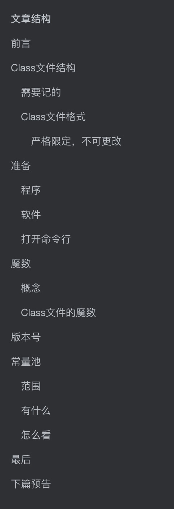

# 前言

上篇文章通过Java的跨平台性引出了字节码文件，这篇文章就是解读字节码文件到底存了哪些东西

这个分析真的很难懂也很绕，不过如果你掌握了字节码的分析方法，怎么看字节码，那么就挺容易看懂的，**希望你有耐心看下去**。因为我觉得这应该算是非常详细而且简单的分析。**我尽量做到详细解读，书上很多隐藏的没说的也尽量给你们讲出来，毕竟对于初学者确实有些坑会卡很久**

可以和《深入理解Java虚拟机》第二版一起看，**不过书上的例子和我实际运行的不一样**，你们看到的应该也是我这种，但是**并不影响我们找到查看字节码的方法**。毕竟方法是互通的

> 这里说的字节码文件和Class文件是一个东西，文章中可能混用，请一定记住

# Class文件结构

任何一个Class文件都对应着唯一一个类或接口的定义信息，但反过来说，类或接口并不一定都得定义在文件里(譬如类或接口也可以通过类加载器直接生成)。(如果不懂这个也不必记)

## 需要记的

- Class文件是一组 **8位字节**为基础的**二进制流**（后面会介绍），各个数据之间排列非常紧凑

- Class文件采用**类似于C语言结构体**的**伪结构来存储数据**，只有**两种**数据类型

  - 无符号
    - 无符号数属于基本的数据类型，以u1，u2，u4，u8来表示一个字节，两个字节，以此类推
  - 表
    - 是复合结构。可能由多个无符号数或者其他表作为数据项构成的类型，习惯性的以"_info"结尾
  - 你可以把整个Class文件看成是一张表

  

## Class文件格式


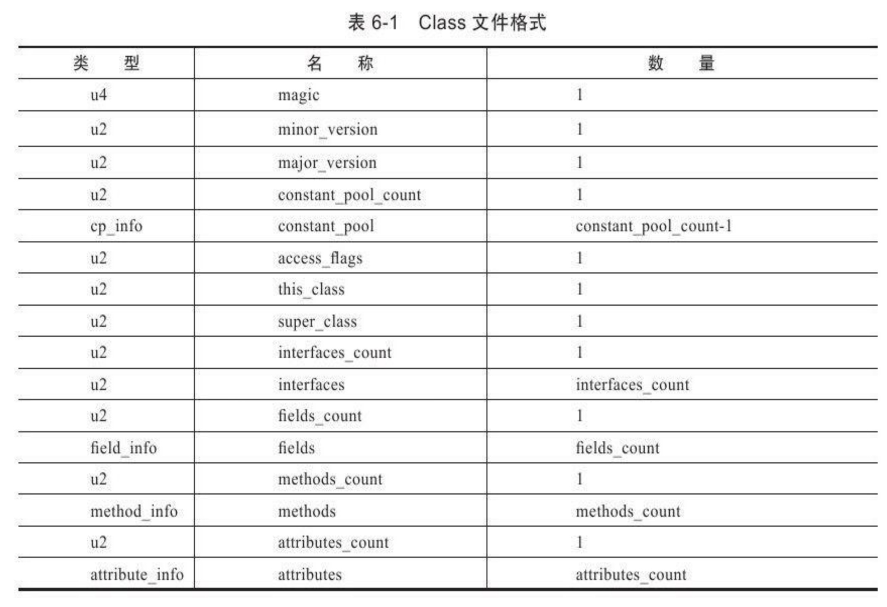

**请一定一定一定！！！！要记住这个表，字节码文件顺序完全按照这个表进行的，我文章的顺序也是按照这个写的，而且这个表后面文章中会经常用到**

### 严格限定，不可更改

**上图Class文件中的数据项，无论顺序是数量，甚至于数据存储的字节序这样的细节，都是被严格限定的。哪个字节代表什么含义，长度是多少，先后顺序如何，都不允许改变**


# 准备

## 程序

```java
package com.swu.leosanqing;

public class TestClass {

    private int m;

    public int inc(){
        return m+1;
    }
}

```

## 软件

一个能用16进制查看二进制文件的软件，比如我用的Ultra Edit


## 打开命令行

- 使用Javac命令，把相应程序编译成Class文件

  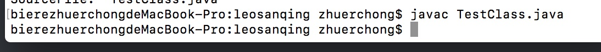

- 使用 `javap -verbose`命令，打开刚刚编译成的Class文件

  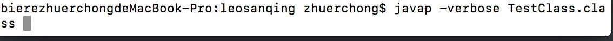

- 使用刚刚的软件打开Class文件

  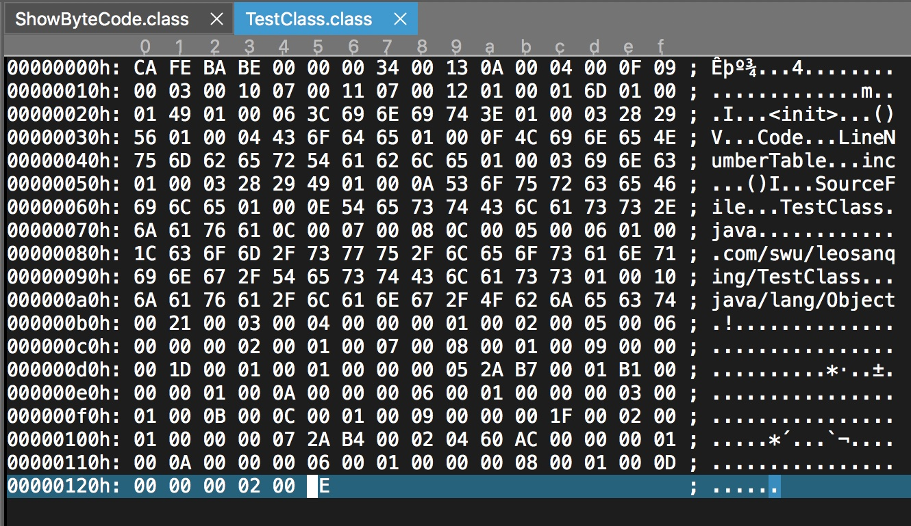

刚刚`javap -verbose`命令打开的文件是这样,这个后面对比的时候会用到，里面的名词参考上面的结构表

```java
Classfile /Users/zhuerchong/Desktop/code/idea/jvm/classFileTest/src/com/swu/leosanqing/TestClass.class
  Last modified 2019-4-22; size 294 bytes
  MD5 checksum b72816f8ed65e104c061eed5275b81e9
  Compiled from "TestClass.java"
public class com.swu.leosanqing.TestClass
  minor version: 0
  major version: 52
  flags: ACC_PUBLIC, ACC_SUPER
Constant pool:
   #1 = Methodref          #4.#15         // java/lang/Object."<init>":()V
   #2 = Fieldref           #3.#16         // com/swu/leosanqing/TestClass.m:I
   #3 = Class              #17            // com/swu/leosanqing/TestClass
   #4 = Class              #18            // java/lang/Object
   #5 = Utf8               m
   #6 = Utf8               I
   #7 = Utf8               <init>
   #8 = Utf8               ()V
   #9 = Utf8               Code
  #10 = Utf8               LineNumberTable
  #11 = Utf8               inc
  #12 = Utf8               ()I
  #13 = Utf8               SourceFile
  #14 = Utf8               TestClass.java
  #15 = NameAndType        #7:#8          // "<init>":()V
  #16 = NameAndType        #5:#6          // m:I
  #17 = Utf8               com/swu/leosanqing/TestClass
  #18 = Utf8               java/lang/Object
{
  public com.swu.leosanqing.TestClass();
    descriptor: ()V
    flags: ACC_PUBLIC
    Code:
      stack=1, locals=1, args_size=1
         0: aload_0
         1: invokespecial #1                  // Method java/lang/Object."<init>":()V
         4: return
      LineNumberTable:
        line 3: 0

  public int inc();
    descriptor: ()I
    flags: ACC_PUBLIC
    Code:
      stack=2, locals=1, args_size=1
         0: aload_0
         1: getfield      #2                  // Field m:I
         4: iconst_1
         5: iadd
         6: ireturn
      LineNumberTable:
        line 8: 0
}
SourceFile: "TestClass.java"

```


# 魔数

## 概念

对应上面的 **magic**,他是标识class文件的基础，一般文件的二进制流都会有 **魔数**，这个是相应的软件识别文件的前提。

我们常说的后缀名，基本上只是电脑识别归类以及给人看，或者给默认的软件解析，省事。你改了后缀名，并不会影响他的二进制内容。而且如果是要确保安全，在做软件的文件上传功能的时候，**一定是要读取内容判断魔数而不是判断后缀名**。

```java
  /** JPG */
	JPEG("FFD8FF"),
	
	/** PNG */
	PNG("89504E47"),
	
	/** GIF */
	GIF("47494638"),
```

一个JPG文件的十六进制码

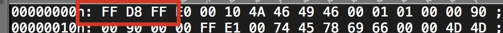

**就像是你给狗起了个人名，难道他就是人了吗？**你只有改了他的DNA，他才有可能成为人。名字就对应后缀名，DNA就对应魔数


还记得我之前提到的，Class是以8位字节为基础的二进制文件吗？如果我们用十六进制来看，那么两位就相当于是一个字节，也就是u1。

**所以我们看的时候，是两位两位一起看，上面提到魔数一共有4位（正确的应该是4个字节）。**

结果他也真的是4位，

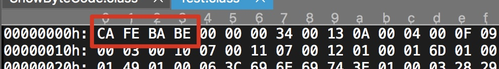


## Class文件的魔数

`CAFE BABE`，这个魔数是不是很浪漫？有没有想到和Java的名字相关(Java也是一种咖啡)？但是这个魔数是在 **Java**还在叫**Oak**的时候就已经确定了下来，或许后面改名**Java**的时候参考了魔数

# 版本号

紧接着魔数的后面的两个数据是版本号，分别都为u2类型，也就是要看2个字节。

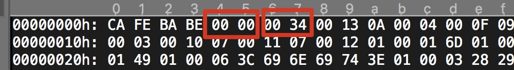

前者表示次版本号，后者表示主版本号。

0x34转换成十进制是52，而主版本号是从45开始，**JDK1.1之后的每个JDK大版本发布主版本号向上加1.**所以52表示JDK1.8.

高版本的JDK能向下兼容，但是低版本的不能向上兼容，即使文件格式并未发生任何变化，虚拟机也拒绝编译。所以JDK1.8能支持45.0-52.65535的class文件

# 常量池

常量池是一个大篇章，我看了很长时间才弄懂，因为一开始没有看懂他是怎么看的那个各种数据表，怎么看他的数据结构体。

## 范围

除了我框出来的部分，剩下的都是常量池的内容，

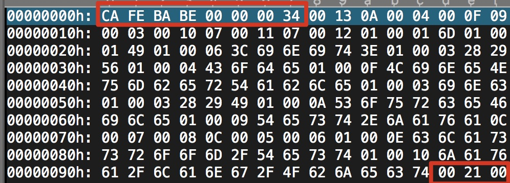

## 有什么

常量池中主要存放两大类：

- 字面量
  - 文本字符串
  - 声明为final的常量值
  - 等….
- 符号引用
  - 类和结构的全限定名
  - 字段的名称和描述符
  - 方法的名称和描述符

## 怎么看

还记得那个表吗

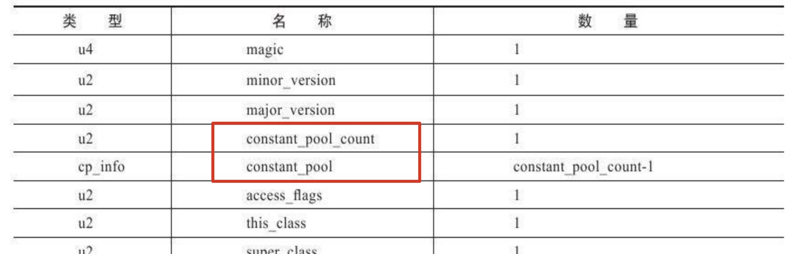

我们看到主版本号之后就是常量池的入口了，头两个字节是常量池的大小。我们看到是0x13，换算成十进制是19，也就是一共有18个常量池的数据（注意，不是从0开始，0单独有用，索引就是1-18）。我就带大家查看下有哪些数据，你从我们用 `javap -verbose`弄出来的也可以看出来。


在看字节码之前，我们得现弄明白常量池中都有哪些项目类型，一共有14个(JDK1.7，1.8之后增加了没有我也不知道，不过不影响我们阅读和理解字节码)

他们的共同特点是，**表开始的第一位是一个u1类型的标志位(tag)**

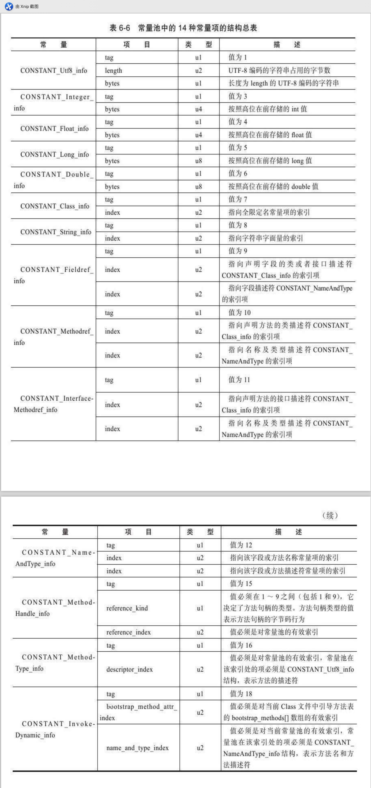


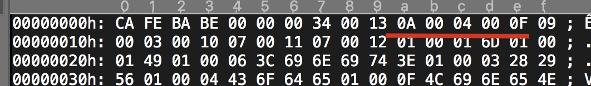

- 我们看到第一个是0x0A，由他们的特征知道他是标志位（不清楚的，你可能忘了或者没看到我图片上面的一句话），

- 那么我们就转换成十进制，就是 10。
- 查看图片，找到标志位是10 的那个常量表。

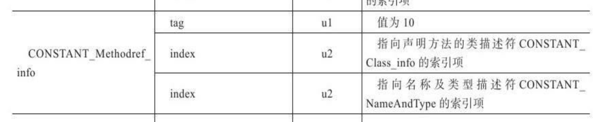

然后我们知道这个表的结构体一共有三个数据项构成。我们再根据这个来找后面的字节码是啥意思。

根据表结构，我们知道他后面两个都是u2类型的，所以后面的都是两个两个看。下一个是0x0004，根据表的定义，他是指向CONSTANT_Class_info的索引。我们再去找CONSTANT_Class_info,他是这样的结构


**由于已经确定了数据的表结构，所以他并没有tag**，所以0x0004就表示后面的index，即指向全限定名的常量项目的索引，**而他指向第四个常量**。（我们现在还没分析到第四个常量，但是我们可以通过之前命令行里的内容找到第四个常量代表啥）

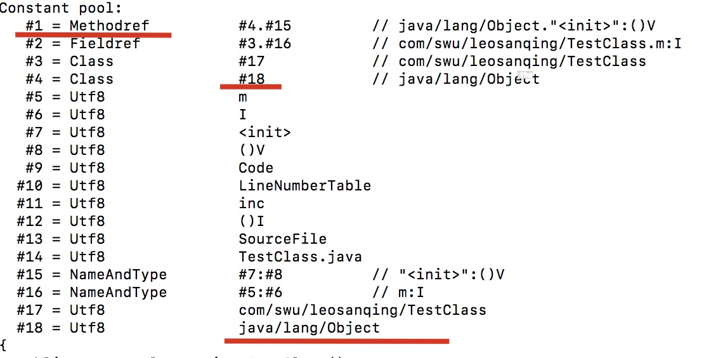

所以它实际上是指向类的全限定名-`java/lang/Object`。

我们也可以通过 javap -verbose 这个来验证我们刚刚翻译过来的字节码到底对不对，我们看到，确实没有问题。

我们再看他的第三个数据项，0x000F，再根据刚刚的方法，我们找到 常量池中第15个常量为 NameAndType类型，并且指向第7和第8 个常量。

后面的翻译方法跟这个一样，我就不再啰嗦了你也可以根据我说的方法一一去验证，直到把常量池中的全部翻译完。


# 最后

如果你想看懂字节码，知道他们代表什么意思，那你最好反复看下我的这个文章，跟我我的方法一一验证一下，弄懂该怎么去看字节码的数据结构体。因为后面的访问标志、类索引和接口索引、字段表集合等等，Class文件的内容都是要采用这种方法翻译。

想要看剩下的都是哪些内容，可以看我的下篇，[能看懂的字节码-下](https://github.com/leosanqing/Java-Notes/blob/master/JVM/%E8%99%9A%E6%8B%9F%E6%9C%BA%E6%89%A7%E8%A1%8C%E5%AD%90%E7%B3%BB%E7%BB%9F/%E5%AD%97%E8%8A%82%E7%A0%81%E6%96%87%E4%BB%B6%E7%BB%93%E6%9E%84/%E8%83%BD%E7%9C%8B%E6%87%82%E7%9A%84%E5%AD%97%E8%8A%82%E7%A0%81-%E4%B8%8B.md)。因为这篇主要是讲如何看懂字节码的方法，该用到哪些工具，怎么验证自己翻译的对不对。

# 下篇预告

字节码中的：

- 访问标志

- 类索引、父类索引和接口索引集合

- 字段表结合

- 方法表集合

- 属性表集合