# 前言

上一篇看得懂的字节码讲了怎么看字节码，以及字节码中的魔数、版本号和常量池部分，这篇文章接着字节码顺序往下将。请一定要看了上一篇之后再看这一篇，因为有绝对的逻辑关系，不看上一篇这篇基本看不懂。

如果这篇文章中有我没有讲到怎么出现的东西，（比如程序的代码，javap工具，查看字节码的工具等）就是我在上一篇文章中已经提到过的，可以查看我的上一篇文章来找到答案。

上一篇地址 [能看懂的字节码-上](https://github.com/leosanqing/Java-Notes/blob/master/JVM/%E8%99%9A%E6%8B%9F%E6%9C%BA%E6%89%A7%E8%A1%8C%E5%AD%90%E7%B3%BB%E7%BB%9F/%E5%AD%97%E8%8A%82%E7%A0%81%E6%96%87%E4%BB%B6%E7%BB%93%E6%9E%84/%E8%83%BD%E7%9C%8B%E6%87%82%E7%9A%84%E5%AD%97%E8%8A%82%E7%A0%81-%E4%B8%8A.md)

# 文章大纲


# 访问标志

紧接着常量池后面的两个字节(u2类型)就表示访问的标志，在字节码中是这两个数

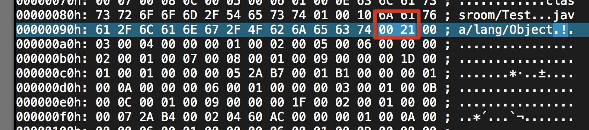

那么他代表什么呢？他表示这个类或者接口声明为 **public**

我们看他的所有含义的表

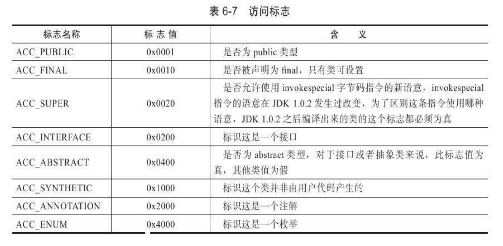

21就是 ACC_PUBLIC 和 ACC_SUPER 这两个标志值相或的结果。即 0x0001 | 0x0020 = 0x0021。

而我们的代码中为

```java
public class TestClass {
  .......
}
```


> 你可以试下将它声明为 private 或者其他情况是什么值

# 类索引、父类索引与接口索引

## 是什么

这三个非常类似，所以放在一起讲。**类索引和父类索引都是u2的数据。接口索引是一组u2类型的数据**。因为Java只能单继承，但是可以实现多个接口

- 类索引和父类索引都是指向一个类型为**CONSTANT_Class_info**的类描述符常量，通过这个的**索引值**我们可以找到定义在**CONSTANT_Utf8_info**中的全限定名字符串
- 接口索引前面有一个接口计数器(interfaces_count)，表示后面索引的容量。如果为零，那么就表示后面的索引表不占任何字符。

## 怎么看

我们回到字节码文件，接着上次看到的 0x0021.

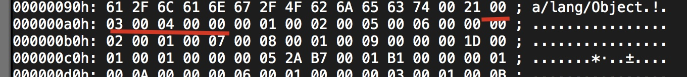

后面是 0x0003, 0x0004,0x0000。这些啥意思呢？

刚刚说了指向**CONTANT_Class_info**，而这个class_info 存了全限定名的信息，结构如下

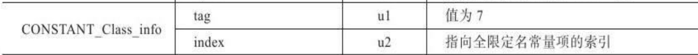

在上一篇我也说了，因为他已经确定了类型，所以是没有tag的位置的，就只有后面的index。所以0x0003表示它指向 第三个常量。第三个常量是什么呢？

我们回到命令行的内容(这个在上篇介绍过怎么打开的)，

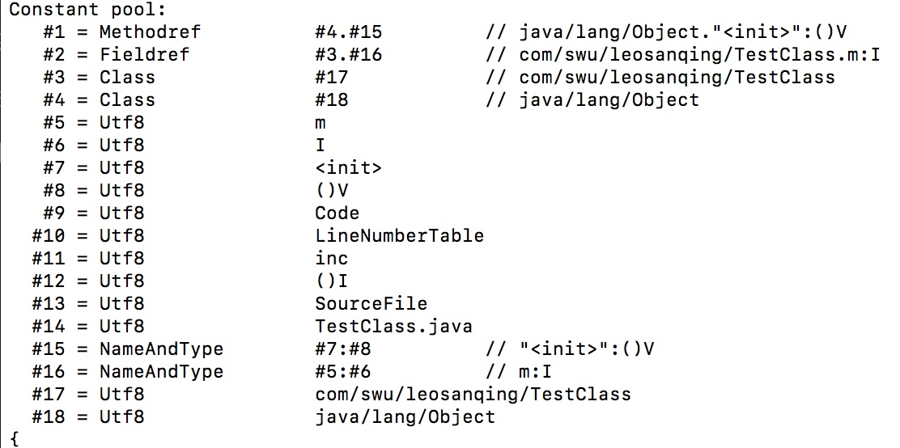

第三个常量指向第17个常量，第17个常量是一个 uft8类型的。他的信息为·`com/swu/leosanqing/TestClass`。这个不就是该类的名称吗？

同理，我们找到 0x0004指向的含义，他是指向第18个常量，第18个常量也是一个**utf8**类型的数据，所存储的信息为 `java/lang/Object`，这个类不就是我们TestClass的父类吗/

0x0000 表示这个类没有实现接口(或者这个接口没有继承其他接口)，所以这三个就已经解析完了。

# 字段表

## 是什么

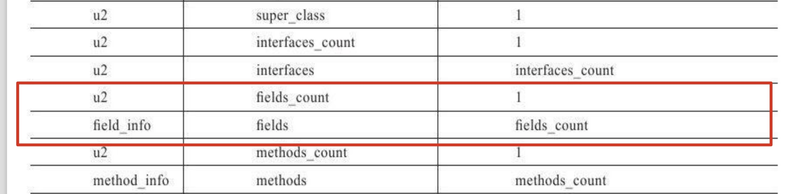

**字段表（field_info）用于描述接口或类中声明的变量，字段包括类级变量以及实例级变量，但不包括在方法内部声明的局部变量**

而这个field_info是一个这样的结构

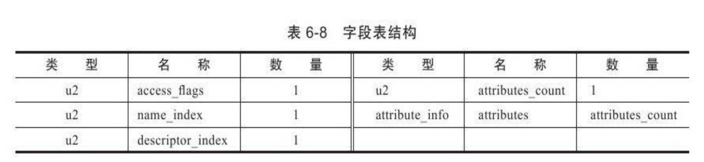

他跟之前的**类的访问标志很像**，都是u2类型的数据，但是有一些差别

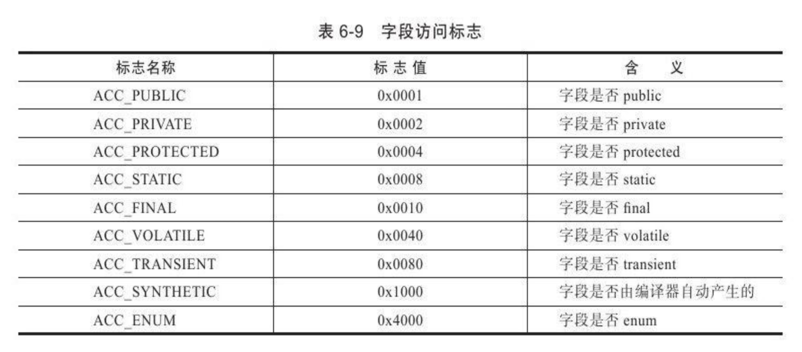


如果是相同的话，那么他们的**标志值**是一模一样的

紧随**access_flags**后面的两个是 **name_index**和**descriptor_index**,这两个分别表示字段的**简单名称**以及**字段和方法的描述符**。

## 简单名称

**简单名称**是指**没有类型和参数修饰**的**方法或者字段的名字**，比如我们定义的方法

```java
public class TestClass {

    private int m;

    public int inc(){
        return m+1;
    }
}
```

那么简单名称就是 "inc"和"m".等会儿你跟着我翻译一下字节码就知道了

**字段和方法的描述符**稍微复杂一些，他的**作用**是用来描述字段的数据类型、方法的参数列表（包括数量、类型和顺序，看到这三个有没有想到啥？没错，**重载**！等下就知道重载为啥要三个不一样）和返回值。

根据描述符规则，**基本数据类型**(byte，short，int…….)以及**代表无返回值的void类型**都用一个**大写字符**来表示，而**对象类型则用字符L+对象的全限定名来表示**。

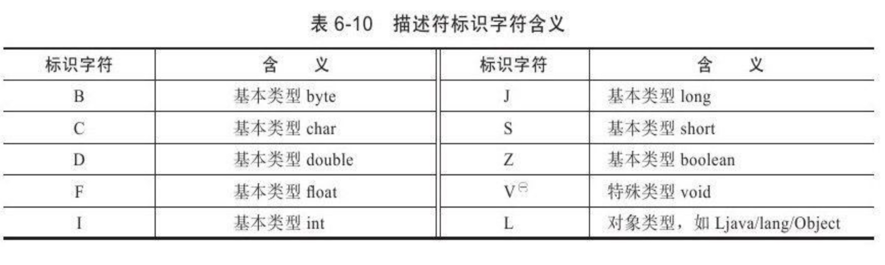

对于数组来说，每一个字符将使用一个前置的"["字符来描述，

下面我来分别举个例子

```java
/* 如果我要表示一个整形数组 int[]
		那么就应该表示为  [I
		
		如果我要表示一个二维的数组char[][]
		那么就应该表示为 [[C
		
		如果我要表示一个二维的字符串数组String[][]
		那么就应该表示为  [[Ljava/lang/String; 注意有分号
		因为String不是基本类型也不是void类型，所以要用对象类型来描述
		所以他就应该用字符L+String类的全限定名来表示
		
		如果我要表示一个自定义的Person类，他在包 com.swu.leosanqing下
		那么就应该表示为 Lcom/swu/leosanqing/Person
		
*/
```

## 描述符(重要)

如果描述符（descriptor_index）要描述一个方法的话，按照**先参数列表**，**后返回值的**顺序描述，参数列表按照参数的严格顺序放在一组小括号"()"中。

下面我举几个例子

```java
/*
	先拿本程序举例，他有一个 方法  
	public int inc(){
        return m+1;
    }
    那么就应该表示为 "()I"
    
    假设 Person类 在包 "com.swu.leosanqing"下
    如果一个方法为 public Person (char[] source,int[] a,char[][] c,int b,int c,String d).
    那么他就应该表示为 			         ([C[I[[CIILjava/lang/String;)Lcom/swu/leosanqing;
  
*/
```

这个后面的方法表集合中会用到

## 怎么看

我们接着类索引、父类索引和接口索引往下看。


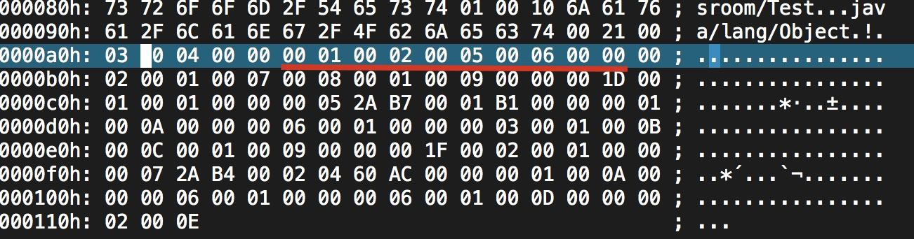

我们对着下面的表进行一一对应，他前面还有一个 `field_count`

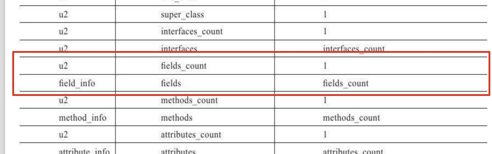


0x0001对应`field_count`表示只有一个参数，因为代码中我们就只定义了一个 `private int m`

0x0002对应`access_flags`，然后我们查上面的表，它的意思为 字段是`private`


然后我们再看 0x0005，它对应的是u2类型的 `name_index`，我们应该找常量池中的第5个参数，我们通过命令行中的找，他的名字是 "m"

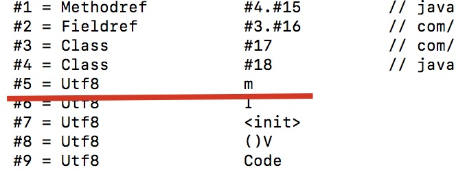


然后我们再往下走，0x0006 ,它对应`descriptor_index`，然后我们去常量池中寻找第6个常量，他是"I"，然后后面两个字节是0x0000，表示没有属性值。如果我的程序是 `private int m = 123;`那么后面的属性值就应该有表示的值

所以看下来，就是 private int m，跟我们程序中定义的是一模一样的，表明我们的解读正确。

## 字段无法重载

Java中没有用过字段的重载吧？也就是说我们不能在程序中这样定义。

```java
private int m;
public String m;

// 我们都知道这样做ide会报错，两个字段的数据类型、修饰符不管是否相同
// 都必须使用不一样的名字

//但是在字节码中就不一样，如果两个字段的描述符不一致，那么他是可以重名的，且是合法的
```

下一个小节将方法的重载，这个应该就稍微清晰一点

# 方法表

## 是什么

如果你理解了上一小节的内容，那么这一小节将会比较好懂，因为两个都差不多。

他就是**用来表示字节码中的方法的各种数据项**

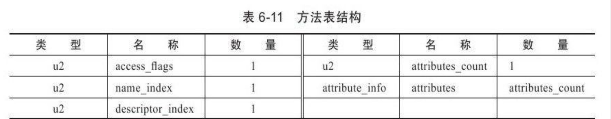

你看这个表是不是很眼熟，和上一小节的字段表结构非常像？

访问标志也很像不过有些增减，比如加了方法的修饰符 native 的标志，删去了字段的 volatile 标志

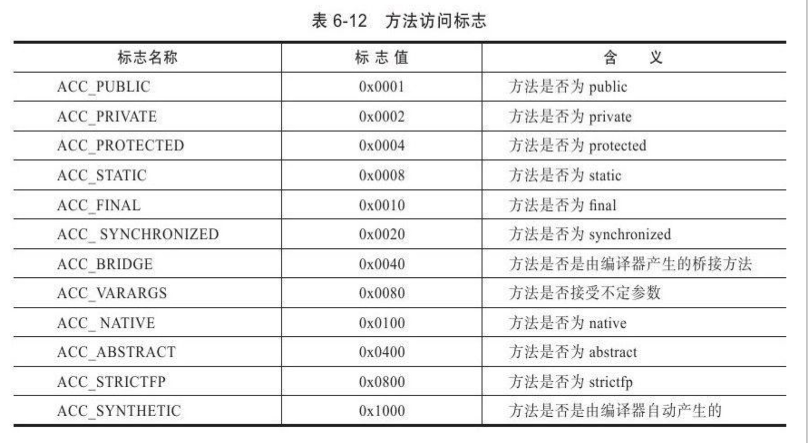

## 方法里的代码去哪了

有没有发现，方法表结构并没有表示或者存放代码的内容，那么他去哪里了呢？他存放到**方法表中**的**属性表里**的 "**Code**"属性里。我会在下一节中讲到。

## 怎么看

### 第一个方法

我们先看下我们的方法对应字节码中的是哪些东西。这个刚好是接着上一节的字段表的位置开始的

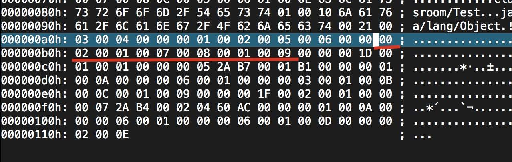

跟上一节的字段表一样，首先他有一个表示方法多少的计数器"methods_count"，然后才是方法表(method_info)里面的数据，所以 0x0002表示里面有两个方法。

**你可能疑惑了，我只定义了一个inc()方法啊，怎么会有两个呢？别忘了，我们还有一个默认的构造函数。所以有两个**

然后我们再对应方法表来看


我们再看下一个 0x0001，它对应`access_flags`，我们查方法访问标志表，发现他是一个`public`

然后我们再看下一个0x0007，他对应`name_index`，我们去常量池找第七个常量，发现他是 `<init>`，这个表示实例构造器.

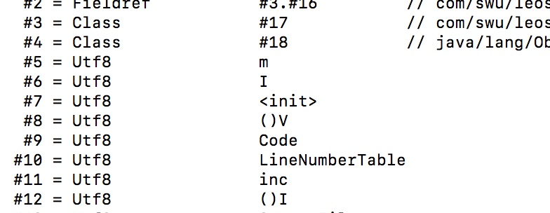

然后看下一个 0x0008，它对应描述符的索引（descriptor_index），去常量池找，发现他是()V，、

再看下一个 0x0001,它对应属性值的的个数(attributes_count)，说明有1个。

再看下一个 0x0009，他对应属性值(attributes),我们查看常量池发现他是表示"Code"，Code也是一个复合表，他的各项定义在下一节中会讲到。

所以综合起来这些字节码就表示 有两个方法，其中一个是构造函数`public void  `

那我们定义的`public int inc()`方法哪去了？这两个离的比较远，因为里面还有其他的东西。这些东西是啥，下节讲属性表会介绍

### 第二个方法

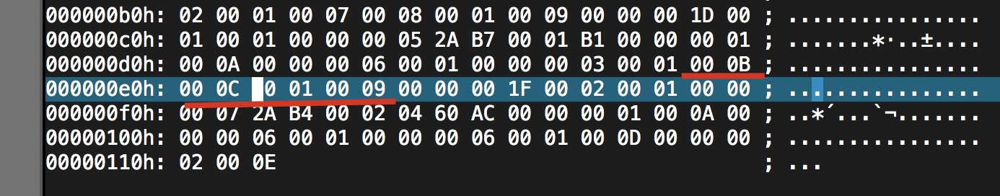

根据刚刚分析第一个方法的方法，我们可以得出，解析出来是`public int inc()`，完全是我们定义的方法。

## 方法的重载

Java中，方法的**重载**只要满足是三个条件的其中一个就行：**参数个数不同，参数类型不同，参数顺序不同**。

那是因为Java代码中要重载一个方法，除了要有相同的名字之外，还得有不同的特征签名。这个特征签名只包括了方法名称、参数顺序、参数类型。

但是字节码中，特征签名不仅包括上面的部分，还要包括返回值和受查异常表，如果仅仅只是Java代码部分的特征签名相同，但是**返回值或者受查异常表**不同，那么字节码也是允许那样的同名方法。


# 属性表

## 是什么

属性表(attribute_info)在之前的小节中出现了多次，它是用来描述某些场景的专有信息

比如我们之前说的Code，还有在字段表小节说的假如 我们有一个代码是`private int m =123；`，属性表就存`123`的值。

虚拟机规范预定义了非常非常多属性

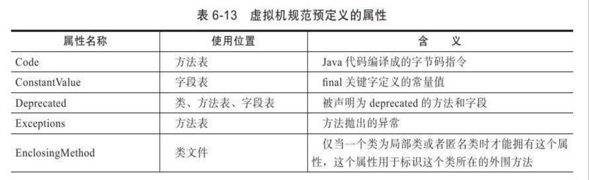

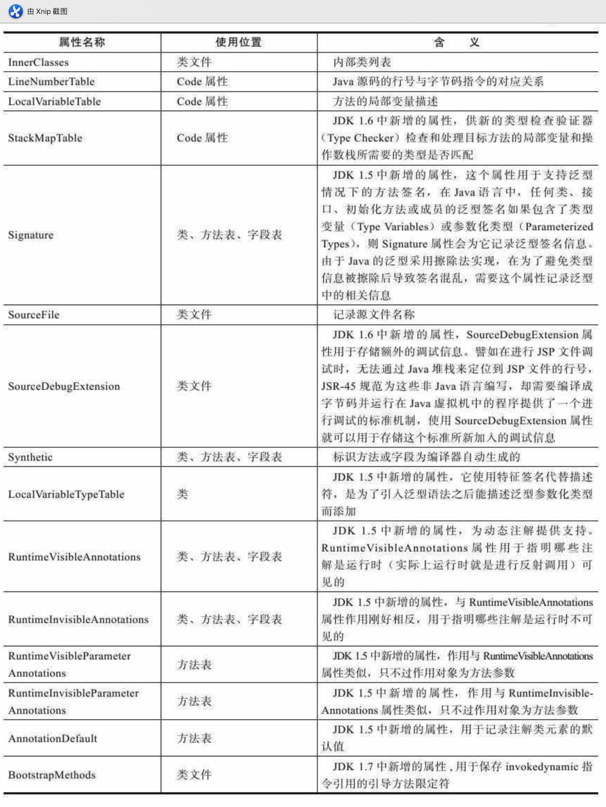

对于每一个属性，他的名称需要从常量池中引用一个`CONSTANT_Utf8_info`类型的常量来表示，而这个属性的结构完全是自定义的，只需要通过一个u4的长度属性去说明属性值所占用的位数即可。

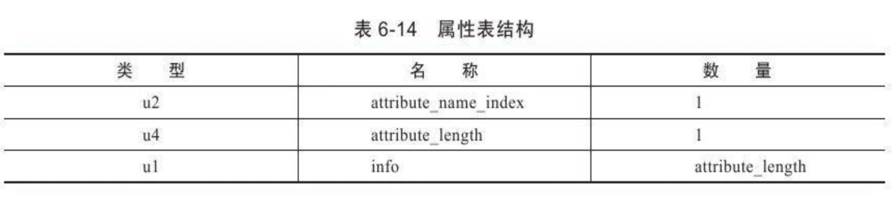

我们来看Code属性表结构(不是每**个方法表都有Code属性**，比如接口和抽象类中的方法就没有这个)

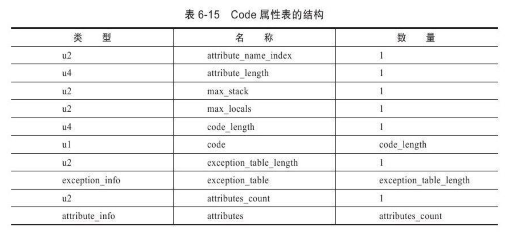

由于这是Code表结构，而且之前的方法表已经记录了Code前两个数据项的内容，所以**属性值的长度固定为整个属性表长度减去6个字节**，即减去 （u2+u4）

## 怎么看

我们先看他的范围

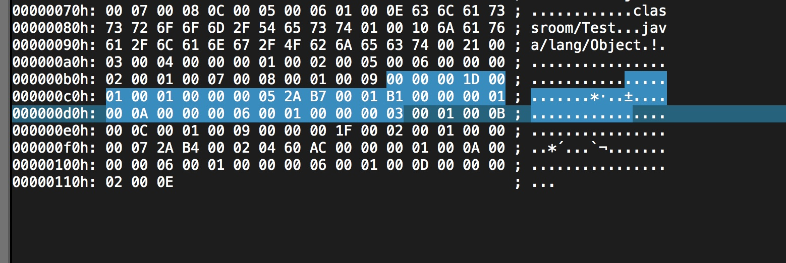

前面的4个字节(0x0000001D)对应`attribute_length`，表示这个Code属性表一共有多长，总共占用多少个字节。我们换算成十进制，就是29，我们数一下他后面的，刚好是29个字节。从 03后面就是第二个方法的存储位置了，刚好对应上一节的第二个方法的起始位置，可以翻回去验证一下(不过之前的红线少画了两个字节，分析的时候加上了)

后面的 0x0001,0x0001,0x00000005分别对应 `max_stack`,`max_local`,`code_length`.

后面的 `2A B7 00 01 B1`分别就是字节码指令了。我们来翻译一下

1. 读入 2A，查表得0x2A对应的指令为 aload_0，这个指令的含义是将第0个Slot中为reference类型的本地变量推送到操作数栈顶

   

2. 读入 B7，查表得 0xB7对应的指令为 `invokespecial`，这条指令的作用是以栈顶的reference 类型的数据所指向的对象作为方法接受者，调用此对象的实例构造器方法、private方法或者他的父类的方法。这个方法有一个u2类型的参数说明具体调用哪一个方法，他指向常量池中的一个CONSTANT_Methodref_info 类型常量，即次方法的方法符号调用(就是下一个参数)

   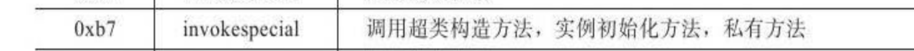

3. 读入 00 01，这是 上一步 `invokespecial`的参数，查常量池得 0x0001对应的常量为 实例构造器` "<init>"`方法的符号引用

   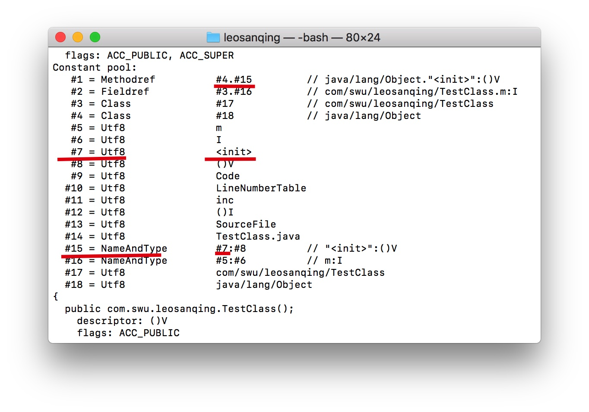

   

4. 读入B1,查表的 0xB1对应的指令为return，含义是返回此方法，并且返回值为Void。这条命令执行后，当前方法结束

   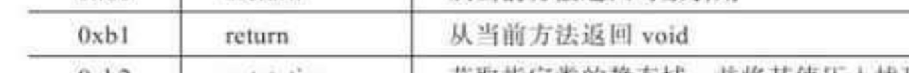

我们通过上述的字节码指令可以看出，虚拟机的这个执行过程是**基于栈**的，所以我们可以初步推测，**Java虚拟机执行字节码是基于栈的体系结构**


后面的那些字节码是什么呢？

00 00 00 01 00 0A 我们接着看code表后面的内容


他的意思分别是  **exception_table_length**参数为0，**attribute_count**参数为1，0A表示指向常量池的第10个常量，也就是**LineNumberTable**。


我们来看**LineNumberTable**的结构


他跟属性表结构**CONTANT_Utf8_info**差不太多，所以我们可以省掉第一个，因为已经知道他是这个名字了，然后再接着上面的字节码，解析一下他们分别表示啥。

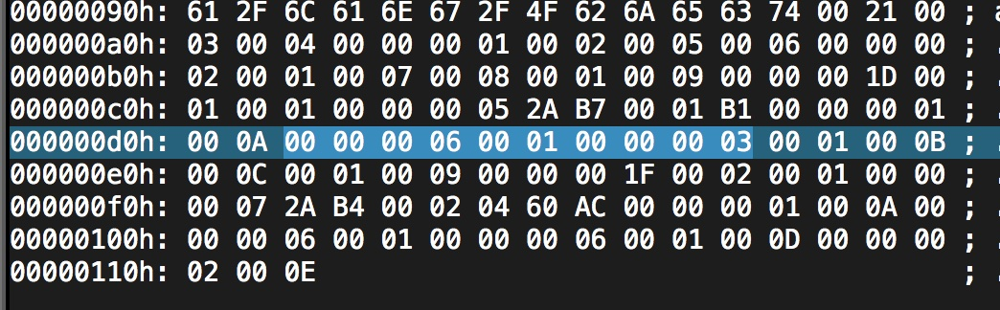

首先他有一个u4类型的数据表示长度，所以 0x00000006就表示后面的6个字节用来描述这个属性。后面刚好只有6个字节。

然后一个 u2类型的 **line_number_table_length**这个就表示有一个行号表，**行号表只有两个u2类型的数据**，**start_pc**和**line_number**，前者表示字节码行号，后者表示Java源码行号，所以分别是 0和3

通过命令行的结果来验证我们是否解析的正确

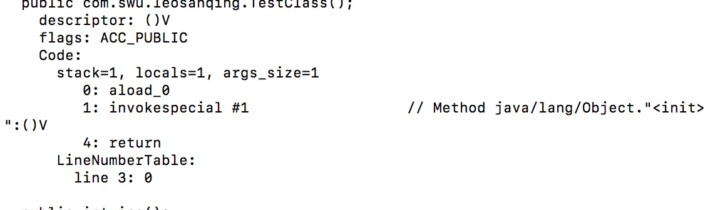

我们看到和我们的解析结果一致。所以我们的解析过程是正确的

后面的第二个方法你可以按照我的思路自己解析一下，应该没有太大的问题。

至此字节码基本已经解析完

# 总结

通过两篇文章我们知道了字节码文件中有哪些东西，又该怎么去看字节码文件。

Class文件中一共就只有两种数据类型

- 无符号数
- 表

Class文件中一共有哪些东西呢？大的分类一共有下面几种

- 魔数
- 版本号
- 常量池
- 访问标志位
- 类索引、父类索引、接口索引
- 字段表
- 方法表
- 属性表

当然我这个程序只是非常简单的程序，还有很多内容用不到，比如异常、接口、同步锁等，但是已经可以将整个Class串起来了，如果你想验证，可以根据我的方法，自行验证


