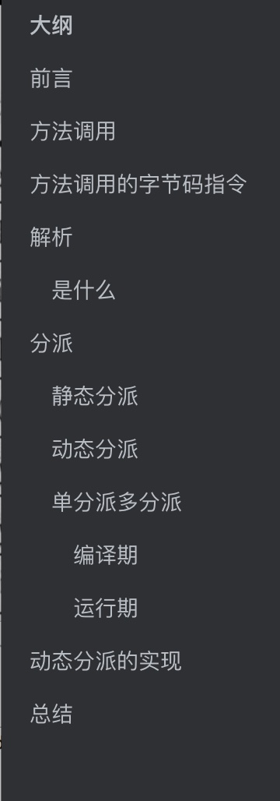
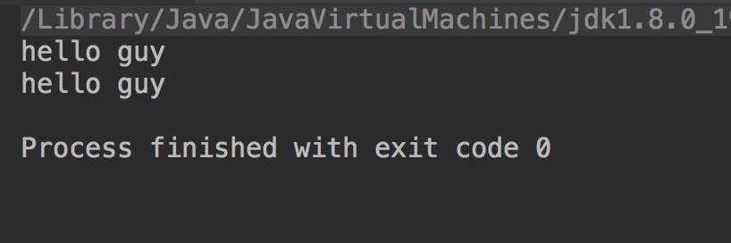
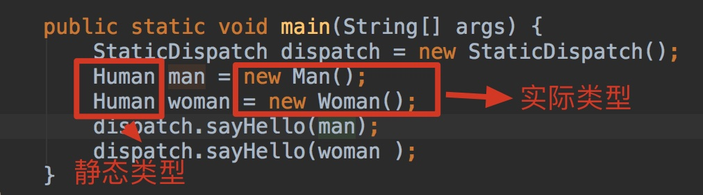
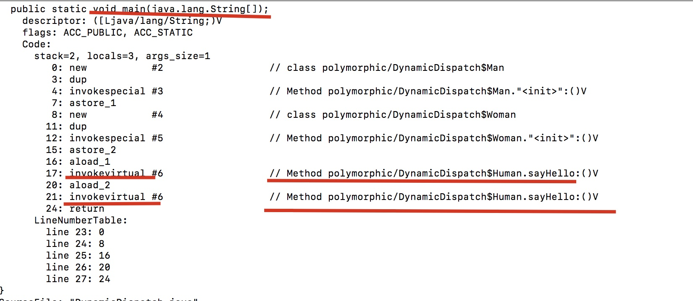
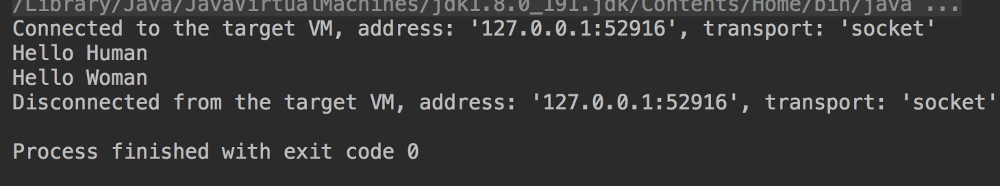
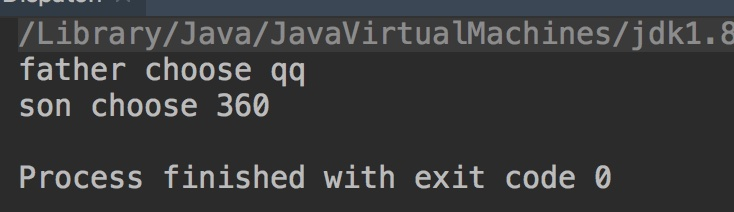
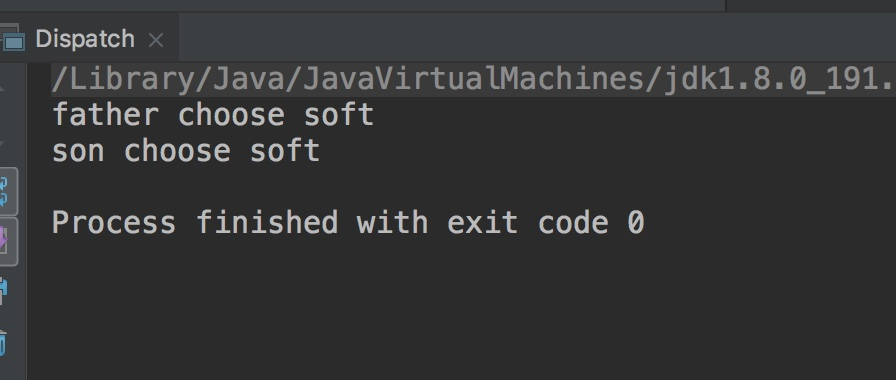
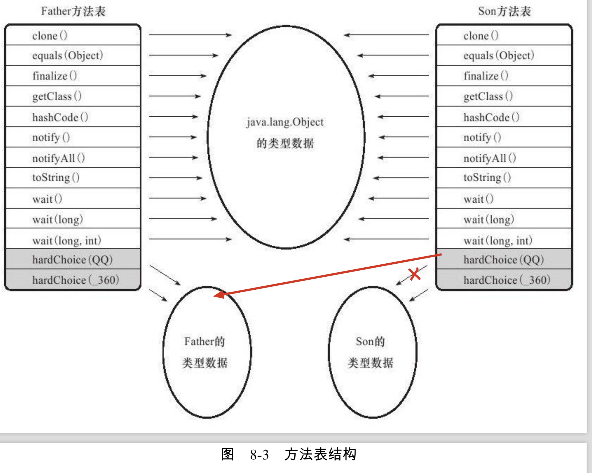

# 大纲



# 前言

重载的优先级是啥

重载和重写的区别又是啥

上一篇我们说了提到符号引用转化为直接引用的两种方法，这节我们就讲下这两种方法，因为引用转化是方法的调用才执行的，所以先弄明白方法调用

# 方法调用

方法执行有两个步骤

- 方法调用，确定调用那个方法
- 基于栈的解释执行。真正执行方法的字节码

所以方法调用并不等于方法的执行，他只是其中一个步骤。

方法调用有两种

- 静态解析
- 分派(有静有动)

还记得我们上篇文章说的将字节码中的符号引用转化为直接引用的两种方法吗？这节就讲这两个方法。他们都属于方法的调用


**重点讲重载和重写的区别**，也就是分派的部分，面试应该也多问这个吧。

# 方法调用的字节码指令

- invokestatic:调用静态方法
- invokespecial：调用实例构造器`<init>`方法、私有方法和构造方法
- invokevirtual：调用所有的虚方法
- invokeinterface:调用接口方法，会在运行时再确定一个实现此接口的对象
- invokedynamic:
  - 先在运行时动态解析出调用点限定符所引用的方法，然后在执行该方法。
  - 和上面四个的区别
    - 之前的四个，分派逻辑是固化在Java虚拟机内部的
    - 这个指令的分派逻辑是由用户自己所设定的引导方法决定的
- **除了最后一个**，其他的四个的第一个参数都是被调用的方法的符号引用，是在编译期就确定的，所以**缺乏**动态语言类型的支持。**这也是Lambda表达式在1.8出现的原因**(1.7出现的这条语句奠定了他的基础)


# 解析

## 是什么

**调用目标在程序代码写好，编译器进行编译时就必须确定下来**。这类方法的调用称为**解析**

还记得之前文章说的，在类加载的解析阶段，**会将一部分的符号引用转化为直接引用吗**，这种解析能成立的前提是：**方法在程序真正运行之前就有一个可确定的调用版本，并且这个版本在运行期间不可变**。

Java语言符合"编译期可知，运行期不可变"这个要求的方法，主要有两大类

- 静态方法
- 私有方法
- 前者和类型直接关联，后者不可被外部访问。这两个特点就保证了他们不可能通过继承或别的方式重写其他版本，所以适合类加载阶段解析

我们看上面的指令的前两个`invokestatic`和`invokespecial`，只要能被这两个指令调用的方法，都可以在解析阶段确定唯一的调用版本，所以符合这个条件的有四类

- 静态方法
- 私有方法
- 实例构造器
- 父类方法

他们被称为 **非虚方法**，与之相对的，就被称为**虚方法**(**final**除外，因为他 不可继承覆盖，所以也只有一个调用版本，所以他也是**非虚方法**)

# 分派

分派按照**调用**可能是静态也可能动态，按照**宗量数**，可分为单分派，多分派，因此组合一下，就有四种不同的分派

- 静态单分派
- 静态多分派
- 动态单分派
- 动态多分派

## 静态分派

何为静态，就是**发生在编译期**，所以确定静态分派的不是由虚拟机完成，而是编译器，编译器在编译阶段确定版本。**重载**是典型的静态分配

我们看下这个代码

```java
package polymorphic;

public class StaticDispatch {
    static abstract class Human{

    }
    static class Man extends Human{

    }
    static class Woman extends Human{

    }

    public void  sayHello(Man man){
        System.out.println("hello man");
    }
    public void sayHello(Woman woman){
        System.out.println("hello woman");
    }
    public void sayHello(Human human){
        System.out.println("hello guy");
    }

    public static void main(String[] args) {
        StaticDispatch dispatch = new StaticDispatch();
        Human man = new Man();
        dispatch.sayHello(man );
        Human woman = new Woman();
        dispatch.sayHello(woman );
    }
}
```

输出是啥呢？



想解释这个，得先知道两个概念

- 静态类型(外观类型)
- 实际类型

以上面的为例



区别：

- 静态类型的变化仅仅在使用时发生，本身的静态类型不会发生变化，并且静态类型是在**编译期**可知的
- 实际类型变化的结果，运行期才可知，编译器在编译程序的时候**并不知道**一个对象的**实际类型**是什么

我们一开始就说，静态分派之所以称为静态分派，是因为他在**编译期**就确定了，所以他就是通过**静态类型**确定的。

**所以重载的时候，是按照静态类型来确定，并且是编译期确定。**

## 动态分派

与静态分派对应的是动态分派，经典的例子就是**重写**

我们来看下面的这个代码

```java
package polymorphic;

public class DynamicDispatch {
    static abstract class Human{
        public abstract void sayHello();
    }
    static class Man extends Human{

        @Override
        public void sayHello() {
            System.out.println("Hello Man");
        }
    }
    static class Woman extends Human{

        @Override
        public void sayHello() {
            System.out.println("Hello Woman");
        }
    }

    public static void main(String[] args) {
        Human man = new Man();
        Human woman = new Woman();
        man.sayHello();
        woman.sayHello();
    }

}
```

我们看他的输出结果


这个显然不是通过**静态类型**来判断两个变量的行为，因为两个变量的静态类型一样啊，都是`Human`。

我们来看他们字节码的内容



我两次调用的语句也是一样啊，是什么导致最后的行为不一样呢？

我们就要从调用语句`invokevirtual`来说起，他在**运行时**解析过程大致分为以下几个步骤

1. 找到操作数栈顶的第一个元素所指向的对象的**实际类型**，记作C
2. 如果在类型C中找到与常量中的描述符合简单名称都相符的方法，则进行访问权限的校验，如果**通过**则返回这个方法的**直接引用**，查找结束；如果不通过，则返回`java.lang.IllegalAccessError`异常
3. 否则，按照**继承关系从下往上**以此对C的**各个父类**进行**第2步**的搜索和验证过程
4. 如果始终没有找到合适的方法，则抛出`java.lang.AbstractMethodError`异常

我们看到他是找的**实际类型**，所以两次调用`invokevirtual`指令把**常量池中的符号引用**解析到了**不同的直接引用**上，这个过程就是**Java重写的本质**

而这种在**运行期根据实际类型**确定方法执行版本的分派过程称为**动态分派**

我们再修改下代码来试一下上面的情况

```java
package polymorphic;

public class DynamicDispatch {
    static abstract class Animal{
        public abstract void sayHello();

    }

    static  class Human extends Animal{

        @Override
        public void sayHello() {
            System.out.println("Hello Human");
        }
    }
    static class Man extends Human{

//        @Override
//        public void sayHello() {
//            System.out.println("Hello Man");
//        }
    }
    static class Woman extends Human{

        @Override
        public void sayHello() {
            System.out.println("Hello Woman");
        }
    }

    public static void main(String[] args) {
        Animal man = new Man();
        Animal woman = new Woman();
        man.sayHello();
        woman.sayHello();
    }

}
```

我们创建了一个抽象类Animal，并且Human继承自Animal，而Man和Woman继承自Human。然后把Man中的重写方法注释掉。

我们看下他的输出结果



可以看到他输出的是他的父类，因为Man类中并没有相关的方法。**他就顺着Man类的父类依次往上查找**

**那么他是怎么实现的呢？**

这个放到后面再讲，我们先把分派的类型讲完，因为后面的图用他的例子(我懒得自己画图，哈哈)

## 单分派多分派

我们先记住结论，**目前为止JDK1.8,Java是静态多分派，动态单分派的语言**

单分派多分派的划分的标准是啥，是根据**宗量**来判断，那么啥是宗量呢？

**方法的接收者**与**方法的参数**统称为方法的**宗量**

方法的接收者是啥？

- 我们看上面的动态分派或者静态分派，动态分派中方法的接收者是**实际类型**或者是**实际类型往上的父类**

- 而在静态分派中，方法的接收者都是**静态类型**

方法的参数是啥？

- 方法的参数就是我们一直说的方法的参数

- 上面的都是单分派，因为我之前的例子不管动态还是静态分派。只有方法的接收者，没有方法的参数。我们看下下面的例子就知道了。

```java
package polymorphic;

public class Dispatch {
    static class Soft {

    }
    static class QQ extends Soft {

    }
    static class _360 extends Soft {}
    public static class Father{
        public void hardChoice(QQ qq){
            System.out.println("father choose qq");
        }
        public void hardChoice(Soft soft){
            System.out.println("father choose soft");
        }
        public void hardChoice(_360 _360){
            System.out.println("father choose 360");
        }
    }
    public static class Son extends Father{

        public void hardChoice(QQ qq){
            System.out.println("son choose qq");
        }

        public void hardChoice(_360 _360){
            System.out.println("son choose 360");
        }
    }

    public static void main(String[] args) {

        Father father =new Father();
        Father son =new Son();

        QQ qq = new QQ();
        father.hardChoice(qq);
        son.hardChoice(new _360());

    }
}
```

我们看他的输出结果



那么这个结果是怎么产生的呢？

### 编译期

我们按照步骤来，先看**编译期编译器的选择**，也就是**静态分派**的过程。

这个时候编译器会根据**两个宗量**来进行判断，所以他是静态多分派

- 静态类型(Father还是Son)
- 方法参数(QQ还是_360)

然后他会产生两条`invokevirtual`语句，一条指向`Father.hardChoice(QQ)`,一条指向`Father.hardChoice(_360)`。

### 运行期

这个时候，我们已经确定了参数是QQ或者_360其中一个，因此虚拟机就不会再管参数了，这个时候确定的只有实际类型到底是`Father`还是`Son`.

所以只有一个类型宗量。因此它是**动态单分派**


所以才输出了上面的结果。由此回答了我一开始的那句话"**截至目前(JDK1.8),Java是静态多分派，动态单分派的语言**"


但是我引用的是书上的例子，我觉得书上还有一点缺陷。他并没有验证编译期的时候的参数选择是根据那个类型来判断的。我修改一下上面的代码：

```java
package polymorphic;

public class Dispatch {
    static class Soft {

    }
    static class QQ extends Soft {

    }
    static class _360 extends Soft {}
    public  static class Person{
        public void hardChoice(QQ qq){
            System.out.println("father choose qq");
        }
        public void hardChoice(Soft soft){
            System.out.println("father choose soft");
        }
        public void hardChoice(_360 _360){
            System.out.println("father choose 360");
        }
    }
    public static class Father extends Person{
        public void hardChoice(QQ qq){
            System.out.println("father choose qq");
        }
        public void hardChoice(Soft soft){
            System.out.println("father choose soft");
        }
        public void hardChoice(_360 _360){
            System.out.println("father choose 360");
        }
    }
    public static class Son extends Father{

        public void hardChoice(QQ qq){
            System.out.println("son choose qq");
        }
        public void hardChoice(Soft soft){
            System.out.println("son choose soft");
        }

        public void hardChoice(_360 _360){
            System.out.println("son choose 360");
        }
    }

    public static void main(String[] args) {

        Person father =new Father();
        Person son =new Son();

        Soft qq = new QQ();
        Soft _360 = new _360();
        father.hardChoice(qq);
        son.hardChoice(_360);

    }
}
```

你可以看到我改动了三处，一处是参数类也有父类Soft，一处是Father和Son有父类Person。一处是Father和Son中添加了Soft参数的语句

我们来看下他这样子输出的结果



我们看到 最后的输出语句是Soft，也就是说参数也是编译期确定的，并且是他的静态类型Soft，而不是实际类型QQ或者_360。

通过我的这个例子你应该更清楚所谓的"**静态多分派，动态单分派**"

# 动态分派的实现

由于动态分派是非常频繁的动作，而且动态分派的方法版本选择过程需要运行时在类的元数据中搜素合适的目标方法，因此在虚拟机的实际实现中基于性能的考虑，**大部分的实现都不会真正的进行如此频繁的搜索**。

面对这种情况，最常用的"稳定优化"手段就是**为类在方法区中**建立一张**虚方法表**(Virtural Method Table,也称"vtable"与此对应的，如果是接口，就是**接口方法表** Interface Method Table，简称itable)。

我们以上面的Father和Son为例，(最开始的，不是我修改的)


那么他是啥呢？

- 虚方法表中存放着各个方法的实际入口地址

- 如果某个方法在**子类**中没有**重写**，
  - 那么**子类**虚方法表中的地址入口和**父类相同方法**的的**地址入口**是**一致的**
- 如果子类重写了
  - 子类方法表中的地址入口将会**替换成子类实现版本的入口地址**

我们看上面的图就能明白，Son重写了来自Father的全部方法(clone这些是Object中的，不是Father的)，所以Son的那些方法的入口地址没有指向Father的。而他们都没有重写来自Object的方法，所以那些方法都指向Object方法的入口地址

如果我们修改了代码（注释掉子类的hardChoice（QQ）方法）

```java
    public static class Son extends Father{

        //public void hardChoice(QQ qq){
        //    System.out.println("son choose qq");
        //}

        public void hardChoice(_360 _360){
            System.out.println("son choose 360");
        }
    }
```

那么上面的图片就会变成这样



为了程序实现上的方便，具有**相同签名**的方法，在父类、子类的虚方法表中都应当**具有一样**的**索引序号**。

**这样当类型变换时，仅需要变更查找的方法表，就可以从不同的虚方法表中按索引转换出所需的入口地址**

# 总结

- 方法调用有两种
  - 解析
  - 分派
- 分派分为
  - 静态分派
    - 编译期
    - 典型代表-重载
  - 动态分派
    - 运行期
    - 典型代表 -重写
- Java目前(JDK1.8，静态多分派，动态单分派)


