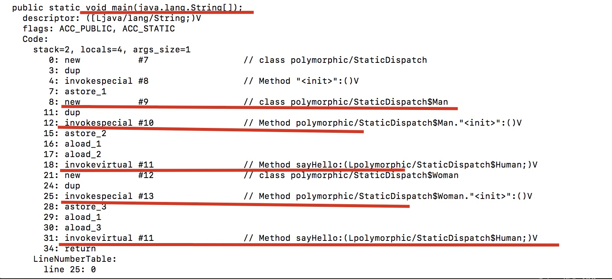

# 大纲

# 前言

重载的优先级是啥

重载和重写的区别又是啥

上一篇我们说了提到符号引用转化为直接引用的两种方法，这节我们就讲下这两种方法，因为引用转化是方法的调用才执行的，所以先弄明白方法调用

# 方法调用

方法执行有两个步骤

- 方法调用，确定调用那个方法
- 基于栈的解释执行。真正执行方法的字节码

所以方法调用并不等于方法的执行，他只是其中一个步骤。

方法调用有两种

- 静态解析
- 分派(有静有动)

还记得我们上篇文章说的将字节码中的符号引用转化为直接引用的两种方法吗？这节就讲这两个方法。他们都属于方法的调用


**重点讲重载和重写的区别**，也就是分派的部分，面试应该也多问这个吧。

# 方法调用的字节码指令

- invokestatic:调用静态方法
- invokespecial：调用实例构造器`<init>`方法、私有方法和构造方法
- invokevirtual：调用所有的虚方法
- invokeinterface:调用接口方法，会在运行时再确定一个实现此接口的对象
- invokedynamic:
  - 先在运行时动态解析出调用点限定符所引用的方法，然后在执行该方法。
  - 和上面四个的区别
    - 之前的四个，分派逻辑是固化在Java虚拟机内部的
    - 这个指令的分派逻辑是由用户自己所设定的引导方法决定的
- **除了最后一个**，其他的四个的第一个参数都是被调用的方法的符号引用，是在编译期就确定的，所以**缺乏**动态语言类型的支持。**这也是Lambda表达式在1.8出现的原因**(1.7出现的这条语句奠定了他的基础)


# 解析

## 是什么

**调用目标在程序代码写好，编译器进行编译时就必须确定下来**。这类方法的调用称为**解析**

还记得之前文章说的，在类加载的解析阶段，**会将一部分的符号引用转化为直接引用吗**，这种解析能成立的前提是：**方法在程序真正运行之前就有一个可确定的调用版本，并且这个版本在运行期间不可变**。

Java语言符合"编译期可知，运行期不可变"这个要求的方法，主要有两大类

- 静态方法
- 私有方法
- 前者和类型直接关联，后者不可被外部访问。这两个特点就保证了他们不可能通过继承或别的方式重写其他版本，所以适合类加载阶段解析

我们看上面的指令的前两个`invokestatic`和`invokespecial`，只要能被这两个指令调用的方法，都可以在解析阶段确定唯一的调用版本，所以符合这个条件的有四类

- 静态方法
- 私有方法
- 实例构造器
- 父类方法

他们被称为 **非虚方法**，与之相对的，就被称为**虚方法**(**final**除外，因为他 不可继承覆盖，所以也只有一个调用版本，所以他也是**非虚方法**)

# 分派

分派按照**调用**可能是静态也可能动态，按照**宗量数**，可分为单分派，多分派，因此组合一下，就有四种不同的分派

- 静态单分派
- 静态多分派
- 动态单分派
- 动态多分派

## 静态分派

何为静态，就是**发生在编译期**，所以确定静态分派的不是由虚拟机完成，而是编译器，编译器在编译阶段确定版本。**重载**是典型的静态分配

我们看下这个代码

```java
package polymorphic;

public class StaticDispatch {
    static abstract class Human{

    }
    static class Man extends Human{

    }
    static class Woman extends Human{

    }

    public void  sayHello(Man man){
        System.out.println("hello man");
    }
    public void sayHello(Woman woman){
        System.out.println("hello woman");
    }
    public void sayHello(Human human){
        System.out.println("hello guy");
    }

    public static void main(String[] args) {
        StaticDispatch dispatch = new StaticDispatch();
        Human man = new Man();
        dispatch.sayHello(man );
        Human woman = new Woman();
        dispatch.sayHello(woman );
    }
}
```

输出是啥呢？


想解释这个，得先知道两个概念

- 静态类型(外观类型)
- 实际类型

以上面的为例


区别：

- 静态类型的变化仅仅在使用时发生，本身的静态类型不会发生变化，并且静态类型是在**编译期**可知的
- 实际类型变化的结果，运行期才可知，编译器在编译程序的时候**并不知道**一个对象的**实际类型**是什么

我们一开始就说，静态分派之所以称为静态分派，是因为他在**编译期**就确定了，所以他就是通过**静态类型**确定的。

**所以重载的时候，是按照静态类型来确定，并且是编译期确定。**

我们通过字节码也可以看出来



我们看到，在`main()`方法中

- 他调用构造函数的时候，是使用invokespecial，	
  - 我们之前看到,这条命令是解析的的其中一条语句
- 而我们看他调用虚方法的命令`invokevirtual`的时候，它指向的是Human这个静态类型，而不是实际类型

## 动态分派

与静态分派对应的是动态分派，经典的例子就是**重写**


