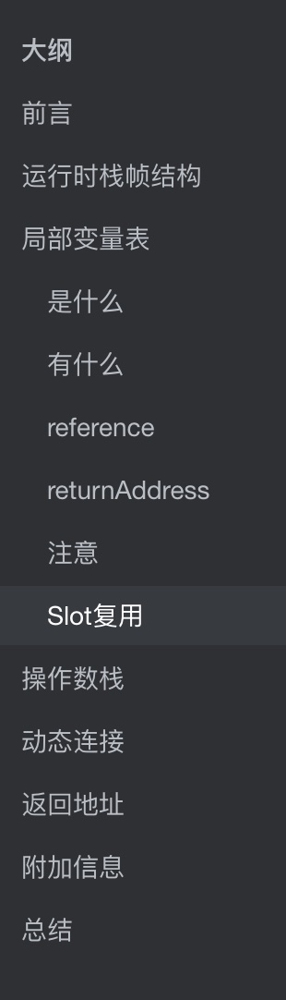
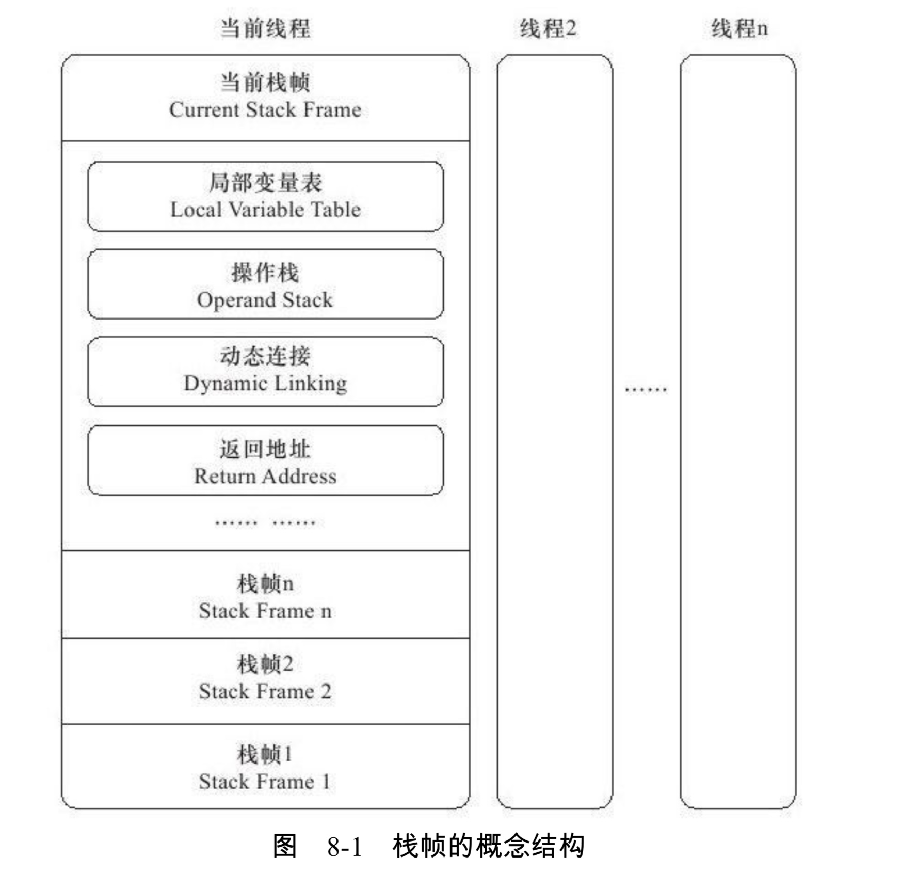
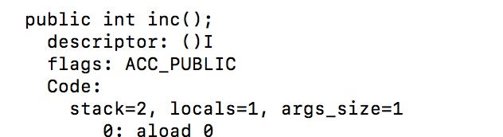
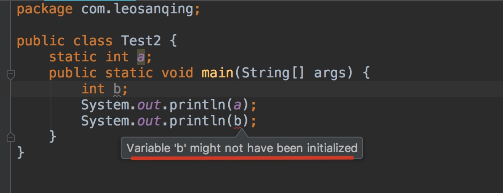
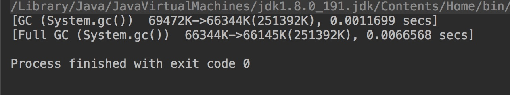
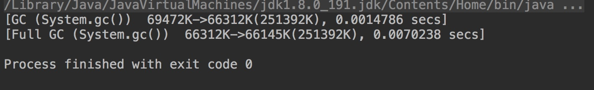
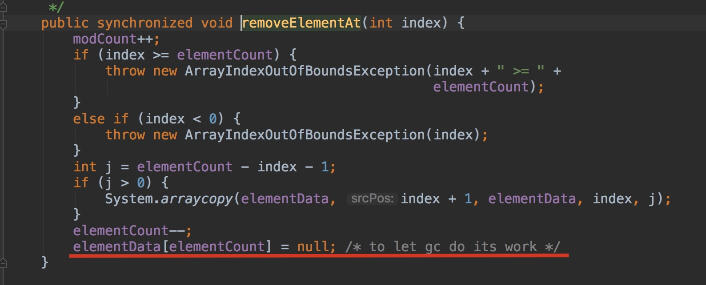
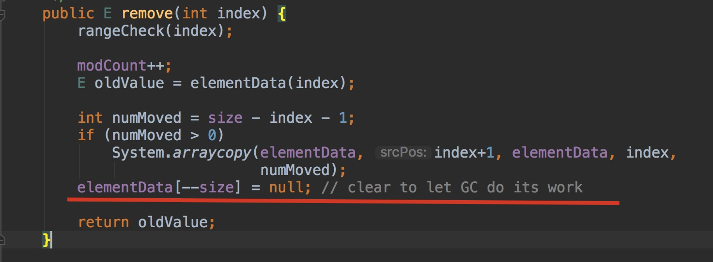

# 大纲



# 前言

之前讲解了运行时数据区和类加载的过程，现在我们看下虚拟机中栈帧都是啥样子的，这个应该算是运行时数据区(JVM内存结构的补充)，如果不了解可以参考我的这篇博文 [JVM内存结构](https://github.com/leosanqing/Java-Notes/blob/master/JVM/Java%E5%86%85%E5%AD%98%E5%8C%BA%E5%9F%9F/Java%E5%86%85%E5%AD%98%E5%8C%BA%E5%9F%9F.md)

# 运行时栈帧结构

运行时栈帧中存储了以下内容

- 局部变量
- 操作数栈
- 动态链接
- 返回地址
- 附加信息
- ….



**每一个方法的调用开始和结束都是栈的压入(入栈)和弹出(出栈)的过程**

# 局部变量表

## 是什么

局部变量表是**一组变量值存储空间**，用于存放**方法参数**和**方法内部**定义的**局部变量**。

大小是编译的时候写进了字节码里面的，在Code属性中的max_local属性




## 有什么

局部变量表的容量以**变量槽**(Variable Slot)为**最小单位**，虚拟机中并没有明确指明一个Slot应占用的内存空间大小，只是很有导向性的说到每个Slot都**应该能存放**一个下面8种类型的其中一个。(如果是long或者double这种64位的数据类型，则需要两个Slot)

-  boolean
- byte
- char
- short
- int
- float
- reference
- returnAddress

前六种应该不用说，是基本的数据类型，reference是啥呢

## reference

reference是一个对象实例的引用

作用：

- 从此引用中**直接或间接**地**查找**到**对象在Java堆**中的数据存放的**起始地址索引**
- 从此引用中**直接或间接**地**查找**到对象所属数据类型在**方法区**中的**存储的类型对象**(因为类信息在方法区中存储)

## returnAddress

为字节码指令jsr、jsr_w和ret提供的，指向了一条字节码指令的地址

已经很少见了。

## 注意

局部变量表中的**局部变量**和之前将类加载的时候的**类变量**（static修饰）不一样，他没有所谓的"准备阶段"，所以没有设置初始值的阶段。不知道的可以参考我类加载这篇文章，看了准备阶段，应该就知道了。[类加载过程](https://github.com/leosanqing/Java-Notes/blob/master/JVM/%E8%99%9A%E6%8B%9F%E6%9C%BA%E6%89%A7%E8%A1%8C%E5%AD%90%E7%B3%BB%E7%BB%9F/%E7%B1%BB%E5%8A%A0%E8%BD%BD%E8%BF%87%E7%A8%8B/%E7%B1%BB%E5%8A%A0%E8%BD%BD.md)

所以我们在写程序的时候这样写，对比你就知道了



其他类型零值


## Slot复用

**不使用的对象，应当手动赋值为null**

为了尽可能节省栈空间，局部变量表的**Slot可以复用**。方法体中定义的变量，**其作用域并不一定覆盖整个方法体**，如果当前字节码PC计数器的值已经超出了某个变量的作用域，那这个变量对应的Slot就可以交给其他变量使用。

不过这样的做法，会有一些缺点，我们来看下面的代码示例

```java
public class Test2 {

    public static void main(String[] args) {
        

            byte[] placeholder = new byte[64 * 1024 * 1024];


        
        System.gc();
    }
}
```

我们通过配置虚拟机参数`-verbose:gc`来打印垃圾回收的结果



我们看到他并没有回收。

我们修改一下代码

```java
public class Test2 {

    public static void main(String[] args) {
        {

            byte[] placeholder = new byte[64 * 1024 * 1024];


        }
        System.gc();
    }
}
```



他还是没有进行回收，按理说 placeHolder 的作用域只在花括号中，在执行gc方法的时候，他就已经不可能用了，算是已经"死"了的对象了，为什么没有回收呢？

我们再修改一下

```java
public class Test2 {

    public static void main(String[] args) {
        {

            byte[] placeholder = new byte[64 * 1024 * 1024];


        }
      	int  a = 0;
        System.gc();
    }
}
```


我们看到，这次垃圾回收器工作了，为什么呢？

placeholder 能否被回收的根本原因是：**局部变量表的Slot是否还存有关于placeholder数组对象的引用。**

第一次修改中，代码虽然离开了该变量的作用域，但是在此之后，**没有任何对局部变量表的读写操作**，该变量**原本占用的Slot**还没有被任何其他变量**复用**，所以作为GC Root 一部分的局部变量表仍然保持着对他的关联(不了解什么可以作为GC Root的话，可以参考我的这篇文章 [JVM垃圾回收](https://github.com/leosanqing/Java-Notes/blob/master/JVM/JVM%E5%9E%83%E5%9C%BE%E5%9B%9E%E6%94%B6.md))

而第二次，则改变了上面的这种情况

所以当遇到一个方法，其后面的代码有一些耗时很长的操作，而前面又定义了占用大量内存、实际上已经用不到的变量，应当手动设置其为null。

很多工具类都有这个操作，比如 ArrayList和Stack中的remove方法，你也可以找下其他的工具类中的方法，看是否有此类操作






# 操作数栈

操作数栈记录了一个方法执行过程中的字节码指令，他往操作数栈中进行入栈和出栈

大小在编译的时候也已经确定了，字节码文件中的Code属性中的max_stacks数据项，即下图的**stack**


当一个方法刚执行的时候，操作数栈是空的，在方法执行的过程中，会有各种字节码指令往操作数栈中入栈和出栈。


# 动态连接

**每一个栈帧**都包含一个**指向运行时常量池**中该栈帧所属的**方法的引用**，持有这个引用是为了支持方法调用过程中的**动态连接**

如果你看了[字节码文件构成](https://github.com/leosanqing/Java-Notes/blob/master/JVM/%E8%99%9A%E6%8B%9F%E6%9C%BA%E6%89%A7%E8%A1%8C%E5%AD%90%E7%B3%BB%E7%BB%9F/%E5%AD%97%E8%8A%82%E7%A0%81%E6%96%87%E4%BB%B6%E7%BB%93%E6%9E%84/%E8%83%BD%E7%9C%8B%E6%87%82%E7%9A%84%E5%AD%97%E8%8A%82%E7%A0%81-%E4%B8%8A.md)和[类加载过程](https://github.com/leosanqing/Java-Notes/blob/master/JVM/%E8%99%9A%E6%8B%9F%E6%9C%BA%E6%89%A7%E8%A1%8C%E5%AD%90%E7%B3%BB%E7%BB%9F/%E7%B1%BB%E5%8A%A0%E8%BD%BD%E8%BF%87%E7%A8%8B/%E7%B1%BB%E5%8A%A0%E8%BD%BD.md)，你应该知道，字节码文件中有很多符号引用。

这些符号引用一部分会在**类加载的解析阶段**或者**第一次使用的时候**转化为直接引用，这种转化称为**静态解析**

另一部分会在**运行期间**转化为直接引用，这部分称为**动态连接**


动态连接会在这篇文章 方法调用 中讲解

# 返回地址

一个方法执行后，**只有**两种方法可以退出：

- return，正常退出
- 异常，并且不在该方法中处理

方法退出时可能的操作：

- 恢复上层方法的局部变量表和操作数栈
- 把返回值(如果有的话)压入调用者战争的操作数栈中
- 恢复PC计数器的值，以指向方法调用指令后面的一条指令

# 附加信息


这部分信息完全取决于具体的虚拟机实现，有的可能有，有的没有。

# 总结

- 栈帧中主要有4种信息
  - 局部变量表
    - 单位Slot
    - Slot复写
  - 操作数栈
    - 方法执行时，入栈出栈各种字节码指令
  - 动态连接
    - 运行期间，将符号引用转化为直接引用
  - 返回地址
    - return
    - 异常并且没有在该方法中处理
  - ….