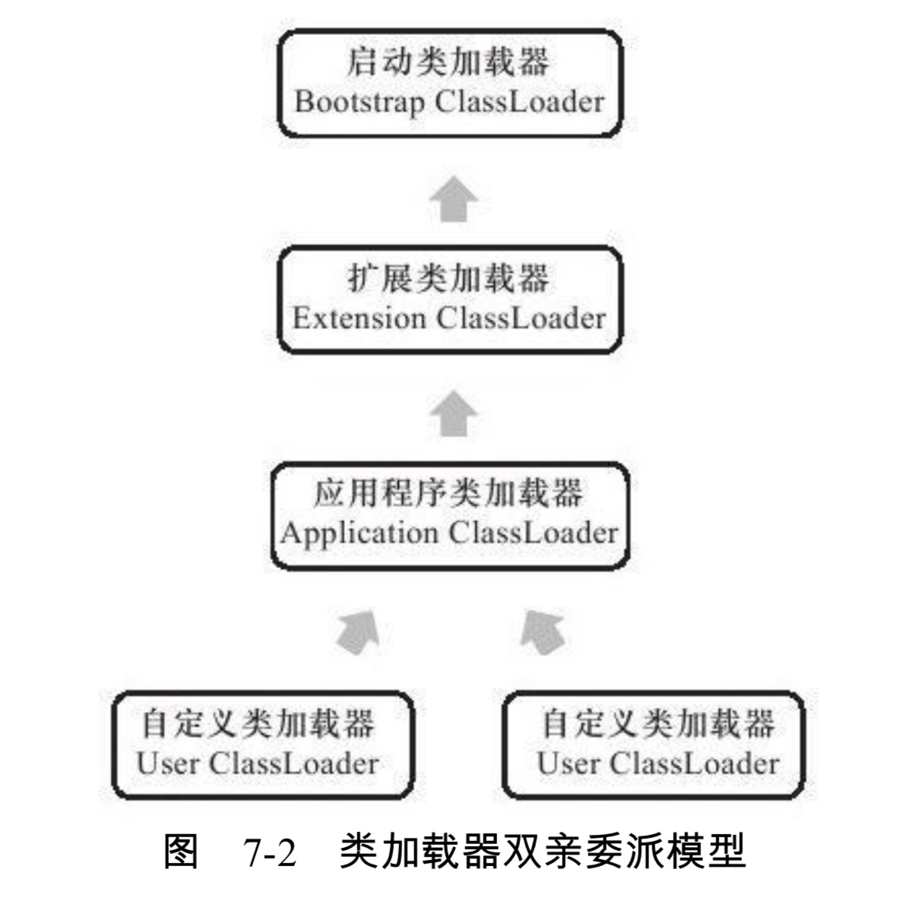
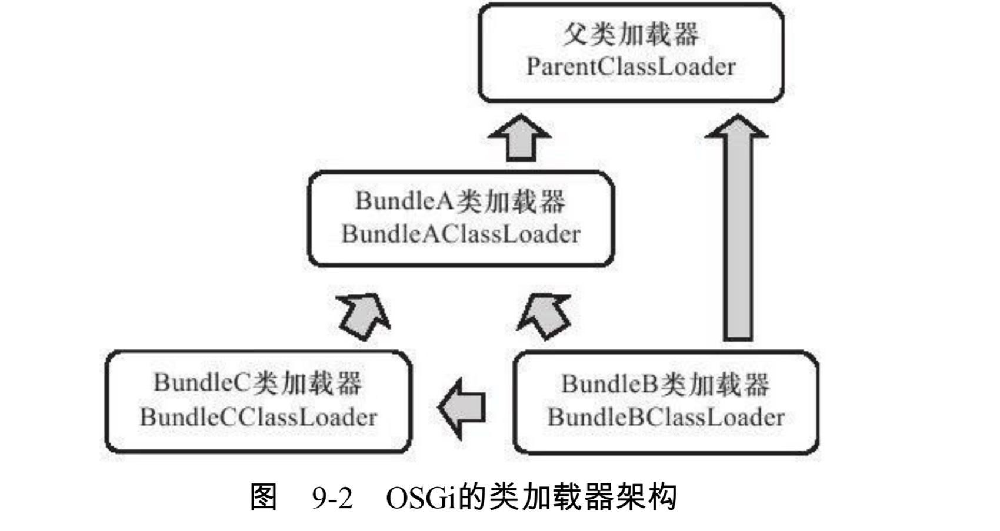

# 大纲


[TOC]

# 前言

类加载器是面试的高频题，类加载器的双亲委派模型更是重中之重，基本问到类加载器就会问到双亲委派模型，那么他到底是什么，又有什么好处呢

我们先来个模拟个这样的情景：

> 我们打仗的时候，另外一个陌生的队伍让你调兵支援，你是自作主张，还是向上级汇报，让上级处理，请求上级指示，按照指示行动呢？

这个场景跟双亲委派的做法有一点相似，你可以考虑下那种做法比较好，又有什么好处。

# 类加载器

上一节我们知道了类加载的过程，其中加载阶段的第一步"**通过一个类的全限定名来获取描述此类的二进制字节流**"这个动作放到虚拟机外部实现，以便让应用程序自己决定如何去获取所需要的类。这个过程的代码模块就是**类加载器**。


## 类相等条件

- 同一个类文件
- 同一个虚拟机加载
- 同一个类加载器加载
- 其中一个不同，这两个类就不相等


## 类加载器分类

- 启动类加载器(Bootstrap ClassLoader)
  - 将放在`<JAVA_HOME>\lib`目录中的或者被`-Xbootclasspath`参数所指定的路径中的，并且是**虚拟机识别的类库**加载到虚拟机内存(注意三个关键词)
  - 启动类加载器无法被Java程序直接引用
- 扩展类加载器(Extension ClassLoader)
  - 负责加载`<JAVA_HOME>\lib\ext`目录中的，或者被`java.ext.dirs`系统变量所指定的路径中的所有库
  - 开发者可以直接使用这个类加载器
- 应用程序类加载器(Application ClassLoader)
  - 负责加载**用户类路径上**所指定的类库
  - 开发者可以直接使用
  - 如果应用程序中没有定义过自己的类加载器，一般情况下**默认的**类加载器
- 用户自定义类加载器

如果划分的粗一点，那么只用两种

- 启动类加载器
  - 在HotSpot中(其他虚拟机可能不一样)，这个是由C++编写的，是虚拟机的一部分
- 其他类加载器
  - 由Java编写。
  - 独立于虚拟机外部
  - 全部继承自`java.lang.ClassLoader`

# 双亲委派模型

上面我们已经介绍了类加载器，大致可以分为四种：

- 启动类加载器
- 扩展类加载器
- 应用程序类加载器
- 用户自定义的类加载器

他们是相互配合工作的，如果类加载之间的层次是下图这种关系，那么就是**双亲委派模型**



双亲委派模型并**不是强制性的约束模型**，他只是一个Java设计者**推荐的**实现方式

## 工作过程

- 一个类加载器收到了类加载的请求
- 他不会自己尝试加载这个类，而是把这个请求委派给父类加载器去完成
- 每一个类加载器都是如此
- 当父类加载器完不成加载动作，才让子类加载器自己去加载

好比这样的情景：

我们打仗的时候，另外一个陌生的队伍让你调兵支援，这个时候你不能擅作主张，要向上级请示，让上级来进行协调工作，做决定。上级做不了决定，你再尝试随机应变，结合实际情况做决定。

那么你结合情景想想，这样做的好处是啥呢？

## 好处

不会无组织无纪律。

没出问题还好，要是遇到这样的情况，那就真的危险了。假如你不向上级请示，擅作主张，让你增援的那个部队是敌人的，布好阵，就埋伏你，这就要丢性命啊。

或者是上级让你增援另一个部队，因为你离得最近，但是他不知道你不在那个位置，等你接到命令再赶到，友军尸体都凉了

------------------

对应到Java中，就是**保证了运行环境不会混乱**。

**因为Java类随着他的类加载器一起具备了一种带有优先级的层次关系**，

例如所有类的父类(除了它本身)"java.lang.Object",有了双亲委派，无论哪一个类加载器加载，都是交给最顶层的**启动类加载器加载**，这样他在任何类加载器下都是那一个Object类。

如果没有双亲委派，我自己定义一个Object类，放到程序的ClassPath中，那么系统就会出现多个Object，那么**Java体系最基础的行为**就都无法保证了。

## 实现

双亲委派的实现非常简单

- 先检查这个类是否已经被加载过
- 如果没有，调用父类加载器的 loadClass()方法
- 如果父类加载器为空，则调用启动类加载器作为父类加载器
- 如果父类加载失败
  - 抛出异常，但是不进行处理
  - 调用自己的findClass()方法加载

```java
protected Class<?> loadClass(String name, boolean resolve)
    throws ClassNotFoundException
{
    synchronized (getClassLoadingLock(name)) {
        // First, check if the class has already been loaded
        Class<?> c = findLoadedClass(name);
        if (c == null) {
            long t0 = System.nanoTime();
            try {
                if (parent != null) {
                    c = parent.loadClass(name, false);
                } else {
                    c = findBootstrapClassOrNull(name);
                }
            } catch (ClassNotFoundException e) {
                // ClassNotFoundException thrown if class not found
                // from the non-null parent class loader
            }

            if (c == null) {
                // If still not found, then invoke findClass in order
                // to find the class.
                long t1 = System.nanoTime();
                c = findClass(name);

                // this is the defining class loader; record the stats
                sun.misc.PerfCounter.getParentDelegationTime().addTime(t1 - t0);
                sun.misc.PerfCounter.getFindClassTime().addElapsedTimeFrom(t1);
                sun.misc.PerfCounter.getFindClasses().increment();
            }
        }
        if (resolve) {
            resolveClass(c);
        }
        return c;
    }
}
```

# 破坏双亲委派

我们之前说到，双亲委派模型只是一个推荐模型，并不是强制约束，既然是推荐，那我可以不听啊。我就是要破坏，不过这里的**破坏并不是贬义**的，而是对其进行创新。一共大概有三次较大规模的"不听"

- 双亲委派出现后为了保证向前兼容
- 自身设计缺陷
- 用户追求程序动态性

## 第一次

双亲委派模型是JDK1.2之后才有的，但是抽象类`java.lang.ClassLoader`是1.0 就存在了的，面对已经存在的用户自定义类加载器的实现代码，Java设计者不得不做出一些妥协。`java.lang.ClassLoader`中添加了一个findClass方法，原来用户需要继承`java.lang.ClassLoader`类，然后重写`loadClass`方法，现在只需要重写`findClass`，把自己实现的加载逻辑放到这个方法里，而不需要重写`loadClass`方法。

如果父类加载失败，则调用自己的`findClass`方法完成加载，这样就可以保证写出来的加载器的逻辑仍是符合双亲委派的。

## 第二次

双亲委派很好的解决了个各类加载器基础类的同一问题，但是用户又想调用用户自己的代码怎么办

比如我们的JDBC，是各个厂商自己独立实现的，Java只是提供一个接口，其他厂商自己独立实现，但是启动类加载器可不认识这个东西。

所以Java设计者引入了一个不太优雅的设计：**线程上下文类加载器**

这个类加载器通过`java.lang.Thread`类中的`setContextClassLoader()`方法进行设置，如果**创建线程时还未设置**，他将会从**父类线程**中继承一个，如果在应用程序的全局范围内都没有设置过，那这个类加载器默认就是**应用程序类加载器**

```java
/**
 * Sets the context ClassLoader for this Thread. The context
 * ClassLoader can be set when a thread is created, and allows
 * the creator of the thread to provide the appropriate class loader,
 * through {@code getContextClassLoader}, to code running in the thread
 * when loading classes and resources.
 *
 * <p>If a security manager is present, its {@link
 * SecurityManager#checkPermission(java.security.Permission) checkPermission}
 * method is invoked with a {@link RuntimePermission RuntimePermission}{@code
 * ("setContextClassLoader")} permission to see if setting the context
 * ClassLoader is permitted.
 *
 * @param  cl
 *         the context ClassLoader for this Thread, or null  indicating the
 *         system class loader (or, failing that, the bootstrap class loader)
 *
 * @throws  SecurityException
 *          if the current thread cannot set the context ClassLoader
 *
 * @since 1.2
 */
public void setContextClassLoader(ClassLoader cl) {
    SecurityManager sm = System.getSecurityManager();
    if (sm != null) {
        sm.checkPermission(new RuntimePermission("setContextClassLoader"));
    }
    contextClassLoader = cl;
}
```

有了这个**线程上下文类加载器**，JDBC服务使用这个线程上下文类加载器去加载所需要的SPI（Service Provider Interface，接口提供者）代码，也就是**父类加载器请**求**子类加载器**去完成类加载的动作。这样的行为实际是**打通了**双亲委派模型的层次结构来**逆向使用**类加载器，违背了双亲委派的一般性原则。

**Java中涉及SPI的加载基本都采用这种方式，如JNDI、JDBC、JCE和JBI**

## 第三次

用户对**程序动态性**的追求而导致的。

**动态性**：指的是当前一些非常热门的名词：代码热替换，模块热部署等等

简单理解就是希望程序像计算机外设那样，接上鼠标、U盘，不用重启就能立即使用，鼠标有问题要换一个，也不需要关机、重启。这样的热部署对企业级软件开发者有很大的吸引力

像OSGi这种实现模块化热部署，已经算是无冕之王了，业界内的Java模块化标准

他实现的关键是它**自定义的类加载器机制**。

- 每一个程序模块（Bundle）都有一个自己的类加载器
- 当需要更换一个Bundle时，就把 Bundle 连同类加载器一起换掉以实现代码的热替换

OSGi下，类加载器**不再是**双亲委派模型中的**树状结构**，而是进一步发展为更加复杂的**网状结构**，当收到类加载请求时，OSGi将按照下面的顺序进行类搜索

1. 将以`java.*`开头的类委派给父类加载器加载
2. 否则，将委派列表名单内的类委派给父类加载器加载
3. 否则，将Import列表中的类委派给Export这个类的Bundle的类加载器加载
4. 否则，查找当前Bundle的ClassPath，使用自己的类加载器加载
5. 否则，查找类是否在自己的`Fragment Bundle`中，如果在，则委派给`Fragment Bundle`的类加载器加载
6. 否则，查找`Dynamic Import`列表的Bundle，委派给对应的Bundle的类加载器加载
7. 否则，类查找失败



# 可参考的案例

可以根据实际项目来理解双亲委派模型，可以参考我下面的博文

比较标准的双亲委派模型——tomcat

异类——OSGi