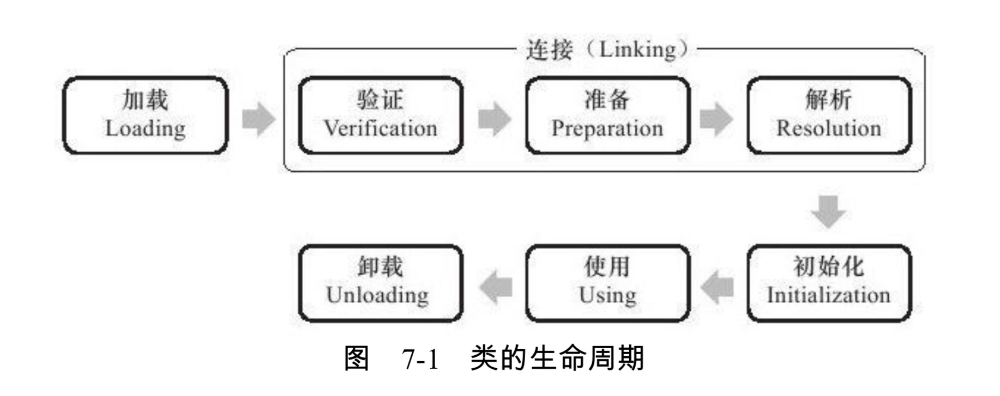
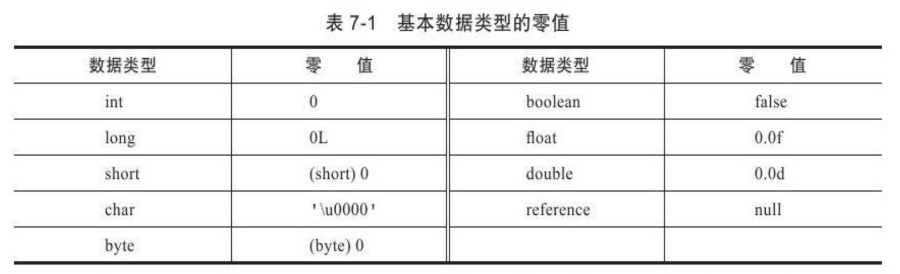
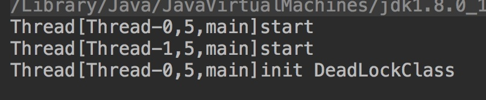
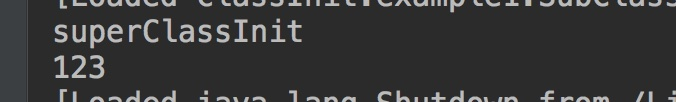

# 前言

前面介绍了字节码的读法，下面就是把字节码存入到内存中，那么他又是怎么加载的这些字节码文件的呢？

# 大纲

- <a href="#1"> 什么是类加载</a>

- <a href="#2">加载</a>

- <a href="#3">验证</a>

- <a href="#4">准备</a>

- <a href="#5">解析</a>

- <a href="#6">初始化</a>

  

  

# <a name="1">什么是类加载</a>

> 虚拟机把描述类的数据从Class文件加载到内存，并对数据进行校验解析和初始化，最终形成可以被虚拟机直接使用的 Java 类型，这就是虚拟机的类加载机制

我们从上面的定义可以看出来他要经历  加载到内存-->数据校验-->解析-->初始化

当然上面的过程并不详细，详细的过程如下：



类的生命周期总共细分为7个阶段

- 加载
- 验证
- 准备
- 解析
- 初始化(这个步骤后面不归类加载)
- 使用
- 卸载

# <a name="2">加载</a>

加载过程是第一步，他需要完成三个步骤

- 通过一个类的**全限定名**来获取定义此类的二进制字节流
- 将这个字节流所代表的**静态存储结构**转化为方法区的**运行时数据结构**
- 在**内存中**生成一个代表这个类的 java.lang.Class 对象，作为方法区这个类的各种数据的**访问接口**

加载这个过程的实现多种多样，虚拟机规范也并没有对其进行明确的约束，比如第一句 "通过全限定名获取二进制流"。没有规定用设么方法获取，从哪里获取。

那么就出现了多种多样的实现方式

- 从zip中获取，成为了日后 war，jar等格式的基础
- 从网络中获取，典型应用 Applet
- 由其他文件生成，JSP应用
- 等等…….


## 数组类

对于一个数组类型和一个非数组类型，后者的可控性在这个阶段对于开发人员更强，

- **因为我们可以使用系统提供的引导类加载器，**

- **也可以使用自己定义的类加载器来完成**(重写 loadClass完成)，

## 非数组类

- 本身不由**类加载器创建**，由**虚拟机直接创建**
- 但是他的元素类型（去掉所有维度，去掉所有`[]`如`int[]`是int，`int[][]`是int）是由类加载器创建
- **组件类型**是去掉一维的类型，比如`int[][]`是`int[]`

规则如下：

- 组件是引用类型
  - 那就递归前面定义的加载过程去加载这个组件类型
  - 可见性：和组件类型一致
- 如果不是引用类型(如`int[]`的组件类型是基本类型)
  - 与引导类加载器相关联
  - 可见性：默认为public

**加载过程可能和验证阶段的一部分交叉进行，但是两个的开始时间仍是保持固定的前后顺序**

# <a name="3">验证(非必要)</a>

> 这个过程不一定非要进行，如果已经反复验证过，实施阶段可以通过 -Xverify:none 来关闭来进行优化。

**这个阶段主要是保护虚拟机不会因为载入有害的字节流而崩溃**

主要完成下列四个阶段的验证：

- 文件格式验证

  - 是否以魔数 `0xCAFEBABE`开头
  - 主次版本号是否在当前虚拟机处理范围内
  - 常量池的常量中是否有不被支持的常量类型(检查常量 tag标志)
  - ……..

  **只有通过了这个阶段，字节码才载入到内存中，后面的3个验证不再对字节码进行操作，直接操作方法区的存储结构**

- 元数据验证

  - 是否有父类，(除Object类，都有父类)
  - 是否继承了不能被继承的类(如被final修饰)
  - 如果这个类不是抽象类，是否实现了其父类或接口中要求实现的所有方法
  - …….

- 字节码验证

  主要是确保被校验的方法在运行时不会做出危害虚拟机的事件

  - 保证任意时刻操作数栈的数据类型与指令代码序列都能配合工作，如不会出现类似这样的操作，操作栈中放了一个int 类型的数据，但是使用时却使用long类型进行载入到本地变量表
  - 保证跳转指令不会跳转到方法体以外的字节码指令上
  - …….

- 符号引用验证

  将**符号引用**转化为**直接引用**，这个转化动作将发生在**解析阶段**。主要校验下列内容

  - 符号引用中通过字符串描述的全限定名是否能找到对应的类
  - 在指定类中是否存在符合方法的字段描述符以及简单名称所描述的方法和字段
  - …….

  如果**不能通过验证**，会抛出`java.lang.IncompatibleClassChangeError`异常类型的子类，如

  - Java.lang.IllegalAccessError
  - java.lang.NoSuchFieldError
  - Java.lang.NoSuchMethodError

# <a name="4">准备</a>

准备阶段是正式为**类变量**分配内存并设置**初始值**的阶段，这些变量所使用的内存在**方法区**中分配

这里有两个注意点;

- 这里是类变量（被static修饰的变量）不是实例变量

- **设置初始值并不等于初始化**，只是将其在内存中的值设置为"零值"

  ​	例如 `public static int value = 123；`

  ​	准备阶段完成之后是value 是0而不是123；

  > 因为这个时候尚未执行任何Java方法，而把value赋值为123的`putstatic`指令是程序被编译后，存放于类构造器`<clinit>()`方法中，所以这个会在初始化阶段执行。初始化阶段会讲到

- 如果是被final修饰的类变量，那么准备阶段完成之后他就是123

  - 如 `public static final int value = 123`;

  因为被final修饰的值是存放在 字节码文件的 ConstantValue属性表中，如果不了解这个可以看看我的这篇文章，[能看懂的字节码](https://github.com/leosanqing/Java-Notes/blob/master/JVM/%E8%99%9A%E6%8B%9F%E6%9C%BA%E6%89%A7%E8%A1%8C%E5%AD%90%E7%B3%BB%E7%BB%9F/%E5%AD%97%E8%8A%82%E7%A0%81%E6%96%87%E4%BB%B6%E7%BB%93%E6%9E%84/%E8%83%BD%E7%9C%8B%E6%87%82%E7%9A%84%E5%AD%97%E8%8A%82%E7%A0%81-%E4%B8%8A.md)

  各个数据类型的初始值如下表

  

# <a name="5">解析</a>

解析是虚拟机将常量池内的**符号引用**转换为**直接引用**的过程

## 二者异同

- 符号引用
  - 符号引用以一组符号来描述所引用的目标，符号可以是任何形式的字面量，只要使用时能无歧义地定位到目标即可
  - 符号引用与内存布局无关，**引用的目标并不一定已经加载到内存中**
- 直接引用
  - 直接引用是可以直接指向**目标的指针**、**相对偏移量**或是一个能**间接定位到目标的句柄**
  - 直接引用和虚拟机布局相关，**如果有直接引用，那么引用的目标一定存在内存中**

# <a name="6">初始化(重要)</a>

初始化相对来说比较重要，因为他是类加载的最后一步，也是开始真正执行类中定义的Java代码，前面的步骤除了可以自己定义类加载器之外都是由虚拟机主导或者控制的

## 初始化的时机(有且只有)

主动引用：

- 遇到`new`、`getstatic`、`putstatic`、`invokestatic`这四条命令的时候，如果类没有进行初始化，则进行初始化
- 使用 `java.lang.reflect`包的方法对类进行反射调用的时候，如果没有，则初始化
- 当初始化一个类时，如果发现父类没有进行初始化，则需要先触发其父类的初始化
- 当虚拟机启动时，用户需要指定一个要执行的主类(包含main()方法的那个类)，虚拟机先初始化这个主类
-  当使用 JDK1.7以后的动态语言支持时，如果一个 `java.lang.invoke.MethodHandle`实例最后的解析结果`REF_getStatic`、`REF_putStatic`、`REF_invokeStatic`的方法句柄，并且这个方法句柄所对应的类没有进行初始化，则先触发初始化

这5类场景被称为**主动引用**，除此之外，所有引用类的方法都不会触发初始化，成为**被动引用**

> 《深入理解Java虚拟机》这本书，这段话放在了前面，不过我觉得这个应该放在后面，因为没有之前的准备阶段，我们并不知道初始化阶段是执行类构造器`<clinit>()`。所以他举得例子有些就看不懂，为啥要用static代码块

`<clinit>()`包含的内容、执行顺序等等，这些也需要先了解

## Clinit()方法

- 内容
  - 他是由编译器自动收集类中的所有**类变量的赋值动作**和**静态语句块**(`static{}`)
- 执行顺序
  - 编译器的收集顺序由语句在**源文件中出现**的**顺序**决定
  - 静态语句块中**只能**访问到定义在**静态语句块之前**的变量
  - 和类的构造函数（实例构造器`<init>()`方法）不同，他不需要显示的调用父类构造器，虚拟机**会保证子类构造器方法执行前，父类构造器先执行。**
    - 也就是说，**父类的静态代码块中的内容一定是先于类的变量赋值**。后面会有示例
- 类和接口的区别
  - `<clinit>()`方法对于类或接口来说并不是必须的，如果一个类中没有对变量的赋值操作，那么编译器可以不为这个类生成`<clinit>()`方法
  - 执行接口的`clinit`方法不需要先执行父类接口的`<clinit>`方法。只有当父接口中定义的变量使用时，父接口才被初始化(对比主动引用的第三条)
  - 接口的实现类在初始化时也不会执行接口的`<clinit>()`方法
- 加锁
  - 虚拟机会保证多线程环境下一个类的 `<clinit>()`会被正确的加锁、同步，
  - 如果多线程同时初始化一个类，只有一个线程会去执行`<clinit>()`方法，其他线程会被阻塞
  - 如果执行时间很长，那么会造成线程阻塞

## 举例

执行顺序

```java
package classInit;

/**
 * 因为父类初始化一定要在子类的<clinit>()方法前，所以输出 2，参考执行顺序的第三条
 */
public class ClinitTest {
    static class Parent{
        public static int  A = 1;
        static {
            A = 2;
        }
    }
    static class Sub extends Parent{
        public static int B = A;
    }

    public static void main(String[] args) {
        System.out.println(Sub.B);
    }
}
```

多线程阻塞

```java
package classInit;

public  class DeadLockClass {
    static class DeadLoopClass {
        static {
            if (true) {
                System.out.println(Thread.currentThread() + "init DeadLockClass");
                while (true) {

                }
            }
        }
    }

    public static void main(String[] args) {
        Runnable script = () -> {
            System.out.println(Thread.currentThread()+"start");
            DeadLoopClass dlc = new DeadLoopClass();
            System.out.println(Thread.currentThread()+"end");
        };


        Thread thread1 = new Thread(script);
        Thread thread2 = new Thread(script);
        thread1.start();
        thread2.start();
    }
}
```



> 由执行结果可知，线程1已经进入阻塞；

被动引用的例子1(我把类全部放在一个代码块中)

```java
package classInit.example1;

public class SuperClass {
    static {
        System.out.println("superClassInit");
    }
    public static int value = 123;
}

public class SubClass extends SuperClass{
    static {
        System.out.println("SubClassInit");
    }
}

/**
 * 不会触发子类的初始化，因为他并没有在那5个情况中
 * 子类引用父类的静态字段，不会导致子类触发
 */
public class ClassInit {
    public static void main(String[] args) {
        System.out.println(SubClass.value);
    }
}

```



并没有触发子类的初始化，因为子类并不符合上述5中条件


```java
package classInit.example2;

import classInit.example1.SuperClass;


/**
 * 通过数组定义来引用类，不会触发此类的初始化
 */
public class NotInit {
    public static void main(String[] args) {
        SuperClass[] superClasses = new SuperClass[10];
    }
}

```


```java
package classInit.example3;

public class ConstClass {
    static {
        System.out.println("ConstClass init");
    }
    public static final String HELLOWORLD = "hello world";

}


/**
 * 没有输出 "ConstClass init"，
 * 因为常量在编译阶段通过常量传播优化，已经将常量放进了 NotInit 类的常量池中
 * 以后NotInit对常量的引用实际都被转化为 NotInit 对自身常量池的引用
 *
 * 也就是说实际上 NotInit 的class文件中并没有ConstClass的符号引用入口
 * 这两个类在编译成Class文件之后就已经不存在联系了
 */
public class NotInit {
    public static void main(String[] args) {
        System.out.println(ConstClass.HELLOWORLD);
    }
}
```

至此，类加载的过程已经全部结束