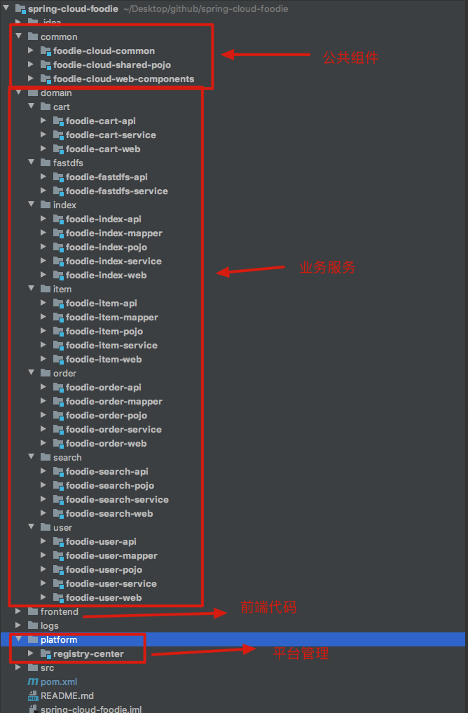

# 写在前面

Java学习笔记，内容包括JVM，spring，hashMap实现源码分析，多线程，剑指offer题解，设计模式。然后根据面试的重点，又将很多从里面抽出，专门整了个面试的分类，如果是看面试的东西的话，可以重点看这个。

码字不易，点个star吧。

现在整个 repo 太乱了，等把项目弄差不多了会把这个 repo 重构一下，包括命名风格、分类等问题。这个是很久前创建的，当时没规划好

| [书籍](https://github.com/leosanqing/Java-Notes/tree/master/books) |                           面试相关                           | [JVM](https://github.com/leosanqing/Java-Notes/tree/master/JVM)(已更完) | [源码区](https://github.com/leosanqing/Java-Notes/tree/master/SourceCode) | spring                                                       |
| :----------------------------------------------------------: | :----------------------------------------------------------: | ------------------------------------------------------------ | ------------------------------------------------------------ | ------------------------------------------------------------ |
| [设计模式](https://github.com/leosanqing/Java-Notes/tree/master/designPattern)(第一阶段完) | [算法](https://github.com/leosanqing/Java-Notes/tree/master/Algorithm)(在更) | [并发编程](https://github.com/leosanqing/Java-Notes/tree/master/ConcurrencyProgramming) | [项目](https://github.com/leosanqing/food-shop)              | [数据结构](https://github.com/leosanqing/Java-Notes/tree/master/Struct) |

# 最近在搞啥

跑路来深圳了，然后之前一直在忙着重构公司之前的代码(瞎搞着玩)

原来这边根本不管什么代码风格，更没有什么code review，代码想怎么写就怎么写，还算比较大的公司吧，代码真的奇烂无比，我见过最垃圾的代码了，代码根本没法维护，改个小地方，看半天。

然后用目前所学吧，花了两个多月的下班时间和周末，把代码全部改了，业务代码改完了，所以没那么忙了，后面就是他们测试了。代码行数少了一半，类数量少了一半。看着舒服多了

后面整个代码风格的文档吧(入职一个月已经写了个60多页的ppt，但是发不出来，后面再整理吧)，对比一下之前的代码，对比下自己有没有可以提升的地方

主要还是这个项目不重要，内部使用的，出问题也问题不会特别大，整个项目还不算太大，不到13w行代码，而且领导也想整，所以才敢搞。

## 关于项目

最近接触了Go，为了方便了解Go与Java在企业方面的优劣，试着使用Go重构之前的电商项目，在开发中，这次项目的管理算是比较正规，每个接口都会单独建分支并编写单元测试。
并且会按照迭代需求进行升级，会一步步完善各种组件，也会使用 docker 管理各个组件，希望这次不在搞的自己不想维护。 有兴趣的朋友可以看下并点个Star呀  [使用Gin重构Java项目](https://github.com/leosanqing/go_foodie_shop)

搞了个 SpringBoot 的电商项目。从单体一步步往上升级，到集群到分布式。现在已经完成了三个版本，微服务版本正在进行，可以直接下载经过简单的配置就可以部署，主要是想通过这个学习下互联网在部署的时候都会用到哪些技术，[有需要的可以看看，如果入门也可以作为选择](https://github.com/leosanqing/food-shop)。

目前我在根据最近学到的一些东西改造项目，优化代码风格。可以有兴趣可以看下历程

下一阶段准备增加 单元测试，规范化开发

## 关于算法

前一段时间在忙着看算法，刷了 leetcode，如果你现在还是学生，请一定一定珍惜你的校招应届生身份，这个非常值钱。并且一定一定要好好看算法数据结构这些基础，真的非常非常重要。**这是过来人对你的最宝贵的建议**

如果你在刷算法，一开始不需要搞太明白原因，简单了解下思路即可，因为等你刷到100道题，真的可以说其义自见。你会发现一般的算法就那几种套路，递归，动态规划，用的最多。如果你不相信我说的也很正常，因为我之前也不相信别人这样说。但是我刷了100道左右之后就摸出了一般解法的套路。如果你刷的痛苦，也很正常，因为这个真的不简单，但是有门槛的东西不才是好东西吗？请坚持下去

以上 是我最近对大家的一部分建议，希望大家都能找到满意的工作。我也会努力进大厂

## 关于文章

这边是最近更的几篇文章

- [自己动手封装Starter](https://github.com/leosanqing/minio-boot-starter)
- [如何看待年轻人崇拜马斯克](http://mp.weixin.qq.com/s?__biz=MzU0ODgzNjQ2MQ==&mid=100000457&idx=1&sn=24732e225c8ba6d63a11857d7802a136&chksm=7bb847cb4ccfcedddc771d51c2ddbd68816f06c075dfe09c8511f1e539e35c4571d943e1b2f4#rd)(马斯克传读后感)
- [可排序的Map--TreeMap](https://github.com/leosanqing/Java-Notes/tree/master/SourceCode/TreeMap)
- [分布式锁的实现和对比](https://github.com/leosanqing/food-shop/tree/master/3.0/blog/%E5%88%86%E5%B8%83%E5%BC%8F%E5%B9%B6%E5%8F%91%E9%97%AE%E9%A2%98)
- [ELK、Kafka日志搜集](https://github.com/leosanqing/food-shop/tree/master/3.0/blog/elk%2Bkafka完成日志搜集)

## 关于书籍

前段时间看了几本非技术书籍，更新了下书籍模块的书单

- 物理世界的数学奇迹(1.21更，数学是怎么影响物理的，物理又是怎么推进数学的。两者在交叉融合之后，又产生了多少神奇的理论。作为物理中目前非常非常热门的弦论，数学表达怎么发展的。)

- 改变世界的方程(1.21更，这本书非常非常nice，通过人物模拟对话的形式向我们展示了 爱因斯坦是怎么发展 牛顿的经典物理的，为啥会有光速不变性，爱因斯坦是怎么将时空统一的，相对论又是怎么兼容牛顿物理的。为啥爱因斯坦的方程能指导制造原子弹，是否有可能造出比氢弹威力更大的反物质弹)

- 数学大师(1.21更, 数学作为所有科学学科的基础，他由哪些数学大佬发展成这样的，你可能知道牛顿，莱布尼兹，高斯，黎曼。但还有很多你不知道的大佬们,我们享受科学带来的种种福利，应当了解哪些人对我们对我们的生活做出了巨大贡献)

- 人类简史(8.17更，我们人类如何从动物中脱颖而出成为地球的霸主，我们经历了三次革命——认知、农业、科学。每次都带来了哪些变革)

- 动物庄园 (8.15更，《1984》作者乔治·奥威尔的另一本神作，比1984更讽刺，里面的预言基本都实现，虽然是讽刺苏联，但上面可是不敢看，因为跟他们一模一样啊，想想被禁也是理所应当) 

- 上帝掷骰子吗(用非常幽默诙谐的语言描绘 物理史话。从经典力学到现在的量子力学，20世纪那个物理世界的诸神之战，最前沿的物理世界又是什么样的)

- 基因传(21世纪三大学科之一，我们如何一步步发现生命的秘密，之后又会怎么发展，转基因能解决哪些问题)

- 跌荡一百年、激荡三十年、激荡十年(作者吴晓波，从商人或者社会经济的角度分析我们国家从清末到2018年的变革。纵观全局可以看到 官商模式基本从未改变,科技在进步，历史仍在轮回。可以看到清末官商如何试图拯救清朝；抗日战争时期中国商人发挥的作用；不可说的十年之中,商人如何挣扎生存；从改革开放之后，经济制度如何改变，中国如何腾飞)

- 全球科技通识(什么是科学，什么是技术？什么又是科技，中国（也可以说东方）为啥一直缺乏科学思维，为啥工业革命之后科技发展的这么快。通过科技的路线讲解人类文明的历史)

- 腾讯传(腾讯是如何从通信软件变成现在的巨无霸，在各个战役中，腾讯如何应对。最终，为什么会有中国最早的产品经理马化腾和最牛产品经理 张小龙)

- 永恒的终结(基地前传,永恒国度的人试图通过时光机来改变各个历史，防止人们走向毁灭，最终永恒国度又是如何瓦解，为什么瓦解)

- 童年的终结(比人类更高文明的超主，也只是更高文明的奴隶附庸。最终人类是如何进化，人类是如何灭绝。有另外一个名称，最后一个地球人)

  

# 项目

我是想通过项目，来一步步讲述我们常说的比如 Nginx、redis、kafka、keepalived 等等是怎么一步步应用至项目里面的，通过项目来说明在那种情况下，在哪种背景下我们采用哪种技术。每篇博客里面都有一个前言，里面介绍了相关背景

目前完成了三个版本迭代，第四个版本改造成微服务正在做

目前项目的架构图

**我后面的配置都是根据博客来配置的，所以基本上每篇博客我都进行过从零部署**，一般不会出现太大的问题，如果遇到困难或者哪里写的有问题也可以直接联系我。

## 版本

### 4.0

这个版本使用 SpringCloud 对项目进行了重构

### 3.0

这个版本主要增加了 几个个中间件

- 使用ES 做为搜索，搜索的关键词可高亮
- [使用FastDFS 作为图片上传的工具](https://github.com/leosanqing/food-shop/tree/master/3.0/blog/fastdfs/FastDFS%E5%AE%89%E8%A3%85%E5%92%8C%E9%85%8D%E7%BD%AE)
- 使用 RabbitMQ 作为消息队列
- [使用 ELK + kafka 作为日志搜集](https://github.com/leosanqing/food-shop/tree/master/3.0/blog/elk%2Bkafka%E5%AE%8C%E6%88%90%E6%97%A5%E5%BF%97%E6%90%9C%E9%9B%86)
- [分布式锁的实现和对比](https://github.com/leosanqing/food-shop/tree/master/3.0/blog/%E5%88%86%E5%B8%83%E5%BC%8F%E5%B9%B6%E5%8F%91%E9%97%AE%E9%A2%98)

### 2.0

- 采用 LVS+Keepalived+Nginx 实现高可用以及高并发集群
- 使用 Redis作为缓存，提升系统性能，搭建集群提高并发和高可用

- LVS+Keepalived+Nginx
  - [Nginx](https://github.com/leosanqing/food-shop/tree/master/2.0/blog/nginx%E5%AE%89%E8%A3%85)(待更)
  - [keepalived](https://github.com/leosanqing/food-shop/tree/master/2.0/blog/keepalived)
  - [LVS](https://github.com/leosanqing/food-shop/tree/master/2.0/blog/lvs)
  - [LVS+Keepalived](https://github.com/leosanqing/food-shop/tree/master/2.0/blog/lvs%2Bkeepalived)
- Redis相关
  - [redis安装和配置](https://github.com/leosanqing/food-shop/tree/master/2.0/blog/redis)
  - [主从复制和哨兵模式](https://github.com/leosanqing/food-shop/tree/master/2.0/blog/redis/%E9%85%8D%E7%BD%AE%E4%B8%BB%E4%BB%8E%E5%A4%8D%E5%88%B6)
  - Redis集群配置

### 1.0

单体项目，前端运行在tomcat即可，后端直接使用idea运行，更改数据库等配置即可

# 书籍

书籍主要分为两方面，一个是技术类书籍，一类是非技术类书籍(这个部分我基本都看过觉得不错的)，如果你不知道该看什么，可以参考我的这些目录

**技术类**我很多也没看过，因为是菜鸡，不过这个是参考了很多推荐的，综合起来的，

**非技术**的我基本都看过，所以每本都会有我觉得好的看点，感兴趣的可以点击链接下载(部分有资源) 或者自行找资源

https://github.com/leosanqing/Java-Notes/tree/master/books

# 数据结构

链接：https://github.com/leosanqing/Java-Notes/tree/master/Struct

可以下载那个文件夹，里面有实现的数据结构

## HashMap

- [hashMap 部分源码注释](<https://github.com/leosanqing/Java-Notes/blob/master/Struct/hashMapDemo/src/MyHashMap.java>)

- [HashMap-put过程](https://github.com/leosanqing/Java-Notes/blob/master/hashMap/HashMap%E5%88%86%E6%9E%90.md)

- [HashMap 输入初始值时,table 长度](https://github.com/leosanqing/Java-Notes/blob/master/hashMap/table%E9%95%BF%E5%BA%A6%E5%88%B0%E5%BA%95%E6%98%AF%E5%A4%9A%E5%B0%91.md)

- [为啥HashMap的长度一定是2的n次方](https://github.com/leosanqing/Java-Notes/blob/master/hashMap/%E4%B8%BA%E5%95%A5HashMap%E7%9A%84%E9%95%BF%E5%BA%A6%E4%B8%80%E5%AE%9A%E6%98%AF2%E7%9A%84n%E6%AC%A1%E6%96%B9.md)

# JVM(基本更完)

可以参考这个来看《深入理解Java虚拟机》

链接：https://github.com/leosanqing/Java-Notes/tree/master/JVM

- ## 自动内存管理

  - [JVM 垃圾回收](https://github.com/leosanqing/Java-Notes/blob/master/JVM/JVM%E5%9E%83%E5%9C%BE%E5%9B%9E%E6%94%B6.md)
  - [从最旧到最新垃圾回收器](https://github.com/leosanqing/Java-Notes/blob/master/JVM/%E5%9E%83%E5%9C%BE%E5%9B%9E%E6%94%B6%E5%99%A8/%E5%9E%83%E5%9C%BE%E5%9B%9E%E6%94%B6%E5%99%A8.md)
  - [Java内存区域与内存模型](https://github.com/leosanqing/Java-Notes/blob/master/JVM/Java%E5%86%85%E5%AD%98%E5%8C%BA%E5%9F%9F/Java%E5%86%85%E5%AD%98%E5%8C%BA%E5%9F%9F.md)
  - [内存分配策略](https://github.com/leosanqing/Java-Notes/blob/master/JVM/%E5%86%85%E5%AD%98%E5%88%86%E9%85%8D%E7%AD%96%E7%95%A5/%E5%86%85%E5%AD%98%E5%88%86%E9%85%8D%E7%AD%96%E7%95%A5.md)

- ## 虚拟机执行子系统

  - [虚拟机跨平台的基础](https://github.com/leosanqing/Java-Notes/blob/master/JVM/%E8%99%9A%E6%8B%9F%E6%9C%BA%E6%89%A7%E8%A1%8C%E5%AD%90%E7%B3%BB%E7%BB%9F/java%E5%A6%82%E4%BD%95%E5%AE%9E%E7%8E%B0%E8%B7%A8%E5%B9%B3%E5%8F%B0/java%E5%A6%82%E4%BD%95%E5%AE%9E%E7%8E%B0%E8%B7%A8%E5%B9%B3%E5%8F%B0.md)
  - [能看懂的字节码系列-上和下](https://github.com/leosanqing/Java-Notes/blob/master/JVM/%E8%99%9A%E6%8B%9F%E6%9C%BA%E6%89%A7%E8%A1%8C%E5%AD%90%E7%B3%BB%E7%BB%9F/%E5%AD%97%E8%8A%82%E7%A0%81%E6%96%87%E4%BB%B6%E7%BB%93%E6%9E%84/%E8%83%BD%E7%9C%8B%E6%87%82%E7%9A%84%E5%AD%97%E8%8A%82%E7%A0%81-%E4%B8%8A.md)。PS：这个真的写了好半天，截了非常多的图，每一步基本都有，就是为了让你们看这个不用翻回到上面
  - [类加载都经历了啥](https://github.com/leosanqing/Java-Notes/blob/master/JVM/%E8%99%9A%E6%8B%9F%E6%9C%BA%E6%89%A7%E8%A1%8C%E5%AD%90%E7%B3%BB%E7%BB%9F/%E7%B1%BB%E5%8A%A0%E8%BD%BD%E8%BF%87%E7%A8%8B/%E7%B1%BB%E5%8A%A0%E8%BD%BD.md)
  - [类加载器和双亲委派模型](https://github.com/leosanqing/Java-Notes/blob/master/JVM/%E8%99%9A%E6%8B%9F%E6%9C%BA%E6%89%A7%E8%A1%8C%E5%AD%90%E7%B3%BB%E7%BB%9F/%E7%B1%BB%E5%8A%A0%E8%BD%BD%E5%99%A8%E5%92%8C%E5%8F%8C%E4%BA%B2%E5%A7%94%E6%B4%BE%E6%A8%A1%E5%9E%8B/%E7%B1%BB%E5%8A%A0%E8%BD%BD%E5%99%A8%E5%92%8C%E5%8F%8C%E4%BA%B2%E5%A7%94%E6%B4%BE%E6%A8%A1%E5%9E%8B.md)
  - [对象创建](<https://github.com/leosanqing/Java-Notes/blob/master/JVM/%E5%AF%B9%E8%B1%A1%E5%88%9B%E5%BB%BA/%E5%AF%B9%E8%B1%A1%E7%9A%84%E5%88%9B%E5%BB%BA.md>)
  - [栈帧结构](https://github.com/leosanqing/Java-Notes/blob/master/JVM/%E8%99%9A%E6%8B%9F%E6%9C%BA%E6%89%A7%E8%A1%8C%E5%AD%90%E7%B3%BB%E7%BB%9F/%E6%A0%88%E5%B8%A7%E7%BB%93%E6%9E%84/%E6%A0%88%E5%B8%A7%E7%BB%93%E6%9E%84.md)(重点看slot复用和动态连接)
  - [重写和重载的区别](https://github.com/leosanqing/Java-Notes/blob/master/JVM/%E8%99%9A%E6%8B%9F%E6%9C%BA%E6%89%A7%E8%A1%8C%E5%AD%90%E7%B3%BB%E7%BB%9F/%E6%96%B9%E6%B3%95%E8%B0%83%E7%94%A8/%E6%96%B9%E6%B3%95%E8%B0%83%E7%94%A8.md)(方法调用层面)

- ## JVM优化

  - [运行期优化](https://github.com/leosanqing/Java-Notes/blob/master/JVM/%E7%A8%8B%E5%BA%8F%E7%BC%96%E8%AF%91%E4%B8%8E%E4%BB%A3%E7%A0%81%E4%BC%98%E5%8C%96/%E8%BF%90%E8%A1%8C%E6%9C%9F%E4%BC%98%E5%8C%96/%E8%BF%90%E8%A1%8C%E6%9C%9F%E4%BC%98%E5%8C%96.md)

- ## 并发

  - 并发准备放在并发编程那一模块，JVM这本书上和并发编程讲到的有一些小细节不一样，那个更加详细，因此到时候就放并发模块的目录。
  - [链接](https://github.com/leosanqing/Java-Notes/tree/master/ConcurrencyProgramming)

# 并发

链接：https://github.com/leosanqing/Java-Notes/tree/master/ConcurrencyProgramming

- 0-基础
  - [Java内存模型](https://github.com/leosanqing/Java-Notes/blob/master/ConcurrencyProgramming/0-%E5%9F%BA%E7%A1%80/Java%20%E5%86%85%E5%AD%98%E6%A8%A1%E5%9E%8B/Java%E5%86%85%E5%AD%98%E6%A8%A1%E5%9E%8B.md)
  - [轻量级锁、重量级锁是啥玩意儿](https://github.com/leosanqing/Java-Notes/blob/master/ConcurrencyProgramming/0-%E5%9F%BA%E7%A1%80/%E9%94%81%E5%AF%B9%E6%AF%94/%E9%94%81%E5%AF%B9%E6%AF%94.md)
  - [悲观锁和乐观锁](https://github.com/leosanqing/Java-Notes/blob/master/ConcurrencyProgramming/0-%E5%9F%BA%E7%A1%80/%E6%82%B2%E8%A7%82%E9%94%81%E5%92%8C%E4%B9%90%E8%A7%82%E9%94%81/%E6%82%B2%E8%A7%82%E9%94%81%E5%92%8C%E4%B9%90%E8%A7%82%E9%94%81.md)
  - [线程实现](https://github.com/leosanqing/Java-Notes/blob/master/ConcurrencyProgramming/0-%E5%9F%BA%E7%A1%80/%E7%BA%BF%E7%A8%8B%E5%AE%9E%E7%8E%B0/%E7%BA%BF%E7%A8%8B%E5%AE%9E%E7%8E%B0.md)

# 设计模式

把『图解设计模式』这本书的代码敲了四遍(因为我实在太菜，只能用这种笨办法)，算是勉强入门了。也根据自己的理解，改动了一小部分。

可以看下我现在对设计模式的理解(不一定对)，主要还是**可拓展性**和**各个类之间解耦**从而达到能作为**独立组件存在**的目的

https://github.com/leosanqing/Java-Notes/tree/master/designPattern

# SpringMVC

[手写的SpringMVC框架](https://github.com/leosanqing/Java-Notes/tree/master/spring/my-spring05)

[单例和多例的区别](https://github.com/leosanqing/Java-Notes/blob/master/spring/spring%E4%B8%AD%E5%8D%95%E4%BE%8B%E5%92%8C%E5%A4%9A%E4%BE%8B%E7%9A%84%E5%8C%BA%E5%88%AB/spring%E4%B8%AD%E5%8D%95%E4%BE%8B%E5%92%8C%E5%A4%9A%E4%BE%8B%E7%9A%84%E5%8C%BA%E5%88%AB.md)

# 关于我

一个刚毕业的菜鸡，Java 后端开发，后期可能会干点感兴趣的，比如科普博主(毕竟看了那么多科普书籍，也该整合一下输出了) 说不定哪天就是 bilibili up主 了

如果是有疑问或者建议意见想和我交流，可以添加我的微信，我会尽可能解答

