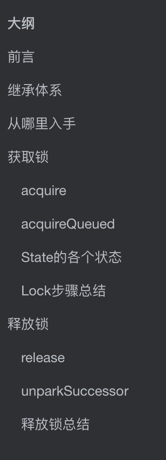
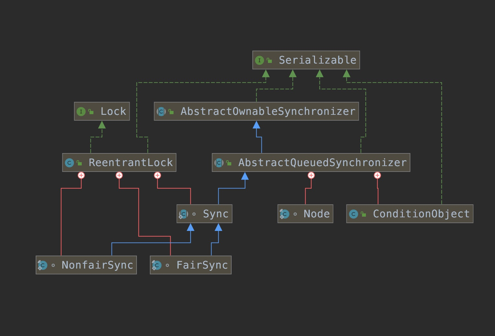
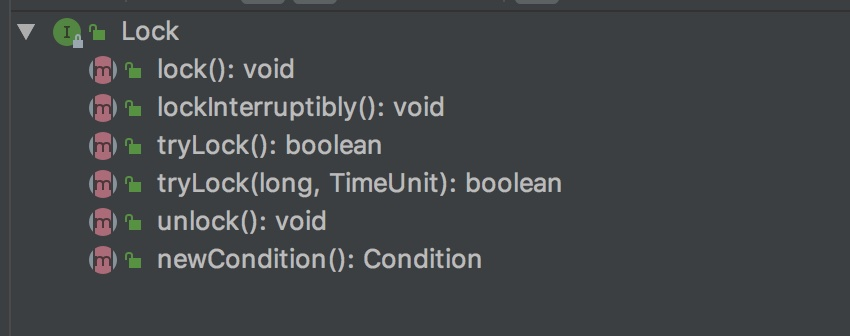
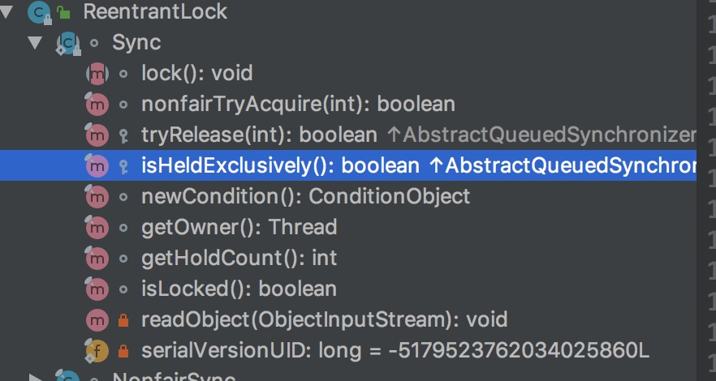
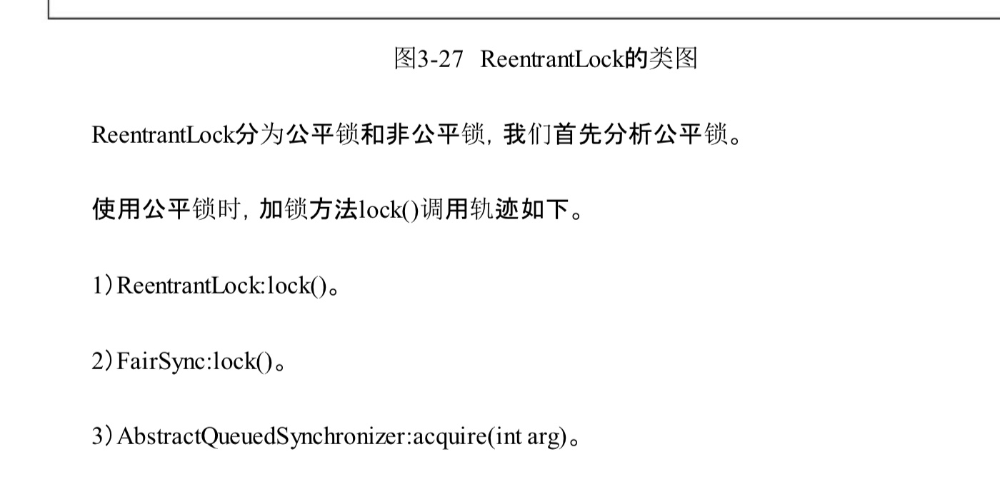
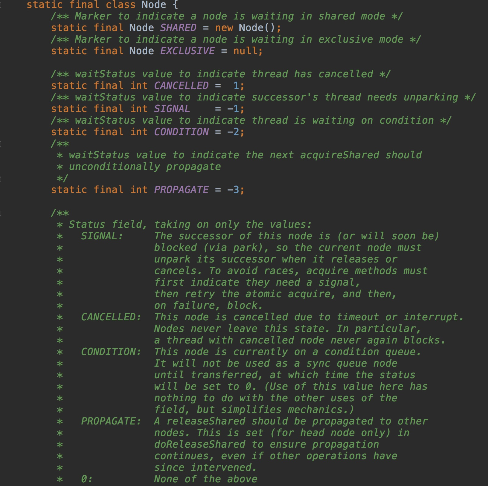

# 大纲



# 前言

ReentrantLock，在面试的时候也是高频问题。

他是一个可重入锁(同样的还有 Synchronized) ，可重入的意思是，当一个资源被一个线程拿到并加了锁之后，这个线程还可以再次进入这个资源，然后再次加锁。锁的count++。当count==0，之后，才表示这个锁被释放，其他线程可以抢夺

那么他是怎么实现的呢？

我们进入到ReentrantLock的源码中进行分析

# 继承体系



如果不知道这个怎么看或者不知道这个怎么调出来的，可以看看我的这篇文章，[看源码用到的小工具](https://github.com/leosanqing/Java-Notes/blob/master/IdeaTools/%E6%9F%A5%E7%9C%8B%E7%B1%BB%E4%B9%8B%E9%97%B4%E7%9A%84%E5%85%B3%E7%B3%BB/%E6%9F%A5%E7%9C%8B%E7%B1%BB%E4%B9%8B%E9%97%B4%E7%9A%84%E5%85%B3%E7%B3%BB.md)

从图中我们可以看到，ReentrantLock实现了两个接口，Lock和Serializable。其中Lock接口里面定义了锁要使用的方法



然后ReentrantLock里面还有一个重要的抽象类 Sync，它定义了很多方法。



我们通过最开始的继承图片可以看出来，这个Sync类继承自AQS(AbstactQueuedSynchronizer)，请记住这个AQS，因为他是JUC
，Java并发工具中的核心。以后会经常出现，面试也会问这个玩意儿

再看AQS

他这里定义了很多很多东西，因为实在太多，而且很重要，所以我又把它单独抽出来，封装成了另一篇文章 谈谈AQS


# 从哪里入手

我是看的《Java并发编程的艺术》，就以他的顺序来，从lock入手



# 获取锁

## acquire

```java

// 他又去调用 sync 实例的lock方法，
//我们之前说过，很多的处理逻辑都是在Sync这个类中完成的
public void lock() {
    sync.lock();
}


  /**
   * Performs {@link Lock#lock}. The main reason for subclassing
   * is to allow fast path for nonfair version 
   */
// 但是这个类中是一个抽象方法，原因也写的很清楚了
// 主要原因是为了非公平锁的子类能更快的找到他的非公平处理方法
abstract void lock();
```

```java
/**
 * Sync object for fair locks
 */
static final class FairSync extends Sync {
    private static final long serialVersionUID = -3000897897090466540L;

    final void lock() {
      // 调用AQS中的方法
        acquire(1);
    }
  
  

  // acquire 是 AQS的方法
  public final void acquire(int arg) {
    if (!tryAcquire(arg) &&
        acquireQueued(addWaiter(Node.EXCLUSIVE), arg))
      // 如果既没有获取到锁，也没有将其加入队列，则此线程中断
      selfInterrupt();
  }
  
  /**再往下看tryAcquire方法，这个方法AQS里没有实现，直接抛出了异常，这么做是避免子类实现所有接口，我们看java.util.concurrent.locks.ReentrantLock.FairSync这个AQS子类的实现
*/
    protected boolean tryAcquire(int arg) {
        throw new UnsupportedOperationException();
    }

    /**
     * Fair version of tryAcquire.  Don't grant access unless
     * recursive call or no waiters or is first.
     */
    protected final boolean tryAcquire(int acquires) {
        final Thread current = Thread.currentThread();
      	// 获取到线程的状态，0表示释放了锁，state>0表示获取了锁
        int c = getState();
        if (c == 0) {
          // 如果没有其他线程占用，并且通过CAS操作把线程状态设置为1了，
          // 那么就将线程指向当前线程
            if (!hasQueuedPredecessors() &&
                compareAndSetState(0, acquires)) {
                setExclusiveOwnerThread(current);
                return true;
            }
        }
      // 如果 此线程是重入的，即占有这个资源的还是原来的那把锁，则将计数器+1
        else if (current == getExclusiveOwnerThread()) {
            int nextc = c + acquires;
            if (nextc < 0)
                throw new Error("Maximum lock count exceeded");
            setState(nextc);
            return true;
        }
        return false;
    }
}
```


## acquireQueued

刚刚我们看了前面的一部分，在看逻辑与运算的的后半截

```java
public final void acquire(int arg) {
    if (!tryAcquire(arg) &&
        acquireQueued(addWaiter(Node.EXCLUSIVE), arg))
        selfInterrupt();
}
```

他调用了acquireQueued的方法，并且传入了两个参数，一个是 addWaiter方法，一个是之前传过来的参数 1.

addWaiter方法传入了一个 **独占式**(EXCLUSIVE)的Node(还有共享式的  SHARED)

我们进入这个方法

```java
/**
 * Creates and enqueues node for current thread and given mode.
 *
 * @param mode Node.EXCLUSIVE for exclusive, Node.SHARED for shared
 * @return the new node
 */

private Node addWaiter(Node mode) {
    Node node = new Node(Thread.currentThread(), mode);
    // Try the fast path of enq; backup to full enq on failure
    Node pred = tail;
  	// 队列的末尾不为空，即有线程拿到了锁，就CAS入队
    if (pred != null) {
        node.prev = pred;
        if (compareAndSetTail(pred, node)) {
            pred.next = node;
            return node;
        }
    }
    enq(node);
    return node;
}
```

如果队列中没有线程，那么就调用下面的enq方法

```java
/**
 * Inserts node into queue, initializing if necessary. See picture above.
 * @param node the node to insert
 * @return node's predecessor
 */
// 一直循CAS设置头和尾，直到两个都成功。
private Node enq(final Node node) {
    for (;;) {
        Node t = tail;
        if (t == null) { // Must initialize
            if (compareAndSetHead(new Node()))
                tail = head;
        } else {
            node.prev = t;
            if (compareAndSetTail(t, node)) {
                t.next = node;
                return t;
            }
        }
    }
}
```

然后我们再看acquireQueued方法

```Java
/**
 * Acquires in exclusive uninterruptible mode for thread already in
 * queue. Used by condition wait methods as well as acquire.
 *
 * @param node the node
 * @param arg the acquire argument
 * @return {@code true} if interrupted while waiting
 */
final boolean acquireQueued(final Node node, int arg) {
    boolean failed = true;
    try {
        boolean interrupted = false;
        for (;;) {
            final Node p = node.predecessor();
          /*
          * 如果前置节点是head，说明当前节点是队列第一个等待的节点，这时去
          * 尝试获取锁，如果成功了则
          * 获取锁成功。这里有的同学可能没看懂，不是刚尝试失败并插入队列
          * 吗，咋又尝试获取锁？ 其实这
          * 里是个循环，其他刚被唤醒的线程也会执行到这个代码
          */
            if (p == head && tryAcquire(arg)) {
                setHead(node);
                p.next = null; // help GC
                failed = false;
                return interrupted;
            }
           // 判断 获取失败是否需要线程阻塞
            if (shouldParkAfterFailedAcquire(p, node) &&
                parkAndCheckInterrupt())
                interrupted = true;
        }
    } finally {
        if (failed)
            cancelAcquire(node);
    }
}
```

我们再进入 `shouldParkAfterFailedAcquire` 这个方法，


```java
/**
 * Checks and updates status for a node that failed to acquire.
 * Returns true if thread should block. This is the main signal
 * control in all acquire loops.  Requires that pred == node.prev.
 *
 * @param pred node's predecessor holding status
 * @param node the node
 * @return {@code true} if thread should block
 */
private static boolean shouldParkAfterFailedAcquire(Node pred, Node node) {
    // 找到前驱节点的状态
    int ws = pred.waitStatus;
    // 如果前驱节点的状态 为 SINGAl，那么本次的阻塞可以安全进行
  	// 因为前驱节点承诺执行完后会唤醒当前线程
    if (ws == Node.SIGNAL)
        /*
         * This node has already set status asking a release
         * to signal it, so it can safely park.
         */
        return true;
  	// 如果前驱节点大于0，那么说明他已经取消了，要往前遍历链表，找到不是已取消状态的节点，并将其后继节点设置为传进来的当前节点
    if (ws > 0) {
        /*
         * Predecessor was cancelled. Skip over predecessors and
         * indicate retry.
         */
        do {
            node.prev = pred = pred.prev;
        } while (pred.waitStatus > 0);
        pred.next = node;
    } else {
        /*
         * waitStatus must be 0 or PROPAGATE.  Indicate that we
         * need a signal, but don't park yet.  Caller will need to
         * retry to make sure it cannot acquire before parking.
         */
      	// 如果都不是，那么就说明 状态不是 0 就是 PROPAGATE，
      	// 这样的话调用者再尝试一下能否获取锁
        compareAndSetWaitStatus(pred, ws, Node.SIGNAL);
    }
    return false;
}
```

```java
public static void park(Object blocker) {
    Thread t = Thread.currentThread();
  	// 设置当前线程的 block 
    setBlocker(t, blocker);
  	// 使用UNSAFE 类，也就是native方法到JVM级别去阻塞当前线程
    UNSAFE.park(false, 0L);
  	// 将 blocker 设置成 空
    setBlocker(t, null);
}
```

## State的各个状态



## Lock步骤总结

- 调用tryAcquire方法尝试获取锁，获取成功的话修改state并直接返回true，获取失败的话把当前线程加到等待队列中
- 加到等待队列之后先检查前置节点状态是否是signal，如果是的话直接阻塞当前线程等待唤醒，如果不是的话判断是否是cancel状态，是cancel状态就往前遍历并把cancel状态的节点从队列中删除。如果状态是0或者propagate的话将其修改成signal
- 阻塞被唤醒之后如果是队首并且尝试获取锁成功就返回true，否则就继续执行前一步的代码进入阻塞

# 释放锁

```java
// 先调用 ReentrantLock 的 unlock方法
// 这个方法会调用内部类的release方法，但是这个方法是Sync从父类AQS继承过来的
// 所以他是调用的 AQS里面的release方法
public void unlock() {
    sync.release(1);
}
```


我们再次进入AQS ，找到release方法

## release

```java
/**
 * Releases in exclusive mode.  Implemented by unblocking one or
 * more threads if {@link #tryRelease} returns true.
 * This method can be used to implement method {@link Lock#unlock}.
 *
 * @param arg the release argument.  This value is conveyed to
 *        {@link #tryRelease} but is otherwise uninterpreted and
 *        can represent anything you like.
 * @return the value returned from {@link #tryRelease}
 */

public final boolean release(int arg) {
    if (tryRelease(arg)) {
        Node h = head;
      	// 如果链表有头，并且不为 0 ，就唤醒后面的节点
        if (h != null && h.waitStatus != 0)
          // 释放这个节点
            unparkSuccessor(h);
        return true;
    }
    return false;
}
```

```java
protected final boolean tryRelease(int releases) {
  	// 得到锁的计数器
    int c = getState() - releases;
    if (Thread.currentThread() != getExclusiveOwnerThread())
        throw new IllegalMonitorStateException();
    boolean free = false;
  	// 如果state为0，说明已经解锁了
    if (c == 0) {
        free = true;
        setExclusiveOwnerThread(null);
    }
    setState(c);
    return free;
}
```
## unparkSuccessor
```java
/**
 * Wakes up node's successor, if one exists.
 *
 * @param node the node
 */

// 唤醒后继节点
private void unparkSuccessor(Node node) {
    /*
     * If status is negative (i.e., possibly needing signal) try
     * to clear in anticipation of signalling.  It is OK if this
     * fails or if status is changed by waiting thread.
     */
    int ws = node.waitStatus;
    if (ws < 0)
      	// 使用CAS设置等待状态
        compareAndSetWaitStatus(node, ws, 0);

    /*
     * Thread to unpark is held in successor, which is normally
     * just the next node.  But if cancelled or apparently null,
     * traverse backwards from tail to find the actual
     * non-cancelled successor.
     */ 
    Node s = node.next;
    // 如果当前节点的后继节点为空 或者是取消状态，从后面遍历，
  	// 找到不是取消状态的，并将其设置为后继节点
    if (s == null || s.waitStatus > 0) {
        s = null;
        for (Node t = tail; t != null && t != node; t = t.prev)
            if (t.waitStatus <= 0)
                s = t;
    }
  	// 如果后继节点不为空，唤醒后继节点
    if (s != null)
        LockSupport.unpark(s.thread);
}
```

## 释放锁总结

- 修改标志位
- 唤醒后继节点
- 结合lock方法，唤醒的节点自动设置为head