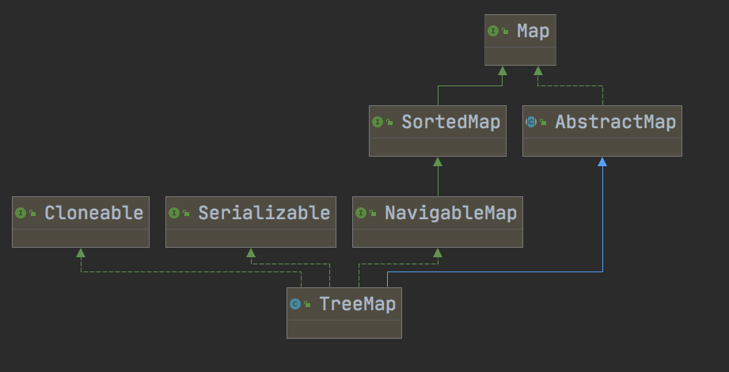
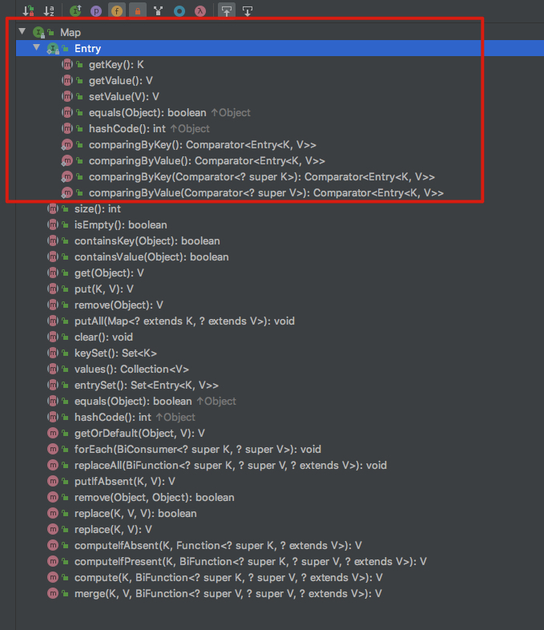
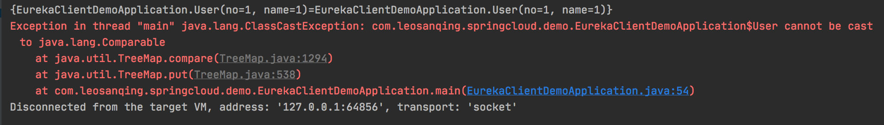

# 前言

不论是 HashMap 还是 ConcurrentHashMap、或者是 TreeMap，在面试和工作中都会用到。尤其是面试，这三样基本都会被问

这篇文章就介绍下TreeMap的源码


# 类继承图



Cloneable 和 Serializable 接口仅仅只是一个标识，可以被克隆和可被序列化


我们主要看右边的那几个类和接口


## Map

Map 是 所有 使用 键值对类型存储的结构的顶级接口，不论是 `HashMap`、`ConcurrentHashMap`、`TreeMap`、`HashTable`等等 都要实现这个接口

它里面定义了N多种 Map这种数据结构需要用到的方法，还有他最最重要的结构 Entry/Node



他的这些基本方法应该不需要我来介绍，看名字应该就能知道他的用途

## SortedMap

这个接口是就是区分和 HashMap等这些没有顺序的Map 很重要的接口

它里面有一个 比较器`Comparator`，这个接口就是用来放置比较规则，让我们放进去的 entry 按照什么规则排列

```java

package java.util;

public interface SortedMap<K,V> extends Map<K,V> {
    
    Comparator<? super K> comparator();

    // 截取Map，输入他的起止 key。因为他是有序的
    SortedMap<K,V> subMap(K fromKey, K toKey);

  	// 截取Map，从头到你输入的Key
    SortedMap<K,V> headMap(K toKey);

   
  	// 截取Map，从你输入的Key到 最后一个元素
    SortedMap<K,V> tailMap(K fromKey);

    // 第一个Key
    K firstKey();

   	// 最后一个Key
    K lastKey();

    // 获取所有Key，并返回 一个Set
    Set<K> keySet();

    // 返回所有Value
    Collection<V> values();

    // 返回键值对
    Set<Map.Entry<K, V>> entrySet();
}
```


## NavigableMap

从他的名字来看，就是 可导航/ 可定位的Map。这个是对上面的 SortedMap的一个补充，他增加了一些方法

```java

public interface NavigableMap<K,V> extends SortedMap<K,V> {
    // 返回比这个 键 更小的 键值对。一定比这个键小
    Map.Entry<K,V> lowerEntry(K key);

   	// 返回比这个 键 更小的 键值对，一定比这个键小
    K lowerKey(K key);
  
  	// 返回 小于或等于 输入键 中的最大的键值对
    Map.Entry<K,V> floorEntry(K key);
  
    K floorKey(K key);

  
  	// 返回 大于或等于 输入键 中的最小的键值对
    Map.Entry<K,V> ceilingEntry(K key);

    // 返回 大于或等于 输入键 中的最小的键
    K ceilingKey(K key);

    // 返回比这个 键 更大的 键值对。一定输入的这个键大
    Map.Entry<K,V> higherEntry(K key);

    K higherKey(K key);

    // 返回第一个键值对
    Map.Entry<K,V> firstEntry();

    // 返回最后一个键值对
    Map.Entry<K,V> lastEntry();

    // 移除并且返回第一个键值对
    Map.Entry<K,V> pollFirstEntry();
  
    Map.Entry<K,V> pollLastEntry();

   	// 返回逆序的键值对
    NavigableMap<K,V> descendingMap();
  	
  	// 返回正序的键值对
    NavigableSet<K> navigableKeySet();

    NavigableSet<K> descendingKeySet();

   	// 返回截取的Map 。开头结尾，各有一个bool值控制是否包含该键值对
    NavigableMap<K,V> subMap(K fromKey, boolean fromInclusive,
                             K toKey,   boolean toInclusive);

    // 返回截取的Map 。从开头到你输入的key，有一个bool值控制是否包含该键值对
    NavigableMap<K,V> headMap(K toKey, boolean inclusive);

    
    NavigableMap<K,V> tailMap(K fromKey, boolean inclusive);

   	// 跟之前类似，不过默认 左闭右开
    SortedMap<K,V> subMap(K fromKey, K toKey);

    // 跟上面类似，不过默认不包括输入的key
    SortedMap<K,V> headMap(K toKey);

    // 跟之前的类似，默认包括输入的key
    SortedMap<K,V> tailMap(K fromKey);
}
```

# 构造函数

```java
public TreeMap() {
    comparator = null;
}


public TreeMap(Comparator<? super K> comparator) {
    this.comparator = comparator;
}


public TreeMap(Map<? extends K, ? extends V> m) {
    comparator = null;
    putAll(m);
}


public TreeMap(SortedMap<K, ? extends V> m) {
    comparator = m.comparator();
    try {
        buildFromSorted(m.size(), m.entrySet().iterator(), null, null);
    } catch (java.io.IOException cannotHappen) {
    } catch (ClassNotFoundException cannotHappen) {
    }
}
```

他一共有 4 个构造方法，不同于我们常见的HashMap，他这个是没有大小一说的，因为他底层不是使用的数组，所以我们也不能一开始给他指定一个大小


如果 我们不指定他的比较器，那么他使用的就是默认的比较器，比如你是自定义的类，没有实现Comparable接口，那么就会报错



如果你传入的是基本类型或者String，那么他就会用他们自己的比较规则去比较

# put

```java
/**
	* 插入逻辑如果不看红黑树调整其实非常好理解，就是一个二叉搜索树的插入；逻辑
	*/
public V put(K key, V value) {
    Entry<K,V> t = root;
  	// 第一个元素的时候
    if (t == null) {
        compare(key, key); // type (and possibly null) check

        root = new Entry<>(key, value, null);
        size = 1;
        modCount++;
        return null;
    }
    int cmp;
    Entry<K,V> parent;
    // split comparator and comparable paths
    Comparator<? super K> cpr = comparator;
  	// 这边是如果有比较器的情况，但是默认是空的，就走下面的else语句
    if (cpr != null) {
        do {
            parent = t;
            cmp = cpr.compare(key, t.key);
            if (cmp < 0)
                t = t.left;
            else if (cmp > 0)
                t = t.right;
            else
                return t.setValue(value);
        } while (t != null);
    }
  	// 找到这个节点合适的位置
    else {
        if (key == null)
            throw new NullPointerException();
        @SuppressWarnings("unchecked")
            Comparable<? super K> k = (Comparable<? super K>) key;
        do {
            parent = t;
            cmp = k.compareTo(t.key);
          	// 二叉树搜索树的逻辑，小了就往左走，大了往右，一样的就覆盖
            if (cmp < 0)
                t = t.left;
            else if (cmp > 0)
                t = t.right;
            else
                return t.setValue(value);
        } while (t != null);
    }
    Entry<K,V> e = new Entry<>(key, value, parent);
    if (cmp < 0)
        parent.left = e;
    else
        parent.right = e;
  	// 这个就是红黑树的调整过程
    fixAfterInsertion(e);
    size++;
    modCount++;
    return null;
}
```

# 红黑树

```java
/**
 *	红黑树最最关键的函数。 左旋右旋都在其中
 *  为了方便，我们先声明一些定义  我们把当前操作的节点称为 关注节点。比如 下面一开始 我们的关注节点就是 x
 */
private void fixAfterInsertion(Entry<K,V> x) {
		// 规定插入必须是红色的
    x.color = RED;
		
  	// 如果是根节点或者他的父节点的颜色是黑色，不用管，因为插入不影响红黑树的样子。否则就要进行下面的逻辑
    while (x != null && x != root && x.parent.color == RED) {
      	// 如果这个节点在祖父节点的左子树
        if (parentOf(x) == leftOf(parentOf(parentOf(x)))) {
          	// 取到他的叔叔节点 y
            Entry<K,V> y = rightOf(parentOf(parentOf(x)));
          	// case1: 如果他的叔叔节点是红色
            if (colorOf(y) == RED) {
              	// 1、设置父亲和叔叔节点为黑色
                setColor(parentOf(x), BLACK);
                setColor(y, BLACK);
              	// 2、设置祖父节点为红色
                setColor(parentOf(parentOf(x)), RED);
              	// 3、把关注节点变成祖父节点
                x = parentOf(parentOf(x));
            } else {
              	// case2: 如果他的叔叔节点是黑色，并且关注节点 x 是其父节点的右子节点
                if (x == rightOf(parentOf(x))) {
                  	// 1. 把关注节点变成他的父节点
                    x = parentOf(x);
                  	// 2.进行左旋
                    rotateLeft(x);
                }
              	// 1.把父节点设置成黑色
                setColor(parentOf(x), BLACK);
              	// 2。祖父节点设置成红色
                setColor(parentOf(parentOf(x)), RED);
                // 3.右旋
              	rotateRight(parentOf(parentOf(x)));
            }
          // 如果是右子树，和上面的情况相反
        } else {
            Entry<K,V> y = leftOf(parentOf(parentOf(x)));
            if (colorOf(y) == RED) {
                setColor(parentOf(x), BLACK);
                setColor(y, BLACK);
                setColor(parentOf(parentOf(x)), RED);
                x = parentOf(parentOf(x));
            } else {
                if (x == leftOf(parentOf(x))) {
                    x = parentOf(x);
                    rotateRight(x);
                }
                setColor(parentOf(x), BLACK);
                setColor(parentOf(parentOf(x)), RED);
                rotateLeft(parentOf(parentOf(x)));
            }
        }
    }
  	// 根节点一定是黑色的 
    root.color = BLACK;
}
```

左旋代码(右旋和左旋类似，逻辑差不多)

```java
private void rotateLeft(Entry<K,V> p) {
    if (p != null) {
      	// 把p之前祖父节点的右子树设置成本节点的左子树
        Entry<K,V> r = p.right;
        p.right = r.left;
        if (r.left != null)
            r.left.parent = p;
        r.parent = p.parent;
      	// 把p的祖父节点换成父节点
        if (p.parent == null)
            root = r;
        else if (p.parent.left == p)
            p.parent.left = r;
        else
            p.parent.right = r;
        r.left = p;
        p.parent = r;
    }
}
```


大家可以看下极客时间的这篇红黑树的文章，但是有些地方由于版本问题可能不太一样


# delete

```java
private void deleteEntry(Entry<K,V> p) {
    modCount++;
    size--;

    // If strictly internal, copy successor's element to p and then make p
    // point to successor.
    if (p.left != null && p.right != null) {
        Entry<K,V> s = successor(p);
        p.key = s.key;
        p.value = s.value;
        p = s;
    } // p has 2 children

    // Start fixup at replacement node, if it exists.
  	// 修正一下替换的那个节点。 注意现在这个 p  是之前的 s。并且这 p 要么只有右子节点，要么没有子节点。如果他有左子节点，那之前找的继承者就不对
    Entry<K,V> replacement = (p.left != null ? p.left : p.right);

  	// 如果他有右子节点，
    if (replacement != null) {
        // Link replacement to parent
      	// 将这个的parent 指向原来 s 的 parent。 因为 s 已经没有用了，要被清除掉
        replacement.parent = p.parent;
        if (p.parent == null)
            root = replacement;
        else if (p == p.parent.left)
            p.parent.left  = replacement;
        else
            p.parent.right = replacement;

        // Null out links so they are OK to use by fixAfterDeletion.
      	// 清除 一开始的 s节点
        p.left = p.right = p.parent = null;

        // Fix replacement
        if (p.color == BLACK)
          	// 删除后的平衡调整
            fixAfterDeletion(replacement);
    } else if (p.parent == null) { // return if we are the only node.
        root = null;
    } else { //  No children. Use self as phantom replacement and unlink.
      	// 说明之前的继任者没有左右子节点，就不需要链接了，直接调整
        if (p.color == BLACK)
            fixAfterDeletion(p);
				// 删除 原来的 s 节点
        if (p.parent != null) {
            if (p == p.parent.left)
                p.parent.left = null;
            else if (p == p.parent.right)
                p.parent.right = null;
            p.parent = null;
        }
    }
}
```

```java
/**
 * Returns the successor of the specified Entry, or null if no such.
 * 找到他的继任者，他的继任者应该是比他大一点的那个节点(如果有的话)
 */
static <K,V> TreeMap.Entry<K,V> successor(Entry<K,V> t) {
    if (t == null)
        return null;
  	// 如果他有右节点，就一直往左找，根据二叉排序树的规则
    else if (t.right != null) {
        Entry<K,V> p = t.right;
        while (p.left != null)
            p = p.left;
        return p;
    } else {
      	// 不然就往上找，这里有两种情况，一种是他在父节点的左子树，一种是他在父节点的右子树
        Entry<K,V> p = t.parent;
        Entry<K,V> ch = t;
      	// 如果在左子树，那么比他大一个的就是他的父节点。(因为上面已经说这个节点没有右子树了)
      	// 如果是右子树，那么就要一直往上溯源
        while (p != null && ch == p.right) {
            ch = p;
            p = p.parent;
        }
        return p;
    }
}
```

```java
/**
 *	删除后进行平衡的代码
 */
private void fixAfterDeletion(Entry<K,V> x) {
    while (x != root && colorOf(x) == BLACK) {
      	// 如果在左子树
        if (x == leftOf(parentOf(x))) {
            // 找他的兄弟节点
            Entry<K,V> sib = rightOf(parentOf(x));
						// 如果是红色
            if (colorOf(sib) == RED) {
                setColor(sib, BLACK);
                setColor(parentOf(x), RED);
                rotateLeft(parentOf(x));
                // 再次找到他的兄弟节点
                sib = rightOf(parentOf(x));
            }
						// 如果 他的兄弟节点的左右子树都为黑色
            if (colorOf(leftOf(sib))  == BLACK &&
                colorOf(rightOf(sib)) == BLACK) {
                setColor(sib, RED);
              	// 关注点变成 他的父节点
                x = parentOf(x);
            } else {
              	// 如果他的兄弟节点的右子节点为黑色
                if (colorOf(rightOf(sib)) == BLACK) {
                    setColor(leftOf(sib), BLACK);
                    setColor(sib, RED);
                    rotateRight(sib);
                    sib = rightOf(parentOf(x));
                }
              	// 把它兄弟节点设置成他父亲的颜色
                setColor(sib, colorOf(parentOf(x)));
                setColor(parentOf(x), BLACK);
                setColor(rightOf(sib), BLACK);
                rotateLeft(parentOf(x));
                x = root;
            }
        } else { // symmetric
          	// 与上面的类似，只不过镜像
            Entry<K,V> sib = leftOf(parentOf(x));

            if (colorOf(sib) == RED) {
                setColor(sib, BLACK);
                setColor(parentOf(x), RED);
                rotateRight(parentOf(x));
                sib = leftOf(parentOf(x));
            }

            if (colorOf(rightOf(sib)) == BLACK &&
                colorOf(leftOf(sib)) == BLACK) {
                setColor(sib, RED);
                x = parentOf(x);
            } else {
                if (colorOf(leftOf(sib)) == BLACK) {
                    setColor(rightOf(sib), BLACK);
                    setColor(sib, RED);
                    rotateLeft(sib);
                    sib = leftOf(parentOf(x));
                }
                setColor(sib, colorOf(parentOf(x)));
                setColor(parentOf(x), BLACK);
                setColor(leftOf(sib), BLACK);
                rotateRight(parentOf(x));
                x = root;
            }
        }
    }

    setColor(x, BLACK);
}
```


# 逻辑

## 插入

1. 如果关注节点是根节点或者父节点是黑色，就不用调整，因为不会影响红黑树结构
2. 否则
   - 如果他是祖父节点的左子树
     - 如果他的叔叔节点是红色，
       1. 设置他的父亲节点和叔叔节点为黑色
       2. 设置他的祖父节点为红色
       3. 把关注节点换成他的祖父节点，然后重复 1
     - 如果他的叔叔节点是黑色
       - 如果他是父节点的左子树
       - 如果他是父节点的右子树
         1. 关注节点变成他的父节点
         2. 进行围绕关注节点左旋
       - 把关注节点的父节点变成黑色
       - 把关注节点的祖父节点变成红色
       - 围绕祖父节点进行右旋
   - 如果他是祖父节点的右子树
     - 对上述做镜像操作


## 删除

1. 首先找到他的继承节点。(比他大的最小的那个节点)
2. 然后对其进行处理，删除掉替换的节点
3. 删除后进行树平衡(fixAfterDeletion)
   - 只要当前关注的节点不是根节点(因为在调用这个函数之前已经设置过他是黑色)
   - 如果他是父亲节点的左子树(注意和插入区分)
     - 如果他的兄弟节点是红色
       - 把它的兄弟节点设置成黑色，把它父亲节点设置成红色
       - 以他父亲节点做左旋
       - 关注点变成他的兄弟节点
     - 如果他的兄弟节点的左右子节点都是黑色
       - 把它兄弟节点设置成红色
       - 关注节点变成他的父亲节点
   - 否则
     - 如果他的兄弟节点的右子节点为黑色，他的兄弟节点的左子节点为红色
       1. 设置他的兄弟节点为红色
       2. 以他的兄弟节点右旋
       3. 把他的兄弟节点指向他的父亲节点的右子节点
     - 把他的兄弟节点设置成他父亲节点的颜色
     - 把他的父亲节点设置成黑色
     - 把它的兄弟节点的右子节点设置成黑色
     - 以他的父亲节点左旋
     - 把当前的关注节点变成root 

