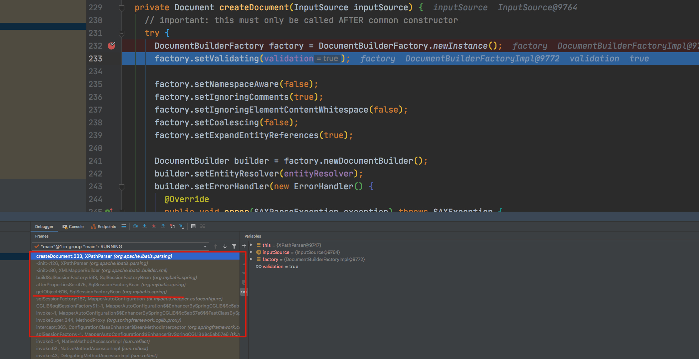
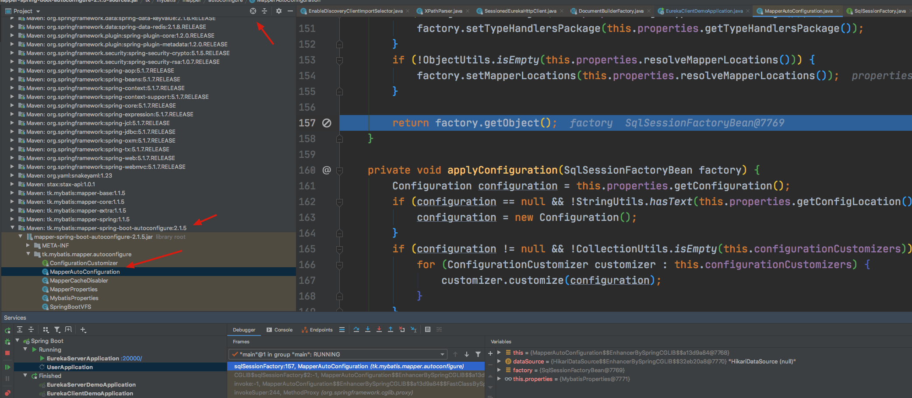
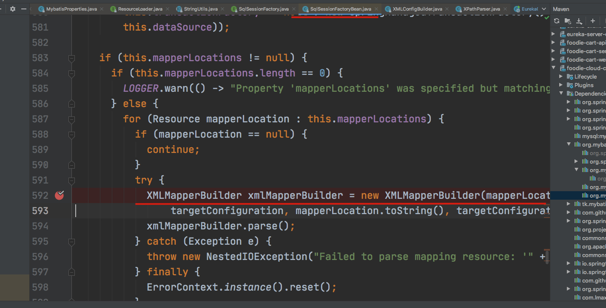

我们来看下 mybatis 是怎么在 springboot 中被初始化的

# 怎么找到入口


这个是我自己摸索的方法，仅供参考

但是我们从哪里入手呢？mybatis最早是在哪里被初始化的呢？我们都不知道、

我们之前看 源码知道，他有一个模块是 `parsing`，这个里面有解析 xml 文件的方法，和解析动态sql 占位符的方法和类

那么在 springboot 启动的时候，他肯定会调用这个类 XPathParser

我们进入这个类中，找到他的构造方法，因为要调用，肯定会调用他的构造方法来进行初始化

```java
// XPathParser.java

public XPathParser(InputStream inputStream, boolean validation, Properties variables) {
    commonConstructor(validation, variables, null);
    this.document = createDocument(new InputSource(inputStream));
  }

  public XPathParser(Document document, boolean validation, Properties variables) {
    commonConstructor(validation, variables, null);
    this.document = document;
  }

  public XPathParser(String xml, boolean validation, Properties variables, EntityResolver entityResolver) {
    commonConstructor(validation, variables, entityResolver);
    this.document = createDocument(new InputSource(new StringReader(xml)));
  }

  public XPathParser(Reader reader, boolean validation, Properties variables, EntityResolver entityResolver) {
    commonConstructor(validation, variables, entityResolver);
    this.document = createDocument(new InputSource(reader));
  }

  public XPathParser(InputStream inputStream, boolean validation, Properties variables, EntityResolver entityResolver) {
    commonConstructor(validation, variables, entityResolver);
    this.document = createDocument(new InputSource(inputStream));
  }

  public XPathParser(Document document, boolean validation, Properties variables, EntityResolver entityResolver) {
    commonConstructor(validation, variables, entityResolver);
    this.document = document;
  }
```

但是我们看到，上面的构造方法实在是太多了，但是他们大多数都调用了 `createDocument()`方法，我们就进入这个方法中，在第一行打上断点，进入之后我们就可以看这边的调用栈。

我们找到和 Mybatis相关的最早的调用栈





我们发现这个类是在`package tk.mybatis.mapper.autoconfigure;`不是 Mybatis 的最初的类，最初的类是这个包开头的`package org.apache.ibatis.XXX`，这个是`mybatis-spring`的自动装配的包，但是他返回的`SqlSessionFactory`，却是ibatis的,那我们再往下找，




这里就是我们开始对文件进行处理，调用 ibatis 的各种方法，比如解析xml文件啊，绑定mapper啊，确定返回类型啊，提取他的 `namespace`啊，等等

# 初始化

## 入口

