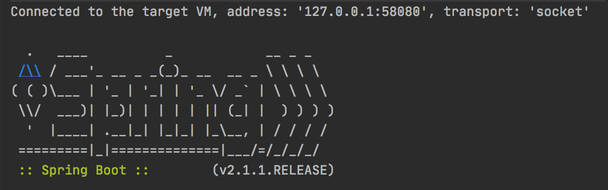
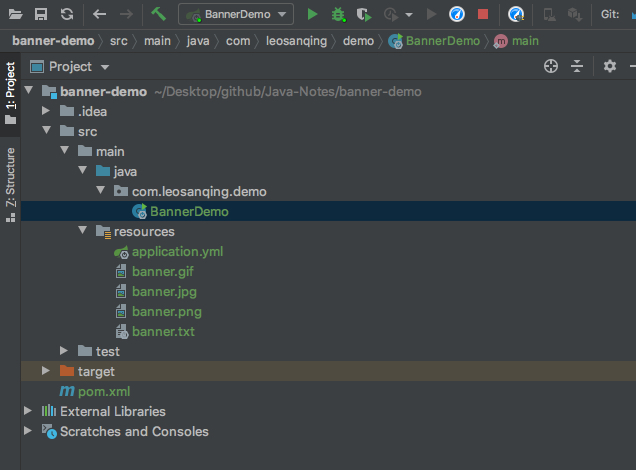
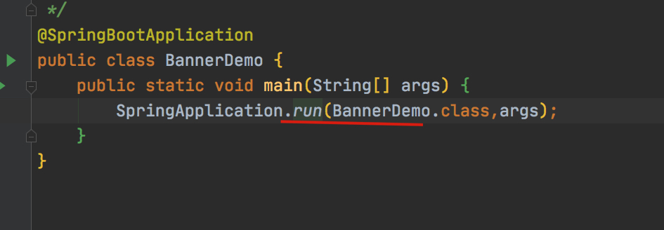
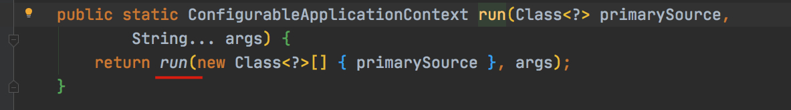
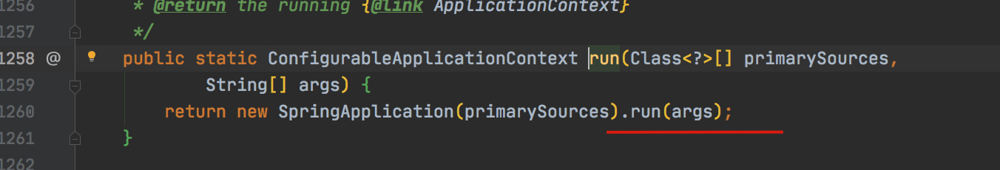
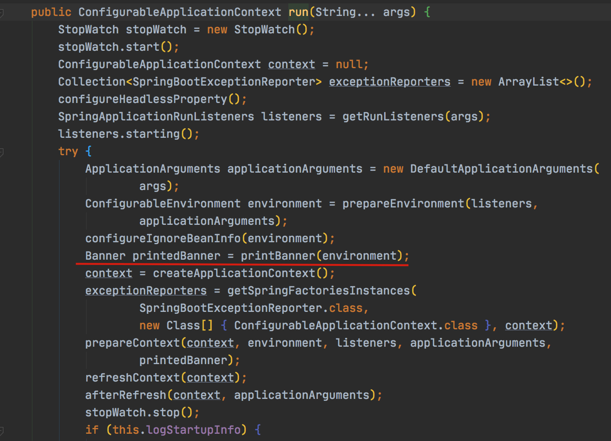
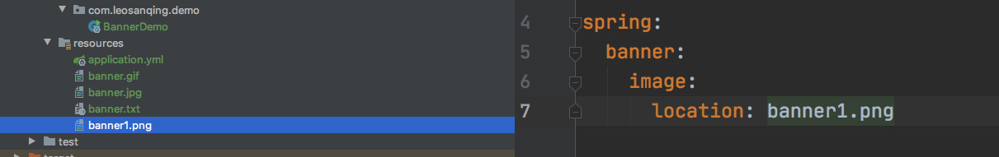
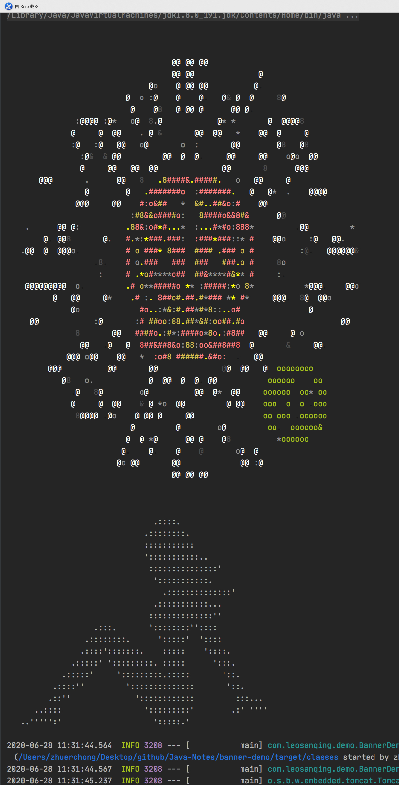

# 前言

我们肯定很好奇，当我们启动 springboot 的时候，这个下面的 banner 是怎么打印出来的呢？



 以及我们可不可以定制我们自己的banner，那我们就进入一下 SpringBoot 的源码，看下他是怎么加载的吧


# 源码分析


## 项目结构



## 入口









```java
private Banner printBanner(ConfigurableEnvironment environment) {
  // 判断是否关闭了 banner 打印模式 
  if (this.bannerMode == Banner.Mode.OFF) {
      return null;
   }
   // 初始化资源加载器
   ResourceLoader resourceLoader = (this.resourceLoader != null)
         ? this.resourceLoader : new DefaultResourceLoader(getClassLoader());
  // 初始化 banner 打印对象 
  SpringApplicationBannerPrinter bannerPrinter = new SpringApplicationBannerPrinter(
         resourceLoader, this.banner);
  // 如果在 log中打印 banner
   if (this.bannerMode == Mode.LOG) {
      return bannerPrinter.print(environment, this.mainApplicationClass, logger);
   }
  // 如果在 控制台打印banner
   return bannerPrinter.print(environment, this.mainApplicationClass, System.out);
}
```

```java
// 只有三种模式，关闭 控制台 和log文件中
enum Mode {

   /**
    * Disable printing of the banner.
    */
   OFF,

   /**
    * Print the banner to System.out.
    */
   CONSOLE,

   /**
    * Print the banner to the log file.
    */
   LOG

}
```


```java
public Banner print(Environment environment, Class<?> sourceClass, PrintStream out) {
  // 获取banner，看了这个我们就知道怎么去更改 banner了 
  Banner banner = getBanner(environment);
  // 打印 banner
   banner.printBanner(environment, sourceClass, out);
   return new PrintedBanner(banner, sourceClass);
}
```

```java
private Banner getBanner(Environment environment) {
  // 创建一个局部对象 Banners ，这个对象继承自 Banner接口，内容很简单，保存banner信息，添加banner方法，打印banner方法
   Banners banners = new Banners();
  // 添加banner ，这个里面还有些道道
   banners.addIfNotNull(getImageBanner(environment));
   banners.addIfNotNull(getTextBanner(environment));
   if (banners.hasAtLeastOneBanner()) {
      return banners;
   }
   if (this.fallbackBanner != null) {
      return this.fallbackBanner;
   }
  // 如果都没有，那么就会打印默认的 banner， 我们都见过
   return DEFAULT_BANNER;
}
```

```java
// 获取 图像banner 信息
private Banner getImageBanner(Environment environment) {
  	// 获取配置文件中的 banner 位置信息
		String location = environment.getProperty(BANNER_IMAGE_LOCATION_PROPERTY);
		if (StringUtils.hasLength(location)) {
			Resource resource = this.resourceLoader.getResource(location);
			return resource.exists() ? new ImageBanner(resource) : null;
		}
  	// 如果配置文件中没有指明，我们就读取默认的配置,banner前缀开头的，挨个遍历匹配。按照 gif。jpg、png的顺序，所以如果匹配到前面的图片，后面的就不会显示
		for (String ext : IMAGE_EXTENSION) {
			Resource resource = this.resourceLoader.getResource("banner." + ext);
			if (resource.exists()) {
				return new ImageBanner(resource);
			}
		}
		return null;
	}
```

```java
// 默认的 banner
class SpringBootBanner implements Banner {

   private static final String[] BANNER = { "",
         "  .   ____          _            __ _ _",
         " /\\\\ / ___'_ __ _ _(_)_ __  __ _ \\ \\ \\ \\",
         "( ( )\\___ | '_ | '_| | '_ \\/ _` | \\ \\ \\ \\",
         " \\\\/  ___)| |_)| | | | | || (_| |  ) ) ) )",
         "  '  |____| .__|_| |_|_| |_\\__, | / / / /",
         " =========|_|==============|___/=/_/_/_/" };

   private static final String SPRING_BOOT = " :: Spring Boot :: ";

   private static final int STRAP_LINE_SIZE = 42;

   @Override
   public void printBanner(Environment environment, Class<?> sourceClass,
         PrintStream printStream) {
      for (String line : BANNER) {
         printStream.println(line);
      }
      String version = SpringBootVersion.getVersion();
      version = (version != null) ? " (v" + version + ")" : "";
      StringBuilder padding = new StringBuilder();
      while (padding.length() < STRAP_LINE_SIZE
            - (version.length() + SPRING_BOOT.length())) {
         padding.append(" ");
      }

      printStream.println(AnsiOutput.toString(AnsiColor.GREEN, SPRING_BOOT,
            AnsiColor.DEFAULT, padding.toString(), AnsiStyle.FAINT, version));
      printStream.println();
   }

}
```

# 实验

我们准备了 四个文件，gif、jpg、png、txt。打印出来是这样的，上面是 gif的内容，下面是 txt的内容


我们在配置文件中指定文件，就不会按照默认的来进行显示了





