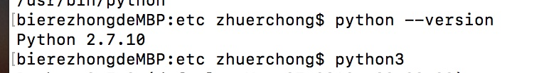
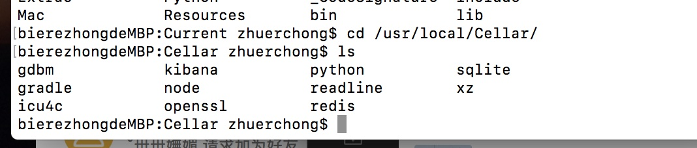
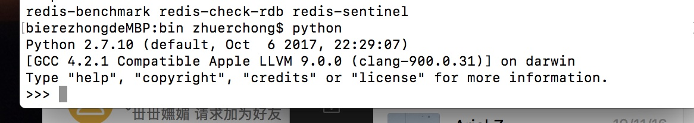
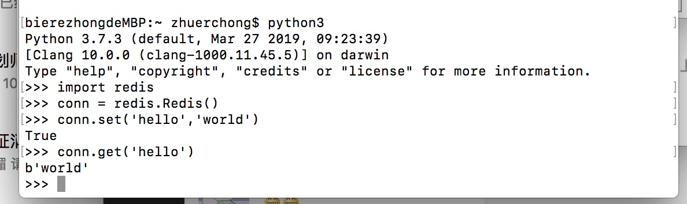
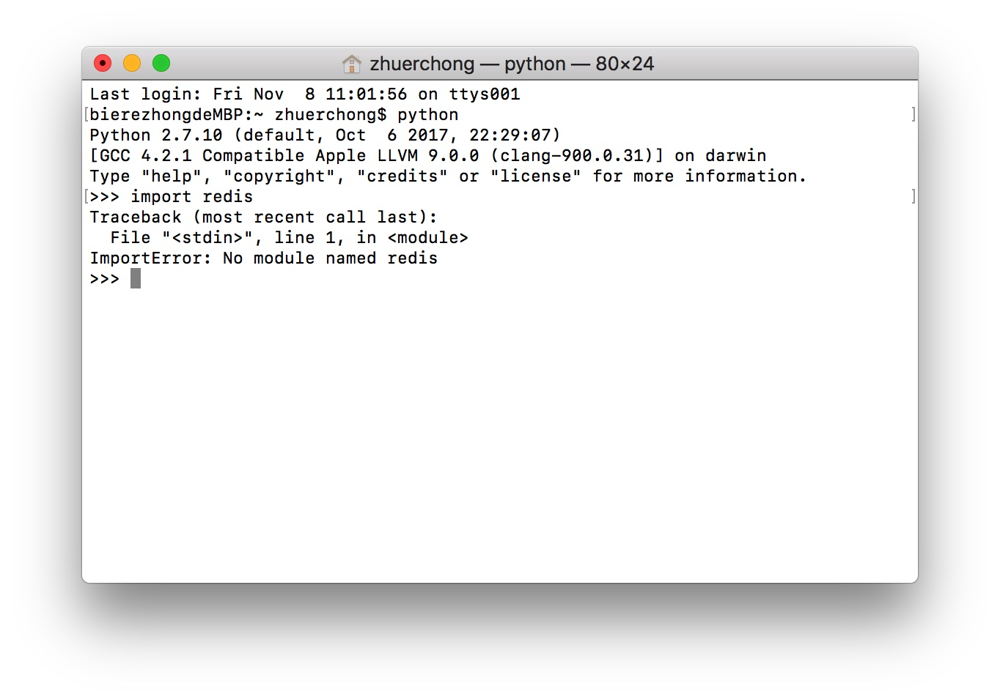

# 安装环境

《Redis实战》这本书中的例子是可以运行的，学习Redis，怎么少的了 Redis的安装 。如果按照书中的代码，还要安装python2

## 安装Homebrew

Homebrew 是MacOS 上管理软件的一个工具。

**如果你要安装新的版本或者安装 Redis，或者其他各种软件，可以使用 Homebrew来进行管理**

具体 安装方法可以点击  [Homebrew安装](https://segmentfault.com/a/1190000018360813)

## 安装Python

我使用的 MacOS的环境，**而且跟书中的安装方式不一样**。所以如果是 Windows 或者 linux，可以看书中的步骤或者自行百度一下。

MacOS 自己就预安装了 Python2的。**所以可以不用安装**，你可以根据 `python --version`查看当前运行的版本

其他命令可以参照这个来 [查看python环境相关](https://blog.csdn.net/BTUJACK/article/details/83856274)

**如果想安装 python3**，而且安装了 Homebrew 可以直接使用 命令 `brew install python3`

如果想安装 Python的依赖库，比如 scrapy，可以用 Homebrew 安装 pip3 `brew install pip3`. 然后使用 `pip3 install scrapy`

## 安装Redis

如果你已经安装了 Homebrew，可以直接 使用  `brew install redis`

之前说了 如果使用 Homebrew 命令安装的话，他会将软件下载到 /usr/local/Cellar

我们可以进入 redis的bin下，启动他的服务器 `redis-server`（注意：**如果你按照书上的方法使用 python 写入redis出错。可能是你没有启动这个服务**）

# 使用Python写入Redis

1. 使用 `python`命令进入 python命令行 . 如果你要用 python3 ，使用 `python3`就行

2. 按照书上的步骤，写入redis 试试
   1. 导入依赖 `import redis`.如果这步出错，是因为没有安装 redis的依赖
   2. 然后获取连接 `conn = redis.Redis()` 这步出错是没有启动 redis服务，可以看我上面的步骤
   3. 设置值 `conn.set('hello','world')`
   4. 获取值 conn.get('hello')

# 如果出错

## 因为没有安装 redis依赖

1. 如果没有使用Homebrew安装python3，使用的是系统自带的 python
   1. 使用 `sudo easy_install pip` 安装 pip。（相当于 Java里的Maven）
   2. 然后 pip install redis
2. 如果使用Homebrew安装的python3，先看看有没有安装 pip3。
   1. 没有 可以使用 `brew install pip3`
   2. 然后使用 `pip3 install redis`就行了 