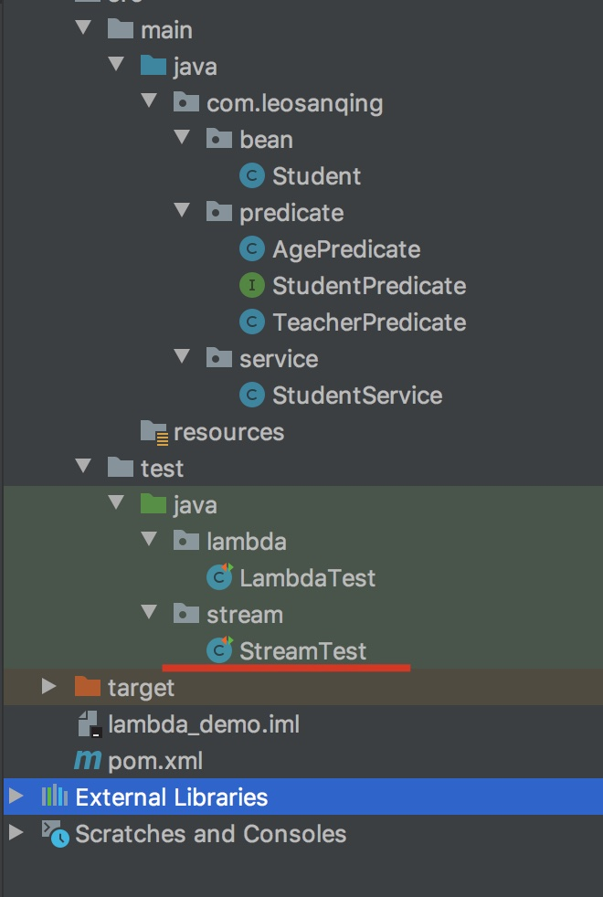

# 前言

我们前面说了 lambda表达式，这次我们就将下JDK8的另一个新特性，**流(Stream)**

stream和lambda‘搭配使用效果更佳，(如果你没有学过lambda表达式，最好先学习下[lambda表达式](https://github.com/leosanqing/Java-Notes/tree/master/Utils/jdk8%E6%96%B0%E7%89%B9%E6%80%A7/lambda))


看着逼格也更高，也更简洁

我们就拿之前的lambda表达式的举例

我们需要找出集合中所有的 男同学 按照年龄从小到大排序 并且打印出来，我们就这样写

```java
studentList.stream()
                .filter(student -> "男".equals(student.getSex()))
                .sorted((x, y) -> x.getAge()-y.getAge())
                .forEach(student -> System.out.println(JSON.toJSONString(student, true)));
```


代码在本目录下的 lambda_demo ，演示在这个测试文件下




# 定义

Stream（流）是一个来自**数据源**的**元素队列**并支持**聚合操作** 

- 元素是特定类型的对象，形成一个队列。 Java中的Stream并不会存储元素，而是按需计算。
- **数据源** 流的来源。 可以是集合，数组，I/O channel， 产生器generator 等。
- **聚合操作** 类似SQL语句一样的操作， 比如filter, map, reduce, find, match, sorted等。


流的处理流程一般是这样

```
+--------------------+       +------+   +------+   +---+   +-------+
| stream of elements +-----> |filter+-> |sorted+-> |map+-> |collect|
+--------------------+       +------+   +------+   +---+   +-------+
```


聚合操作按照分法可以分成两种：**中间操作，终端操作**

- 中间操作
  - 无状态操作
    - filter、map、peek等
  - 有状态操作
    - Sorted、distinct、limit等
- 终端操作
  - 非短路操作
    - foreach、count、collect等
  - 短路操作
    - findFirst、findAny、anyMatch等

**中间操作**

中间操作和很多命令像不像我们 sql 里面的命令，你可以理解为我们的那些限制语句，通过这些手段得到我们想要的一些数据

**终端操作**

顾名思义，就是指最后的操作。一个流里面进行完终端操作之后就不能再进行其他操作了

**无状态操作**

就是不需要全部遍历完之后才能得到，比如 我上面的代码，我只看这个元素符不符合，不符合我就不要，不需要遍历完全部元素。与此相对，有状态操作就是需要整个集合遍历完才行，比如我们的 sorted，我不遍历完所有元素，我怎么知道哪一个最大，哪一个最小

**短路操作**

就是找到一个我们就不往下执行了。与此相反，非短路操作也很好理解

# 各个方法演示

我的集合中有如下元素

```java
private static List<Student> studentList = new ArrayList<Student>() {
        {
            add(new Student("张三丰", 20, "男", "体育",
                    180, 75, "太上老君"));
            add(new Student("张无忌", 18, "男", "语文",
                    178, 73, "文曲星"));
            add(new Student("赵敏", 17, "女", "数学",
                    170, 50, "太白金星"));
            add(new Student("金毛狮王", 25, "男", "体育",
                    176, 80, "太白金星"));
            add(new Student("周芷若", 16, "女", "语文",
                    168, 48, "太上老君"));
            add(new Student("张三", 21, "男", "英语",
                    172, 65, "如来"));
            add(new Student("赵勇", 26, "男", "体育",
                    188, 80, "太上老君"));


        }
    };

```


## 中间操作

### 无状态操作

#### filter

filter，就是过滤掉那些不符合你设定的条件的元素

我们看源码

```java
/**
     * Returns a stream consisting of the elements of this stream that match
     * the given predicate.
     *
     * <p>This is an <a href="package-summary.html#StreamOps">intermediate
     * operation</a>.
     *
     * @param predicate a <a href="package-summary.html#NonInterference">non-interfering</a>,
     *                  <a href="package-summary.html#Statelessness">stateless</a>
     *                  predicate to apply to each element to determine if it
     *                  should be included
     * @return the new stream
     */
    Stream<T> filter(Predicate<? super T> predicate);

// 再看他的参数，记不记得我当初 讲 lambda 时候讲到的 这个
// Predicate 接口 是输入一个类型，返回一个bool值

@FunctionalInterface
public interface Predicate<T> {

    /**
     * Evaluates this predicate on the given argument.
     *
     * @param t the input argument
     * @return {@code true} if the input argument matches the predicate,
     * otherwise {@code false}
     */
    boolean test(T t);
}
```

所以我们使用的时候，返回的是一个bool值，如下所示

Equals 方法返回的是一个bool值

```java
studentList.stream()
                .filter(student -> "男".equals(student.getSex()))
                .forEach(student -> System.out.println(JSON.toJSONString(student, true)));
    
```

结果,我们看到它里面已经过滤掉了女同学

```javascript
{
	"age":20,
	"height":180,
	"name":"张三丰",
	"sex":"男",
	"subject":"体育",
	"teacher":"太上老君",
	"weight":75
}
{
	"age":18,
	"height":178,
	"name":"张无忌",
	"sex":"男",
	"subject":"语文",
	"teacher":"文曲星",
	"weight":73
}
{
	"age":25,
	"height":176,
	"name":"金毛狮王",
	"sex":"男",
	"subject":"体育",
	"teacher":"太白金星",
	"weight":80
}
{
	"age":21,
	"height":172,
	"name":"张三",
	"sex":"男",
	"subject":"英语",
	"teacher":"如来",
	"weight":65
}
{
	"age":26,
	"height":188,
	"name":"赵勇",
	"sex":"男",
	"subject":"体育",
	"teacher":"太上老君",
	"weight":80
}


```


#### map

map的作用是，将一个类型的集合转化为另一个类型的集合

我们来看他的源码

```java
    /**
     * Returns a stream consisting of the results of applying the given
     * function to the elements of this stream.
     *
     * <p>This is an <a href="package-summary.html#StreamOps">intermediate
     * operation</a>.
     * @return the new stream
     */
    <R> Stream<R> map(Function<? super T, ? extends R> mapper);


 		// 他要传入的是一个 Function 接口，作用是输入一个类型，返回另一个类型
    @FunctionalInterface
    public interface Function<T, R> {

        /**
         * Applies this function to the given argument.
         *
         * @param t the function argument
         * @return the function result
         */
        R apply(T t);
    }
```

我们用它生成一个 学生选课的集合。我们输入的是一个Student类型的集合，返回的是一个 String类型的集合

```java
    @Test
    public void mapTest(){

        studentList.stream()
                .map(student -> student.getSubject())
                .forEach(student -> System.out.println(JSON.toJSONString(student, true)));
    }
```

结果如下

```
"体育"
"语文"
"数学"
"体育"
"语文"
"英语"
"体育"
```

#### faltMap

将一个类型的集合转换成另一个类型的流(注意和map区分)

```java
/**
     * Returns a stream consisting of the results of replacing each element of
     * this stream with the contents of a mapped stream produced by applying
     * the provided mapping function to each element.  Each mapped stream is
     * {@link java.util.stream.BaseStream#close() closed} after its contents
     * have been placed into this stream.  (If a mapped stream is {@code null}
     * an empty stream is used, instead.)
     *
     * @return the new stream
     */
    <R> Stream<R> flatMap(Function<? super T, ? extends Stream<? extends R>> mapper);


		// 他也是 Function接口，但是另一个参数是继承自 Stream类的
```

```java
    /**
     * 将一个类型的集合抓换成流.我们把一个字符串流转换成一个字符流
     */
    @Test
    public void flatMapTest() {

        studentList.stream()
                .flatMap(student -> Arrays.stream(student.getName().split("")))
                .forEach(stu -> System.out.println(JSON.toJSONString(stu,true)));
    }
```

#### peek

peek和foreach很相似，区别是 ，一个是中间操作，一个是终端操作。peek用完之后还能被其他操作进行处理。

```java
/**
     * Returns a stream consisting of the elements of this stream, additionally
     * performing the provided action on each element as elements are consumed
     * from the resulting stream.
     *
    
     * @return the new stream
     */
    Stream<T> peek(Consumer<? super T> action);


// 我们看到他的函数接口是Consumer，他是输入一个参数，但是不会有返回值
@FunctionalInterface
public interface Consumer<T> {

    /**
     * Performs this operation on the given argument.
     *
     * @param t the input argument
     */
    void accept(T t);
}
```

```java
    /**
     * peek 方法
     */
    @Test
    public void peekTest() {
        studentList.stream()
                .peek(student -> System.out.println(student.getName()))
                .forEach(stu -> System.out.println(JSON.toJSONString(stu,true)));
    }
```

```java
张三丰
{
	"age":20,
	"height":180,
	"name":"张三丰",
	"sex":"男",
	"subject":"体育",
	"teacher":"太上老君",
	"weight":75
}
张无忌
{
	"age":18,
	"height":178,
	"name":"张无忌",
	"sex":"男",
	"subject":"语文",
	"teacher":"文曲星",
	"weight":73
}
赵敏
{
	"age":17,
	"height":170,
	"name":"赵敏",
	"sex":"女",
	"subject":"数学",
	"teacher":"太白金星",
	"weight":50
}
金毛狮王
{
	"age":25,
	"height":176,
	"name":"金毛狮王",
	"sex":"男",
	"subject":"体育",
	"teacher":"太白金星",
	"weight":80
}
周芷若
{
	"age":16,
	"height":168,
	"name":"周芷若",
	"sex":"女",
	"subject":"语文",
	"teacher":"太上老君",
	"weight":48
}
张三
{
	"age":21,
	"height":172,
	"name":"张三",
	"sex":"男",
	"subject":"英语",
	"teacher":"如来",
	"weight":65
}
赵勇
{
	"age":26,
	"height":188,
	"name":"赵勇",
	"sex":"男",
	"subject":"体育",
	"teacher":"太上老君",
	"weight":80
}
```

我们看到 人名和student类是交替打印的**，也就是执行了一次 peek，执行了一次 foreach**，那么每次都是这样吗？不是的，我们来看下一节

### 有状态操作

#### sorted

sorted是用来排序的


```java
 /**
     * Returns a stream consisting of the elements of this stream, sorted
     * according to the provided {@code Comparator}
     * @return the new stream
     */
    Stream<T> sorted(Comparator<? super T> comparator);

		// 他提供了一个 Comparator接口
		@FunctionalInterface
		public interface Comparator<T> {
    /**
     * Compares its two arguments for order.  Returns a negative integer,
     * zero, or a positive integer as the first argument is less than, equal
     * to, or greater than the second.<p>
     */
    int compare(T o1, T o2);
```


```java
/**
     * sorted 方法,按照年龄大小排序
     */
    @Test
    public void sortedTest() {
        studentList.stream()
                .peek(student -> System.out.println(student.getName()))
                .sorted((x,y) -> x.getAge()-y.getAge())
                .forEach(stu -> System.out.println(JSON.toJSONString(stu,true)));
    }
```

```
张三丰
张无忌
赵敏
金毛狮王
周芷若
张三
赵勇
{
	"age":16,
	"height":168,
	"name":"周芷若",
	"sex":"女",
	"subject":"语文",
	"teacher":"太上老君",
	"weight":48
}
{
	"age":17,
	"height":170,
	"name":"赵敏",
	"sex":"女",
	"subject":"数学",
	"teacher":"太白金星",
	"weight":50
}
{
	"age":18,
	"height":178,
	"name":"张无忌",
	"sex":"男",
	"subject":"语文",
	"teacher":"文曲星",
	"weight":73
}
{
	"age":20,
	"height":180,
	"name":"张三丰",
	"sex":"男",
	"subject":"体育",
	"teacher":"太上老君",
	"weight":75
}
{
	"age":21,
	"height":172,
	"name":"张三",
	"sex":"男",
	"subject":"英语",
	"teacher":"如来",
	"weight":65
}
{
	"age":25,
	"height":176,
	"name":"金毛狮王",
	"sex":"男",
	"subject":"体育",
	"teacher":"太白金星",
	"weight":80
}
{
	"age":26,
	"height":188,
	"name":"赵勇",
	"sex":"男",
	"subject":"体育",
	"teacher":"太上老君",
	"weight":80
}

```


我们看到，这次是先打印peek的内容，再打印 foreach的内容，为什么会这样呢？

**因为之前我们除只有无状态的方法，他不需要遍历完其他全部的操作，所以他就交替打印了，也符合流的特性。但是我们这一次有了有状态的操作，就只能等到处理完全部元素之后能进行foreach的遍历操作**

#### distinct

去重

```java
/**
     * Returns a stream consisting of the distinct elements (according to
     * {@link Object#equals(Object)}) of this stream
     *
     * @return the new stream
     */
    Stream<T> distinct();
```


```java
/**
 * distinct 方法,找出所有老师
 */
@Test
public void distinctTest() {
    studentList.stream()
            .map(student -> student.getTeacher())
            .distinct()
            .forEach(stu -> System.out.println(JSON.toJSONString(stu,true)));
}
```

```
"太上老君"
"文曲星"
"太白金星"
"如来"
```

#### limit

```java
    /**
     * Returns a stream consisting of the elements of this stream, truncated
     * to be no longer than {@code maxSize} in length.
     *
     * @param maxSize the number of elements the stream should be limited to
     * @return the new stream
     * @throws IllegalArgumentException if {@code maxSize} is negative
     */
    Stream<T> limit(long maxSize);   


   /**
     * limit 方法,只显示前4个
     */
    @Test
    public void limitTest() {
        studentList.stream()
                .limit(4)
                .forEach(stu -> System.out.println(JSON.toJSONString(stu,true)));
    }
```


```
{
	"age":20,
	"height":180,
	"name":"张三丰",
	"sex":"男",
	"subject":"体育",
	"teacher":"太上老君",
	"weight":75
}
{
	"age":18,
	"height":178,
	"name":"张无忌",
	"sex":"男",
	"subject":"语文",
	"teacher":"文曲星",
	"weight":73
}
{
	"age":17,
	"height":170,
	"name":"赵敏",
	"sex":"女",
	"subject":"数学",
	"teacher":"太白金星",
	"weight":50
}
{
	"age":25,
	"height":176,
	"name":"金毛狮王",
	"sex":"男",
	"subject":"体育",
	"teacher":"太白金星",
	"weight":80
}

```

#### skip

```java
/**
     * Returns a stream consisting of the remaining elements of this stream
     * after discarding the first {@code n} elements of the stream.
     * If this stream contains fewer than {@code n} elements then an
     * empty stream will be returned.
     
     * @throws IllegalArgumentException if {@code n} is negative
     */
    Stream<T> skip(long n);
    


/**
     * skip 方法,跳过前4个
     */
    @Test
    public void skipTest() {
        studentList.stream()
                .skip(4)
                .forEach(stu -> System.out.println(JSON.toJSONString(stu,true)));
    }
```

```java
{
	"age":16,
	"height":168,
	"name":"周芷若",
	"sex":"女",
	"subject":"语文",
	"teacher":"太上老君",
	"weight":48
}
{
	"age":21,
	"height":172,
	"name":"张三",
	"sex":"男",
	"subject":"英语",
	"teacher":"如来",
	"weight":65
}
{
	"age":26,
	"height":188,
	"name":"赵勇",
	"sex":"男",
	"subject":"体育",
	"teacher":"太上老君",
	"weight":80
}
```

**skip+limit可以完成分页功能**

```java
    /**
     * limit+skip 方法,完成分页功能
     */
    @Test
    public void skipAndLimitTest() {
        studentList.stream()
                .skip(1 * 4)
                .limit(4)
                .forEach(stu -> System.out.println(JSON.toJSONString(stu, true)));
    }
```


## 终端操作

### 短路


#### anyMatch

```java
    /**
     * Returns whether any elements of this stream match the provided
     * predicate.  May not evaluate the predicate on all elements if not
     * necessary for determining the result.  If the stream is empty then
     * {@code false} is returned and the predicate is not evaluated.
     
     * @return {@code true} if any elements of the stream match the provided
     * predicate, otherwise {@code false}
     */
    boolean anyMatch(Predicate<? super T> predicate);


/**
     * anyMatch方法,判断是否有一个满足条件
     */
    @Test
    public void anyMatchTest() {
        final boolean b = studentList.stream()
                .peek(student -> System.out.println(student))
                .allMatch(student -> student.getAge() > 100);
        System.out.println(b);
    }
```

为啥说是**短路操作**。我们测试一下就知道

我们看到，它只打印了一个元素。因为第一个就不满足，他就不会再往下执行了，直接返回false

```java
Student(name=张三丰, age=20, sex=男, subject=体育, height=180, weight=75, teacher=太上老君)
false
```


#### allMatch

```java
 /**
     * Returns whether all elements of this stream match the provided predicate.
     * May not evaluate the predicate on all elements if not necessary for
     * determining the result.  If the stream is empty then {@code true} is
     * returned and the predicate is not evaluated
     * @return {@code true} if either all elements of the stream match the
     * provided predicate or the stream is empty, otherwise {@code false}
     */

		// 我们看到他的接口是一个 Predicate ，这个我们之前介绍过，返回的是一个bool值
    boolean allMatch(Predicate<? super T> predicate);


    /**
     * allMatch方法,判断是否全部满足输入的条件
     */
    @Test
    public void allMatchTest() {
        final boolean b = studentList.stream()
                .allMatch(student -> student.getAge() < 100);
        System.out.println(b);
    }

```


#### findFirst

```java
/**
     * Returns an {@link Optional} describing the first element of this stream,
     * or an empty {@code Optional} if the stream is empty.  If the stream has
     * no encounter order, then any element may be returned.
     
     * @return an {@code Optional} describing the first element of this stream,
     * or an empty {@code Optional} if the stream is empty
     * @throws NullPointerException if the element selected is null
     */

		// 他返回的是一个 Optional对象
    Optional<T> findFirst();   


/**
     * findFirst方法
     */
    @Test
    public void findFirstTest() {
        final Optional<Student> first = studentList.stream()
                .peek(student -> System.out.println(student))
                .findFirst();
        System.out.println(first.get());
    }

```

#### findAny

```java
/**
     * Returns an {@link Optional} describing some element of the stream, or an
     * empty {@code Optional} if the stream is empty.
     *
     * <p>This is a <a href="package-summary.html#StreamOps">short-circuiting
     * terminal operation</a>.
     *
     * <p>The behavior of this operation is explicitly nondeterministic; it is
     * free to select any element in the stream.  This is to allow for maximal
     * performance in parallel operations; the cost is that multiple invocations
     * on the same source may not return the same result.  (If a stable result
     * is desired, use {@link #findFirst()} instead.)
     *
     * @return an {@code Optional} describing some element of this stream, or an
     * empty {@code Optional} if the stream is empty
     * @throws NullPointerException if the element selected is null
     * @see #findFirst()
     */

		// 注意 他的解释中说了，findAny可以发挥并行操作的性能，但是如果你在并行的时候想要一个稳定的结果，要用 findFirst。
    Optional<T> findAny();
    

    /**
    	* 因为我们使用的是串行的操作，所以并不影响结果，和findFirst 的结果一样
    	*/
		@Test
    public void findAnyTest() {
        final Optional<Student> first = studentList.stream()
                .peek(student -> System.out.println(student))
                .findAny();
        System.out.println(first.get());
    }
```

#### max

```java
/**
     * Returns the maximum element of this stream according to the provided
     * {@code Comparator}.  This is a special case of a
     * <a href="package-summary.html#Reduction">reduction</a>.
     *
     * <p>This is a <a href="package-summary.html#StreamOps">terminal
     * operation</a>.
     *
     * @param comparator a <a href="package-summary.html#NonInterference">non-interfering</a>,
     *                   <a href="package-summary.html#Statelessness">stateless</a>
     *                   {@code Comparator} to compare elements of this stream
     * @return an {@code Optional} describing the maximum element of this stream,
     * or an empty {@code Optional} if the stream is empty
     * @throws NullPointerException if the maximum element is null
     */
		// 返回的是一个 Optional类
    Optional<T> max(Comparator<? super T> comparator);


  /**
     * max 方法测试，输出最大的年龄。如果从这里点进入就是使用的 intStream接口,和之前的还不一样
     */
    @Test
    public void maxTest() {
        final OptionalInt max = studentList.stream()
                .mapToInt(stu -> stu.getAge())
                .max();
        System.out.println(max.getAsInt());
    }


```

### 终端非短路

### collect

```java
    

		@Test
    public void collectTest(){
        final List<Student> list = studentList.stream()
                .filter(student -> "女".equals(student.getSex()))
                .collect(Collectors.toList());

        System.out.println(JSON.toJSONString(list,true));
    }
```

```
[
	{
		"age":17,
		"height":170,
		"name":"赵敏",
		"sex":"女",
		"subject":"数学",
		"teacher":"太白金星",
		"weight":50
	},
	{
		"age":16,
		"height":168,
		"name":"周芷若",
		"sex":"女",
		"subject":"语文",
		"teacher":"太上老君",
		"weight":48
	}
]
```


groupBy  进行分类

```JAVA
/**
     * Returns a {@code Collector} implementing a "group by" operation on
     * input elements of type {@code T}, grouping elements according to a
     * classification function, and returning the results in a {@code Map}.
     *
     * <p>The classification function maps elements to some key type {@code K}.
     * The collector produces a {@code Map<K, List<T>>} whose keys are the
     * values resulting from applying the classification function to the input
     * elements, and whose corresponding values are {@code List}s containing the
     * input elements which map to the associated key under the classification
     * function.
     */

		// 可以看到，他的参数也是一个 Function接口，
    public static <T, K> Collector<T, ?, Map<K, List<T>>>
    groupingBy(Function<? super T, ? extends K> classifier) {
        return groupingBy(classifier, toList());
    }


    @Test
    public void collectTest(){
//        final List<Student> list = studentList.stream()
//                .filter(student -> "女".equals(student.getSex()))
//                .collect(Collectors.toList());

      // 按照性别分类
        final Map<String, List<Student>> list = studentList.stream()
                .collect(Collectors.groupingBy(s -> s.getSex()));

        System.out.println(JSON.toJSONString(list,true));
    }


```

```java
{
	"女":[
		{
			"age":17,
			"height":170,
			"name":"赵敏",
			"sex":"女",
			"subject":"数学",
			"teacher":"太白金星",
			"weight":50
		},
		{
			"age":16,
			"height":168,
			"name":"周芷若",
			"sex":"女",
			"subject":"语文",
			"teacher":"太上老君",
			"weight":48
		}
	],
	"男":[
		{
			"age":20,
			"height":180,
			"name":"张三丰",
			"sex":"男",
			"subject":"体育",
			"teacher":"太上老君",
			"weight":75
		},
		{
			"age":18,
			"height":178,
			"name":"张无忌",
			"sex":"男",
			"subject":"语文",
			"teacher":"文曲星",
			"weight":73
		},
		{
			"age":25,
			"height":176,
			"name":"金毛狮王",
			"sex":"男",
			"subject":"体育",
			"teacher":"太白金星",
			"weight":80
		},
		{
			"age":21,
			"height":172,
			"name":"张三",
			"sex":"男",
			"subject":"英语",
			"teacher":"如来",
			"weight":65
		},
		{
			"age":26,
			"height":188,
			"name":"赵勇",
			"sex":"男",
			"subject":"体育",
			"teacher":"太上老君",
			"weight":80
		}
	]
}

Process finished with exit code 0

```

