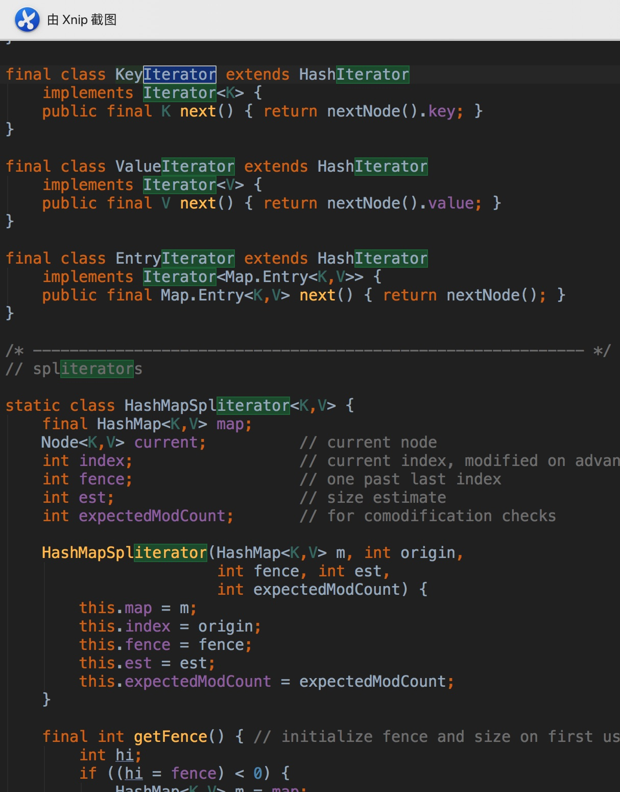
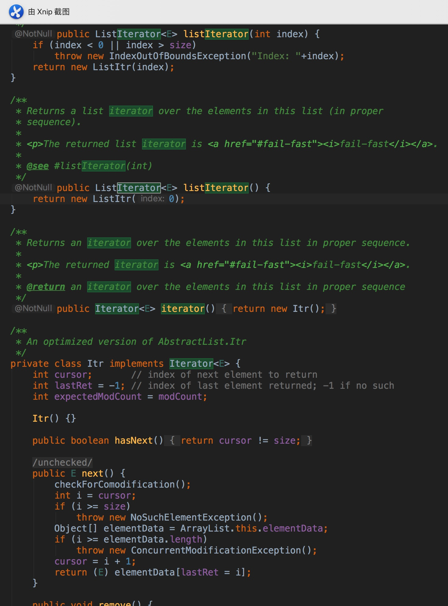

# Iterator

我们看很多的工具类都会用到Iterator

比如HashMap



比如ArrayList



# 优点

## 遍历和实现相分离

我们来看遍历的代码

```java
while (iterator.hasNext()){
    Book next = (Book) iterator.next();
    System.out.println(next.getName());
}
```

上面的代码中只是用了Iterator的`hasNext`和`next`方法，而并没有调用BookShelf类中的任何方法

所以，**这里的While循环并不依赖于BookShelf的实现**

 这句话的意思是，哪怕我们突然说，BookShelf 中的成员 books，我们不用数组了，我们改成 Vector，或者我们改成List，这样即使我们改变了这个类。只要`BookShelf`的 `iterator`能够返回正确地返回Iterator的实例，即使不对上面的 while 循环做任何更改，代码都可以正常工作。

```java
package com.leosanqing.iterator.vectorImp;

import java.util.Vector;

/**
 * 将数组改成 vector，其他不更改，代码仍然可以运行
 */
public class BookShelf implements Aggregate {
    public Vector<Book> books;
    private int last = 0;

    public BookShelf(int maxsize){
        books = new Vector<>(maxsize);
    }


    public Book getBookAt(int index){
        return books.elementAt(index);
    }

    public void appendBook(Book book){
        books.add(last,book);
        last++;
    }

    public int getLength(){
        return last;
    }

    @Override
    public Iterator iterator() {
        return new BookShelfIteratorVec(this);
    }
}

```

## 可复用

**可复用性是指：当我的一个组件发生变化，不需要对其他组件进行更改或者只更改其中的一小部分就可以满足需求**

我们看上面的代码，如果我的需求是将数组改成使用vector，那么我只需要改BookShelf中的一些代码即可。其他组件不改仍能正常运行

