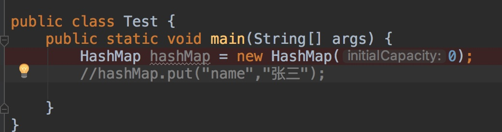
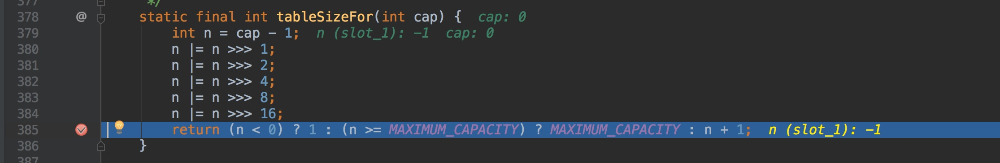
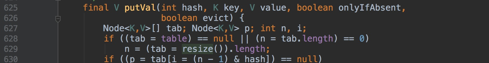

##  创建函数时，传入初始长度0,1,2,3,4……15,16，数组table长度为多少


记住一点，当table进行初始化的时候，table.length 就是  `比传入的值大的或者等于的最小的 2的n次方`，**table.length 的长度一直是 2的n次方**

也就是说，我`new HashMap(0)`,table初始化后 table.length ==1(当然，源码中所有的变量都采用延迟初始化，只有等到用的时候，即put元素的时候才初始化。如果没有放入元素，那么 table一直为 null，我上面的只是另外一个变量 `threshold`得出来的，因为这两个有关系。我使用断点调试一下就知道了)




我们注意到，当构建函数时，threshold的初始值和 `tableSizeFor()`这个函数有关


我们再进入`tableSizeFor`



这个是返回一个比输入值大的或者等于的最小的 2的n次方(如果你不明白可以看下我后面的测试值和这篇文章

[https://www.cnblogs.com/loading4/p/6239441.html](https://www.cnblogs.com/loading4/p/6239441.html)

所以他返回的值为 1（比0大的或者等于的最小的2的n次方 就是1）；

然后这个时候假如我们第一次 put一个元素，这个时候table数组就要开始初始化了，他就会执行这个`resize`函数，在源码中是这样

而resize的解读如下

```java
/**
     * 扩容函数
     *   使用情景: 1.初始化数组table，
     *           2.++size>threshold. 
     * @return 新的数组table
     *         或者是当扩容一倍长度超过最大值，返回原来的table数组
 */
    final  Entry[] resize() {
        // 定义旧的数组为 Entry 类型的数组，oldTab
        Entry[] oldTab = table;
        // 如果oldTab==null  则返回 0，否则返回数组大小
        int oldCap = (oldTab==null) ? 0 : oldTab.length;

        int oldThreshold = threshold;

        int newCap,newThreshold=0;

        // 说明已经不是第一次 扩容，那么已经初始化过，容量一定是 2的n次方，所以可以直接位运算
        if(oldCap>0){
            // 如果 原来的数组大小已经大于等于了最大值，那么阈值设置为 Integer的最大值,即不会再进行扩容
            if(oldCap >= MAX_CAPACITY){
                threshold = Integer.MAX_VALUE;
                return oldTab;
            }

            // 因此已经不是第一次扩容，一定是2的n次方
            else if ((newCap = oldCap << 1) < MAX_CAPACITY &&
                      oldCap >= INIT_CAPACITY)

                newThreshold = oldThreshold << 1;

        }
        // 如果oldThreshold > 0,并且oldCap == 0，说明是还没有进行调用resize方法。
        // 说明输入了初始值，且oldThreshold为 比输入值大的最小的2的n次方
        // 那么就把 oldThreshold 的值赋给 newCap ，因为这个值现在为 比输入值大的最小的2的n次方
        else if(oldThreshold>0)
            newCap = oldThreshold;

        // 这个是只有使用无参构造器的时候才能满足的条件。，全部是否默认的值
        else{
            newCap = INIT_CAPACITY;
            newThreshold = (int) (INIT_CAPACITY * DEFAULT_LOADFACTOR);
        }

        //
        if(newThreshold == 0){

            float ft = (float) (newCap * loadFactor);
            newThreshold =(newCap < MAX_CAPACITY && ft < (float) MAX_CAPACITY ?
                    (int )ft : Integer.MAX_VALUE);
        }

        threshold = newThreshold;

        Entry newTable[] = new Entry[newCap];
        table=newTable;

        // 将原来数组中的所有元素都 copy进新的数组
        if(oldTab != null){
            for (int j = 0; j < oldCap; j++) {
                Entry e;

                if((e = oldTab[j]) != null){
                    oldTab[j] = null;

                    // 说明还没有成链，数组上只有一个
                    if(e.next == null){
                        // 重新计算 数组索引 值
                        newTable[e.h & (newCap-1)] = e;

                    }
                    // 判断是否为树结构
                    //else if (e instanceof TreeNode)


                    // 如果不是树，只是链表,即长度还没有大于 8 进化成树
                    else{
                        // 扩容后，如果元素的 index 还是原来的。就使用这个lo前缀的
                        Entry loHead=null, loTail =null;

                        // 扩容后  元素index改变，那么就使用 hi前缀开头的
                        Entry hiHead = null, hiTail = null;
                        Entry next;
                        do {
                            next = e.next;
                            //这个非常重要，也比较难懂，
                            // 将它和原来的长度进行相与，就是判断他的原来的hash的上一个	bit 位是否为 1。
                            //以此来判断他是在相同的索引还是table长度加上原来的索引
                            if((e.h & oldCap) == 0){
                                // 如果 loTail == null ,说明这个 位置上是第一次添加，没有哈希冲突
                                if(loTail == null)
                                    loHead = e;
                                else
                                    loTail.next = e;
                                loTail = e;
                            }
                            else{
                                if(hiTail == null)
                                    loHead = e;
                                else
                                    hiTail.next = e;
                                hiTail = e ;
                            }

                        }while ((e = next) != null);


                        if(loTail != null){
                            loTail.next = null;
                            newTable[j] = loHead;
                        }

                        // 新的index 等于原来的 index+oldCap
                        else {

                            hiTail.next = null;
                            newTable[j+oldCap] = hiHead;
                        }

                    }
                }

            }
        }

        return newTable;
    }

```

我们注意这里，满足这个的条件为  `oldCap==0 && oldThreshold>0`

```java
    else if(oldThreshold>0)
        newCap = oldThreshold;
```

`oldThreshold`等于之前使用 tableSizeFor 的返回值，也就是 1；所以`table`一经初始化长度就为1**（但是还要说明一点,执行完 resize函数之后 table.length等于1，threshold等于0。看我上面的分析，newThreshold=(int)0.75)就等于0**

但是我们执行的是存入元素的操作，所以存完之后，就要++size(因为之前里面没有元素)，这个时候 size就等于1，他就大于 threshold。所以他又要执行`resize`函数进行扩容操作。执行完之后，table.length 就等于2了，threshold就等于 1了。

**table的扩容全部都是乘以 2（左移一位），而且table.length也一直等于2的n次方，即(table.length &(table.length-1)) == 0**

> 之后同理可以推，一开始创建对象时，传入 1的话，table 初始化长度为1；传入 2，长度为2；传入3，长度为4；传入[5,8]，长度为8；传入[9,16]，长度为16