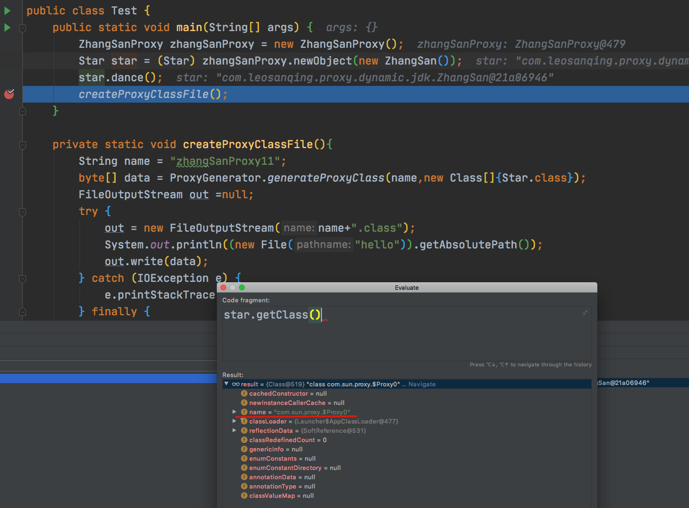

# 什么是代理

代理 的字面意思就是 代替别人处理事情。 举一个比较简单的例子，艺人要接商演，但是艺人时间宝贵，很忙，不可能什么都自己处理，所以有一个经济人的角色，这个经纪人就用来代替艺人处理一些不太重要的事情，比如商演薪酬洽谈，行程安排等等，**只有唱歌等演出才由艺人自己做**

经纪人就是我们的代理类，而艺人就是 被代理的类。

代理又分静态代理和动态代理

# 静态代理

**静态代理的代理对象和被代理对象在代理之前就已经确定，它们都实现相同的接口或继承相同的抽象类.**

用个例子看下,某公司要*徐坤商演，但是收钱和洽谈这方面肯定交给 经纪人(代理类)来做,所以我们就这样写

```java
public interface Star {
    /**
     * 跳舞
     */
    void dance();
}
```

```java
public class Cxk implements Star {
    @Override
    public void dance() {
        System.out.println("我是 练习时长两年半的练习生 " + this.getClass() + " ,我来 跳舞....");
    }
}
```

```java
public class CxkProxy implements Star {


    private Star star;

    // 或者直接写死
//    private Star star = new Cxk();

    public CxkProxy(Star star){
        this.star = star;
    }

    @Override
    public void dance() {
        System.out.println("... 我是 cxk 的经纪人, 跳舞前 收钱 ...");
        star.dance();
    }
}
```

```java
public class Company {
    public static void main(String[] args) {

        Star cxkProxy = new CxkProxy(new Cxk());
        cxkProxy.dance();
    }
}
```

```
输出结果
... 我是 cxk 的经纪人, 跳舞前 收钱 ...
我是 练习时长两年半的练习生 class com.leosanqing.proxy.static1.Cxk ,我来 跳舞....
```


我们看上面的调用，其实我们一直是找 经纪人这个角色来进行 dance ，但最后 他还是调用了 真正的 跳舞的人，。

我们从这方面想一下我们的业务，我们只要 dance 这个业务(你可以想成其他实际业务，比如 扣库存)，而 经纪人 的种种行为，我们可以看成是 在做业务之前 进行了 log 日志打印。相当于增强了 我们 之前的业务。这也是 Spring AOP Advise 所做的事。所以应该翻译成 **增强**更贴切语境。

但是 Spring 不可能使用 静态代理，所以下面就要介绍 动态代理了

# JDK 动态代理

动态代理有两种，一种是 JDK 的动态代理，一种是 CGlib 的动态代理。我们看下他们两个分别是什么

```java
public class ZhangSan implements Star {

    @Override
    public void dance() {
        System.out.println("我是 " + this.getClass().getName() +" 我来跳舞");
    }
}


public class ZhangSanProxy implements InvocationHandler {
    private Object target;

    public Object newObject(Object o){
        this.target = o;
        return Proxy.newProxyInstance(o.getClass().getClassLoader(),o.getClass().getInterfaces(),this);
    }
    @Override
    public Object invoke(Object proxy, Method method, Object[] args) throws Throwable {
        System.out.println("------ 我是张三经纪人，唱歌前先收钱 -------");
        return method.invoke(target, args);
    }
}


public class Test {
    public static void main(String[] args) {
        ZhangSanProxy zhangSanProxy = new ZhangSanProxy();
        Star star = (Star) zhangSanProxy.newObject(new ZhangSan());
        star.dance();
    }
}

// 输出结果
------ 我是张三经纪人，唱歌前先收钱 -------
我是 com.leosanqing.proxy.dynamic.jdk.ZhangSan 我来跳舞
```

我们看到，代理类 实现了 InvocationHandler 这个接口，然后重写他的 invoke 方法，在这里我们添加了某些其他的业务，比如收钱

当代码执行到 star.dance()方法时，他会调用 ZhangSanProxy 的 invoke 方法，这是为啥？，肯定是我们 的 `zhangSanProxy.newObject(new ZhangSan());`这里做了什么，我们看下源码

## 走进源码

```java
@CallerSensitive
public static Object newProxyInstance(ClassLoader loader,
                                      Class<?>[] interfaces,
                                      InvocationHandler h)
    throws IllegalArgumentException
{
    Objects.requireNonNull(h);

    final Class<?>[] intfs = interfaces.clone();
    final SecurityManager sm = System.getSecurityManager();
    if (sm != null) {
        checkProxyAccess(Reflection.getCallerClass(), loader, intfs);
    }

    /*
     * Look up or generate the designated proxy class 
     * 查找或生成指定的代理类，这个是生成的主要的方法
     */
    Class<?> cl = getProxyClass0(loader, intfs);

    /*
     * Invoke its constructor with the designated invocation handler.
     */
    try {
        if (sm != null) {
            checkNewProxyPermission(Reflection.getCallerClass(), cl);
        }

        final Constructor<?> cons = cl.getConstructor(constructorParams);
        final InvocationHandler ih = h;
        if (!Modifier.isPublic(cl.getModifiers())) {
            AccessController.doPrivileged(new PrivilegedAction<Void>() {
                public Void run() {
                    cons.setAccessible(true);
                    return null;
                }
            });
        }
        return cons.newInstance(new Object[]{h});
    } catch (IllegalAccessException|InstantiationException e) {
        throw new InternalError(e.toString(), e);
    } catch (InvocationTargetException e) {
        Throwable t = e.getCause();
        if (t instanceof RuntimeException) {
            throw (RuntimeException) t;
        } else {
            throw new InternalError(t.toString(), t);
        }
    } catch (NoSuchMethodException e) {
        throw new InternalError(e.toString(), e);
    }
}
```

```java
 /**
     * Generate a proxy class.  Must call the checkProxyAccess method
     * to perform permission checks before calling this.
     */
    private static Class<?> getProxyClass0(ClassLoader loader,
                                           Class<?>... interfaces) {
        if (interfaces.length > 65535) {
            throw new IllegalArgumentException("interface limit exceeded");
        }
 
        // If the proxy class defined by the given loader implementing
        // the given interfaces exists, this will simply return the cached copy;
        // otherwise, it will create the proxy class via the ProxyClassFactory
     		// 返回代理类，如果有缓存返回缓存，没有则创建
        return proxyClassCache.get(loader, interfaces);
    }
```

```java
 /**
     * Look-up the value through the cache. This always evaluates the
     * {@code subKeyFactory} function and optionally evaluates
     * {@code valueFactory} function if there is no entry in the cache for given
     * pair of (key, subKey) or the entry has already been cleared.
     *
     * @param key       possibly null key
     * @param parameter parameter used together with key to create sub-key and
     *                  value (should not be null)
     * @return the cached value (never null)
     * @throws NullPointerException if {@code parameter} passed in or
     *                              {@code sub-key} calculated by
     *                              {@code subKeyFactory} or {@code value}
     *                              calculated by {@code valueFactory} is null.
     */
    public V get(K key, P parameter) {
        Objects.requireNonNull(parameter);
 
        expungeStaleEntries();
 
      	// 能不能从缓存中获取对象，这里使用的是 弱引用，可能会被内存回收
        Object cacheKey = CacheKey.valueOf(key, refQueue);
 
        // lazily install the 2nd level valuesMap for the particular cacheKey
        ConcurrentMap<Object, Supplier<V>> valuesMap = map.get(cacheKey);
        if (valuesMap == null) {
			//putIfAbsent这个方法在key不存在的时候加入一个值,如果key存在就不放入
            ConcurrentMap<Object, Supplier<V>> oldValuesMap
                = map.putIfAbsent(cacheKey,
                                  valuesMap = new ConcurrentHashMap<>());
            if (oldValuesMap != null) {
                valuesMap = oldValuesMap;
            }
        }
 
        // create subKey and retrieve the possible Supplier<V> stored by that
        // subKey from valuesMap
        Object subKey = Objects.requireNonNull(subKeyFactory.apply(key, parameter));
        Supplier<V> supplier = valuesMap.get(subKey);
        Factory factory = null;
 
      	// 一直循环，直到生成好对象并返回
        while (true) {
            if (supplier != null) {
                // supplier might be a Factory or a CacheValue<V> instance
              // 在这里是返回
                V value = supplier.get();
                if (value != null) {
                    return value;
                }
            }
            // else no supplier in cache
            // or a supplier that returned null (could be a cleared CacheValue
            // or a Factory that wasn't successful in installing the CacheValue)
 
            // lazily construct a Factory
          	// 
            if (factory == null) {
                factory = new Factory(key, parameter, subKey, valuesMap);
            }
 
            if (supplier == null) {				
                supplier = valuesMap.putIfAbsent(subKey, factory);
                if (supplier == null) {
                    // successfully installed Factory
                    supplier = factory;
                }
                // else retry with winning supplier
            } else {
                if (valuesMap.replace(subKey, supplier, factory)) {
                    // successfully replaced
                    // cleared CacheEntry / unsuccessful Factory
                    // with our Factory
                    supplier = factory;
                } else {
                    // retry with current supplier
                    supplier = valuesMap.get(subKey);
                }
            }
        }
    }
```

```java
// 我们会从上一步 的  V value = supplier.get(); 进入到这里，这里就是真正生成代理类的地方 

private static final class ProxyClassFactory
    implements BiFunction<ClassLoader, Class<?>[], Class<?>>
{
    // prefix for all proxy class names
    private static final String proxyClassNamePrefix = "$Proxy";

    // next number to use for generation of unique proxy class names
    private static final AtomicLong nextUniqueNumber = new AtomicLong();

    @Override
    public Class<?> apply(ClassLoader loader, Class<?>[] interfaces) {

        Map<Class<?>, Boolean> interfaceSet = new IdentityHashMap<>(interfaces.length);
        for (Class<?> intf : interfaces) {
            /*
             * Verify that the class loader resolves the name of this
             * interface to the same Class object.
             */
            Class<?> interfaceClass = null;
            try {
                interfaceClass = Class.forName(intf.getName(), false, loader);
            } catch (ClassNotFoundException e) {
            }
            if (interfaceClass != intf) {
                throw new IllegalArgumentException(
                    intf + " is not visible from class loader");
            }
            /*
             * Verify that the Class object actually represents an
             * interface.
             */
            if (!interfaceClass.isInterface()) {
                throw new IllegalArgumentException(
                    interfaceClass.getName() + " is not an interface");
            }
            /*
             * Verify that this interface is not a duplicate.
             */
            if (interfaceSet.put(interfaceClass, Boolean.TRUE) != null) {
                throw new IllegalArgumentException(
                    "repeated interface: " + interfaceClass.getName());
            }
        }

        String proxyPkg = null;     // package to define proxy class in
        int accessFlags = Modifier.PUBLIC | Modifier.FINAL;

        /*
         * Record the package of a non-public proxy interface so that the
         * proxy class will be defined in the same package.  Verify that
         * all non-public proxy interfaces are in the same package.
         */
        for (Class<?> intf : interfaces) {
            int flags = intf.getModifiers();
            if (!Modifier.isPublic(flags)) {
                accessFlags = Modifier.FINAL;
                String name = intf.getName();
                int n = name.lastIndexOf('.');
                String pkg = ((n == -1) ? "" : name.substring(0, n + 1));
                if (proxyPkg == null) {
                    proxyPkg = pkg;
                } else if (!pkg.equals(proxyPkg)) {
                    throw new IllegalArgumentException(
                        "non-public interfaces from different packages");
                }
            }
        }

        if (proxyPkg == null) {
            // if no non-public proxy interfaces, use com.sun.proxy package
            proxyPkg = ReflectUtil.PROXY_PACKAGE + ".";
        }

        /*
         * Choose a name for the proxy class to generate.
         * 生成的代理类的名称
         */
        long num = nextUniqueNumber.getAndIncrement();
        String proxyName = proxyPkg + proxyClassNamePrefix + num;

        /*
         * Generate the specified proxy class.
         */
        byte[] proxyClassFile = ProxyGenerator.generateProxyClass(
            proxyName, interfaces, accessFlags);
        try {
            return defineClass0(loader, proxyName,
                                proxyClassFile, 0, proxyClassFile.length);
        } catch (ClassFormatError e) {
            /*
             * A ClassFormatError here means that (barring bugs in the
             * proxy class generation code) there was some other
             * invalid aspect of the arguments supplied to the proxy
             * class creation (such as virtual machine limitations
             * exceeded).
             */
            throw new IllegalArgumentException(e.toString());
        }
    }
}
```

```java
/*
 * Generate the specified proxy class.
 * 这里是重点，这里生成代理类的Class文件
 */
byte[] proxyClassFile = ProxyGenerator.generateProxyClass(
    proxyName, interfaces, accessFlags);
```

后面就看不到源码了，只能看到编译优化好的代码

```java
public static byte[] generateProxyClass(final String var0, Class<?>[] var1, int var2) {
    ProxyGenerator var3 = new ProxyGenerator(var0, var1, var2);
  // 这里生成文件
    final byte[] var4 = var3.generateClassFile();
    if (saveGeneratedFiles) {
        AccessController.doPrivileged(new PrivilegedAction<Void>() {
            public Void run() {
                try {
                    int var1 = var0.lastIndexOf(46);
                    Path var2;
                    if (var1 > 0) {
                        Path var3 = Paths.get(var0.substring(0, var1).replace('.', File.separatorChar));
                        Files.createDirectories(var3);
                        var2 = var3.resolve(var0.substring(var1 + 1, var0.length()) + ".class");
                    } else {
                        var2 = Paths.get(var0 + ".class");
                    }

                    Files.write(var2, var4, new OpenOption[0]);
                    return null;
                } catch (IOException var4x) {
                    throw new InternalError("I/O exception saving generated file: " + var4x);
                }
            }
        });
    }

    return var4;
}
```

我们看到代理对象的类型是 

这个名字在哪里生成的，可以看看前面两三个类，我有一行注释

最后绑定完之后，我们看 Star 生成的class 文件

```java
//
// Source code recreated from a .class file by IntelliJ IDEA
// (powered by Fernflower decompiler)
//

import com.leosanqing.proxy.Star;
import java.lang.reflect.InvocationHandler;
import java.lang.reflect.Method;
import java.lang.reflect.Proxy;
import java.lang.reflect.UndeclaredThrowableException;

public final class zhangSanProxy extends Proxy implements Star {
    private static Method m1;
    private static Method m3;
    private static Method m2;
    private static Method m0;

    public zhangSanProxy(InvocationHandler var1) throws  {
        super(var1);
    }

    public final boolean equals(Object var1) throws  {
        try {
            return (Boolean)super.h.invoke(this, m1, new Object[]{var1});
        } catch (RuntimeException | Error var3) {
            throw var3;
        } catch (Throwable var4) {
            throw new UndeclaredThrowableException(var4);
        }
    }

    public final void dance() throws  {
        try {
            super.h.invoke(this, m3, (Object[])null);
        } catch (RuntimeException | Error var2) {
            throw var2;
        } catch (Throwable var3) {
            throw new UndeclaredThrowableException(var3);
        }
    }

    public final String toString() throws  {
        try {
            return (String)super.h.invoke(this, m2, (Object[])null);
        } catch (RuntimeException | Error var2) {
            throw var2;
        } catch (Throwable var3) {
            throw new UndeclaredThrowableException(var3);
        }
    }

    public final int hashCode() throws  {
        try {
            return (Integer)super.h.invoke(this, m0, (Object[])null);
        } catch (RuntimeException | Error var2) {
            throw var2;
        } catch (Throwable var3) {
            throw new UndeclaredThrowableException(var3);
        }
    }

    static {
        try {
            m1 = Class.forName("java.lang.Object").getMethod("equals", Class.forName("java.lang.Object"));
            m3 = Class.forName("com.leosanqing.proxy.Star").getMethod("dance");
            m2 = Class.forName("java.lang.Object").getMethod("toString");
            m0 = Class.forName("java.lang.Object").getMethod("hashCode");
        } catch (NoSuchMethodException var2) {
            throw new NoSuchMethodError(var2.getMessage());
        } catch (ClassNotFoundException var3) {
            throw new NoClassDefFoundError(var3.getMessage());
        }
    }
}

```

我们看到 他的 dance 方法，调用了`super.h.invoke(this, m3, (Object[])null);` 而那个 h 就是我们的`ZhangSanProxy`,然后就有了 我们写的 `ZhangSanProxy.invoke()`里面的内容

# CGlib

```java
public class LiSi {
    public void dance() {
        System.out.println("我是 "+this.getClass().getName() + ", 我来唱歌");
    }
}


public class LiSiProxy implements MethodInterceptor {

    public static Object createProxyObject(Object o){
        Enhancer enhancer = new Enhancer();
        enhancer.setSuperclass(o.getClass());
        enhancer.setCallback(new LiSiProxy());
        return enhancer.create();
    }

    @Override
    public Object intercept(Object o, Method method, Object[] objects, MethodProxy methodProxy) throws Throwable {
        System.out.println("我是李四经纪人，演出前先收钱");
        methodProxy.invokeSuper(o, objects);
        return null;
    }
}


public class Test {
    public static void main(String[] args) {
        LiSi proxyObject = (LiSi)LiSiProxy.createProxyObject(new LiSi());
        proxyObject.dance();
    }
}


我是李四经纪人，演出前先收钱
我是 com.leosanqing.proxy.dynamic.cglib.LiSi$$EnhancerByCGLIB$$d5e54c2b, 我来唱歌
```


在使用 CGlib 的时候，**我们并没有 使用 Star 接口**，这也是 JDK 动态代理和 CGlib 的主要区别，


# 区别

1. JDK 动态代理只能代理实现了接口的类，没有实现接口的类是不能使用 JDK 动态代理的
2. CGlib 是对类进行代理，运行时动态生成被代理类的子类 拦截父类的方法调用，所以类和方法不能声明成 final 类，不然会报错 `Exception in thread "main" java.lang.IllegalArgumentException: Cannot subclass final class com.leosanqing.proxy.dynamic.cglib.LiSi`

# 结合Spring

做Javaweb 项目，都是 三层结构，controller、service、dao,一层调用一层，但是我们在创建 service的时候，总是要先生成一个 ServiceInterface 然后再编写他的实现类，为什么会这样？难道不能不这样？

**当然可以不这样**，不过这样子是因为 Spring 他 可以采用 CGlib 进行AOP，如果没有 CGlib，那么肯定要有 接口才行

早期由于 Spring 只有 JDK的动态代理，所以必须 要写接口，然后接口实现，甚至你在 controller 层注入 的时候都不能这样写

```java
@Autowired
private ServiceImpl servcieImpl
```

如果你这样，他会直接报错，因为他是用的是 JDK 的动态代理，你只能注入他的接口，而不能注入他的实现

好在现在 Spring 引入了 CGlib，我们如果项目不大，或者不对外交互，可以少去 Service 的 interface 层。

我们有一个项目就没有 interface层，直接编写他的实现类  `public class DealService extends ServiceImpl<DealMapper, Deal> `,配合Mybatis-plus 直接进行快速开发

