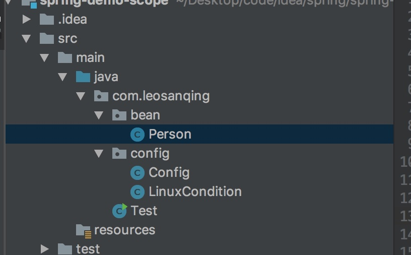
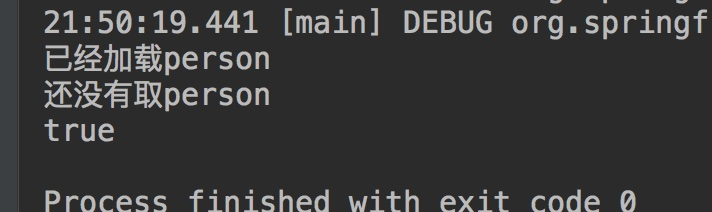
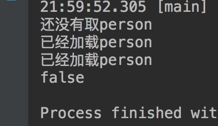
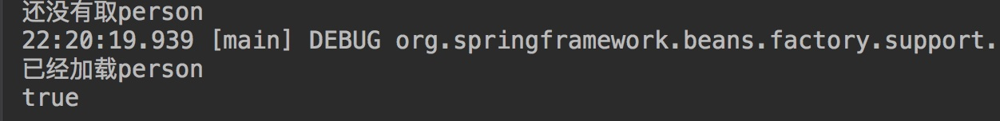

# 前言

面试的时候的单例模式会经常问到，问到单例可能会问你在spring中的应用，我们肯定会想到Spring创建Bean的时候，默认是单例。

那么在Spring的Bean里，单例和多例到底有啥区别呢？

# 区别


- 实例个数
  - 顾名思义，这个应该都知道
- 创建时间(这个可能新手不知道)
  - 单例IOC运行就创建（也可以设置懒加载/延迟加载，延迟加载时间），多例使用时才创建

# 演示

口说无凭我们就来实际证实一下

我们程序结构是这样的，我们主要用到三个类，一个是实体类`Person`，一个是配置类`Config`，一个是测试类`Test`(LinuxConfig可以忽略，是我测试另外一个注解时的东西)



## 单例

为了方便阅读，我把三个类的代码写在一个里面，你们自行拆解即可

```java
package com.leosanqing.bean;

import lombok.AllArgsConstructor;
import lombok.Data;
import lombok.NoArgsConstructor;
import org.springframework.context.annotation.ComponentScan;

@Data
@NoArgsConstructor
@AllArgsConstructor
@ComponentScan(useDefaultFilters = false)
public class Person {
    private String name;
    private int age;
}


package com.leosanqing.config;

import com.leosanqing.bean.Person;
import org.springframework.context.annotation.*;
import org.springframework.stereotype.Controller;
import org.springframework.stereotype.Service;

@Configuration
@ComponentScan
public class Config {
    @Bean
    //@Conditional(LinuxCondition.class)
    //@Scope("prototype")
    public Person person(){
        System.out.println("已经加载person");
        return new Person("leosanqing",22);
    }
}


package com.leosanqing;

import com.leosanqing.config.Config;
import org.springframework.context.annotation.AnnotationConfigApplicationContext;

import java.util.HashMap;

public class Test {
    public static void main(String[] args) {
        AnnotationConfigApplicationContext annoApp = new AnnotationConfigApplicationContext(Config.class);
        System.out.println("还没有取person");
        Object person1 = annoApp.getBean("person");
        Object person2 = annoApp.getBean("person");
        System.out.println(person1 == person2);

    }
}

```

我们看到我们在配置类和测试类中添加了两条输出语句，

- 在配置类中输出的目的是说明初始化IOC容器的时候，看Bean是否已经加载进IOC
- 在测试类中输出两个，
  - 一个是为了测试加载完IOC后，输出一条语句，相当于是断点
  - 一个是测试创建的两个Bean是否相等

**如果"已经加载person"先输出，那么说明我们在初始化IOC的时候，Bean已经开始加载进IOC了**

**如果"还没有取person"先输出，那么说明我们在初始化IOC的时候，Bean还没有加载进IOC**

我们先看**默认的**，也就是**单例**的输出结果



**我们看到"已经加载person"在前，说明在初始化IOC的时候，或者说IOC还没有初始完成，Bean就已经加载进IOC**

**而"true"，则说明，我们取到的两个实例都是同一个，也就是说他就是单例模式**

## 多例

如果我们把配置类中的`    //@Scope("prototype")`注释去掉，则说明我们使用多例进行Bean的管理。

那么结果就是这样



说明当我们**初始化完IOC容器**的时候，**Bean还没有进行创建**，等我们进行`getBean`操作的时候，他**才开始创建**Bean的实例，并且两个Bean实例**并不是同一个**(因为输出了 false)

## 懒加载

如果我们在Person类中加入这样一个注释

```java
@Configuration
@ComponentScan
public class Config {
    @Bean
    @Lazy
    //@Conditional(LinuxCondition.class)
    //@Scope("prototype")
    public Person person(){
        System.out.println("已经加载person");
        return new Person("leosanqing",22);
    }
}
```

这样就说明我们在**初始化IOC容器**的时候，**并不创建实例**Bean，而是在**用到的时候再创建**

所以就输出结果就是这样

